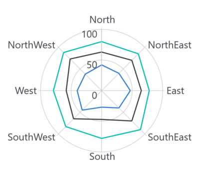
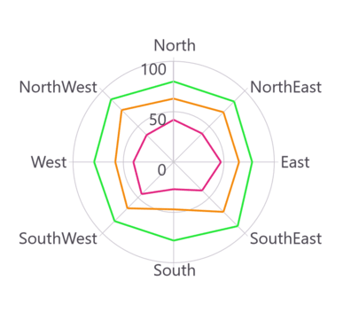
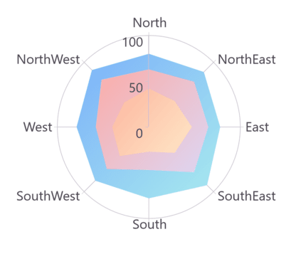
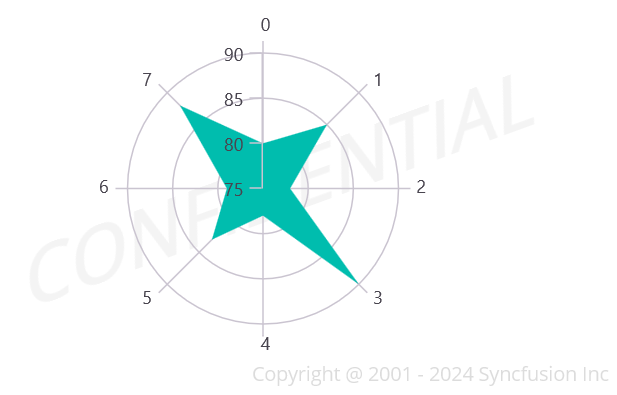

# Appearance in .NET MAUI Polar Chart
The appearance of [SfPolarChart](https://help.syncfusion.com/cr/maui-toolkit/Syncfusion.Maui.Toolkit.Charts.SfPolarChart.html) can be customized using the predefined brushes, custom brushes, and gradient, which allows for the enrichment of the application.

## Default PaletteBrushes for Chart

By default, the chart applies a set of predefined brushes to the series in a specific order. The following screenshot displays the default appearance of multiple series.





<chart:SfPolarChart> 
    . . .
    <chart:PolarLineSeries ItemsSource="{Binding PlantDetails}" XBindingPath="Direction" YBindingPath="Tree"/> 
    <chart:PolarLineSeries ItemsSource="{Binding PlantDetails}" XBindingPath="Direction" YBindingPath="Weed"/> 
    <chart:PolarLineSeries ItemsSource="{Binding PlantDetails}" XBindingPath="Direction" YBindingPath="Flower"/>
</chart:SfPolarChart>





// Create a new SfPolarChart instance
SfPolarChart chart = new SfPolarChart();

var viewModel = new ViewModel();
. . .
// Define the first PolarLineSeries
PolarLineSeries series1 = new PolarLineSeries()
{
    ItemsSource = viewModel.PlantDetails, 
    XBindingPath = "Direction", 
    YBindingPath = "Tree" 
};

// Define the second PolarLineSeries
PolarLineSeries series2 = new PolarLineSeries()
{
    ItemsSource = viewModel.PlantDetails, 
    XBindingPath = "Direction", 
    YBindingPath = "Weed" 
};

// Define the third PolarLineSeries
PolarLineSeries series3 = new PolarLineSeries()
{
    ItemsSource = viewModel.PlantDetails, 
    XBindingPath = "Direction", 
    YBindingPath = "Flower" 
};

// Add all three series to the chart
chart.Series.Add(series1);
chart.Series.Add(series2);
chart.Series.Add(series3);

// Set the chart as the content of the current page or control
this.Content = chart;





### Custom PaletteBrushes

The [SfPolarChart](https://help.syncfusion.com/cr/maui-toolkit/Syncfusion.Maui.Toolkit.Charts.SfPolarChart.html) provides support for defining custom brushes for the chart in a preferred order using the [PaletteBrushes](https://help.syncfusion.com/cr/maui-toolkit/Syncfusion.Maui.Toolkit.Charts.SfPolarChart.html#Syncfusion_Maui_Toolkit_Charts_SfPolarChart_PaletteBrushes) property, as illustrated in the following code example.





<chart:SfPolarChart x:Name="chart" PaletteBrushes="{Binding CustomBrushes}">
    . . .
</chart:SfPolarChart>





// Create a new instance of SfPolarChart
SfPolarChart chart = new SfPolarChart();

// Define a list of custom brushes for the chart
List<Brush> CustomBrushes = new List<Brush>()
{
    new SolidColorBrush(Color.FromArgb("#25E739")),
    new SolidColorBrush(Color.FromArgb("#F4890B")),
    new SolidColorBrush(Color.FromArgb("#E2227E"))
};

// Set the custom palette brushes for the chart
this.chart.PaletteBrushes = CustomBrushes;

// ... (other chart configurations)

// Set the chart as the content of the current view
this.Content = chart;





## Applying Gradient

The gradient for the chart can be set using the [PaletteBrushes](https://help.syncfusion.com/cr/maui-toolkit/Syncfusion.Maui.Toolkit.Charts.ChartSeries.html#Syncfusion_Maui_Toolkit_Charts_ChartSeries_PaletteBrushes) property with the help of `LinearGradientBrush` or `RadialGradientBrush`.

The following code sample and screenshot illustrates how to apply the gradient brushes for the series using the [PaletteBrushes](https://help.syncfusion.com/cr/maui-toolkit/Syncfusion.Maui.Toolkit.Charts.ChartSeries.html#Syncfusion_Maui_Toolkit_Charts_ChartSeries_PaletteBrushes) property.





<chart:SfPolarChart PaletteBrushes="{Binding CustomBrushes}">
    . . .
    <chart:PolarAreaSeries ItemsSource="{Binding PlantDetails}" XBindingPath="Direction" YBindingPath="Tree"/>
    <chart:PolarAreaSeries ItemsSource="{Binding PlantDetails}" XBindingPath="Direction" YBindingPath="Weed"/>
    <chart:PolarAreaSeries ItemsSource="{Binding PlantDetails}" XBindingPath="Direction" YBindingPath="Flower"/>
</chart:SfPolarChart>





public class ViewModel
{
    // Collection to hold data for the chart
    public ObservableCollection<Model> Data { get; set; }

    // List to store custom brushes for chart styling
    public List<Brush> CustomBrushes { get; set; }

    public ViewModel()
    {
        CustomBrushes = new List<Brush>();

        LinearGradientBrush gradientColor1 = new LinearGradientBrush(); // Create and configure gradient brush 1
        gradientColor1.GradientStops = new GradientStopCollection()
        {
            new GradientStop() { Offset = 1, Color = Color.FromRgb(168, 234, 238) },
            new GradientStop() { Offset = 0, Color = Color.FromRgb(123, 176, 249) }
        };

        LinearGradientBrush gradientColor2 = new LinearGradientBrush(); // Create and configure gradient brush 2
        gradientColor2.GradientStops = new GradientStopCollection()
        {
            new GradientStop() { Offset = 1, Color = Color.FromRgb(221, 214, 243) },
            new GradientStop() { Offset = 0, Color = Color.FromRgb(250, 172, 168) }
        };

        LinearGradientBrush gradientColor3 = new LinearGradientBrush(); // Create and configure gradient brush 3
        gradientColor3.GradientStops = new GradientStopCollection()
        {
            new GradientStop() { Offset = 1, Color = Color.FromRgb(255, 231, 199) },
            new GradientStop() { Offset = 0, Color = Color.FromRgb(252, 182, 159) }
        };

        // Add all created gradient brushes to the CustomBrushes list
        CustomBrushes.Add(gradientColor1);
        CustomBrushes.Add(gradientColor2);
        CustomBrushes.Add(gradientColor3);
    }
    // ... (other methods)
}





## Plotting Area Customization:

[SfPolarChart](https://help.syncfusion.com/cr/maui-toolkit/Syncfusion.Maui.Toolkit.Charts.SfPolarChart.html) allows you to add any view to the chart plot area, which is useful for adding any relevant data, a watermark, or a color gradient to the background of the chart.





<chart:SfPolarChart>
   <chart:SfPolarChart.PlotAreaBackgroundView>
    	<AbsoluteLayout>
      		<Label Text="Copyright @ 2001 - 2024 Syncfusion Inc"
		       FontSize="18" AbsoluteLayout.LayoutBounds="1,1,-1,-1"
		       AbsoluteLayout.LayoutFlags="PositionProportional"
		       Opacity="0.4"/>
       		<Label Text="CONFIDENTIAL" Rotation="340" FontSize="80"
		       FontAttributes="Bold,Italic" TextColor="Gray" Margin="10,0,0,0"
	               AbsoluteLayout.LayoutBounds="0.5,0.5,-1,-1"
		       AbsoluteLayout.LayoutFlags="PositionProportional"
		       Opacity="0.3"/>
    	</AbsoluteLayout>
   </chart:SfPolarChart.PlotAreaBackgroundView>
</chart:SfPolarChart>




// Create a new SfPolarChart instance
SfPolarChart chart = new SfPolarChart();

// Create an AbsoluteLayout to hold the copyright and watermark
AbsoluteLayout absoluteLayout = new AbsoluteLayout();
// Create a Label for the copyright text
var copyRight = new Label() 
{
    Text = "Copyright @ 2001 - 2024 Syncfusion Inc",
    FontSize = 18,
    Opacity = 0.4
};

AbsoluteLayout.SetLayoutBounds(copyRight, new Rect(1, 1, -1, -1));
AbsoluteLayout.SetLayoutFlags(copyRight, Microsoft.Maui.Layouts.AbsoluteLayoutFlags.PositionProportional);
absoluteLayout.Children.Add(copyRight);

// Create a Label for the watermark
var watermark = new Label()
{
    Text = "CONFIDENTIAL",
    Rotation = 340,
    FontSize = 80,
    FontAttributes = FontAttributes.Bold,
    TextColor = Colors.Gray, 
    Opacity = 0.3
};

AbsoluteLayout.SetLayoutBounds(watermark, new Rect(0.5, 0.5, -1, -1));
AbsoluteLayout.SetLayoutFlags(watermark, Microsoft.Maui.Layouts.AbsoluteLayoutFlags.PositionProportional);
absoluteLayout.Children.Add(watermark);

chart.PlotAreaBackgroundView = absoluteLayout; // Set the AbsoluteLayout as the PlotAreaBackgroundView of the chart

// Set the chart as the content of the current page or view
this.Content = chart;





