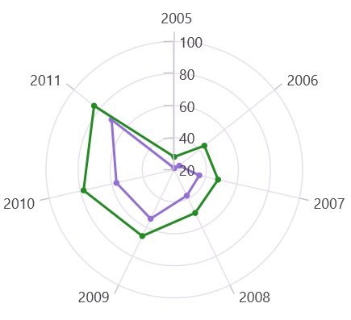

# Axis labels in .NET MAUI Polar Chart

Axis labels are used to display the units, measures, or category values of an axis in a user-friendly way. They are generated based on the range and the values bound to the [XBindingPath](https://help.syncfusion.com/cr/maui-toolkit/Syncfusion.Maui.Toolkit.Charts.ChartSeries.html#Syncfusion_Maui_Toolkit_Charts_ChartSeries_XBindingPath) or [YBindingPath](https://help.syncfusion.com/cr/maui-toolkit/Syncfusion.Maui.Toolkit.Charts.XYDataSeries.html#Syncfusion_Maui_Toolkit_Charts_XYDataSeries_YBindingPath) properties of the series.

## Positioning the labels

The [LabelsPosition](https://help.syncfusion.com/cr/maui-toolkit/Syncfusion.Maui.Toolkit.Charts.ChartAxis.html#Syncfusion_Maui_Toolkit_Charts_ChartAxis_LabelsPosition) property is used to position the axis labels inside or outside the chart area. The default value is `AxisElementPosition.Outside`.

N> This is only applicable to the secondary axis of Polar chart.





<chart:SfPolarChart>
    . . .
    <chart:SfPolarChart.SecondaryAxis>
        <chart:NumericalAxis LabelsPosition="Inside"/>
    </chart:SfPolarChart.SecondaryAxis>
</chart:SfPolarChart>





SfPolarChart chart = new SfPolarChart();
. . .
NumericalAxis axis = new NumericalAxis()
{
    LabelsPosition = AxisElementPosition.Inside // Set the position of the axis labels
};

chart.SecondaryAxis = axis;
. . .
this.Content = chart;




## Label customization

The [LabelStyle](https://help.syncfusion.com/cr/maui-toolkit/Syncfusion.Maui.Toolkit.Charts.ChartAxis.html#Syncfusion_Maui_Toolkit_Charts_ChartAxis_LabelStyle) property of the axis provides options to customize the font family, font size, font attributes, and text color of axis labels. The axis labels can be customized using the following properties:

* `Background` - Gets or sets the background color of the labels.
* `CornerRadius` - Gets or sets a value that defines the rounded corners for labels.
* `FontAttributes` - Gets or sets the font style for the label.
* `FontFamily` - Gets or sets the font family name for the label.
* `FontSize` - Gets or sets the font size for the label.
* `Margin` - Gets or sets the margin of the label to customize the appearance of label. 
* `Stroke` - Gets or sets the border stroke color of the labels.
* `StrokeWidth` - Gets or sets the border thickness of the label.
* `TextColor` - Gets or sets the color for the text of the label.
* `LabelFormat` - Gets or sets the label format. This property is used to set numeric or date-time format to the chart axis label.
* `LabelAlignment` - Gets or sets the axis label at start, end, and center positions.

## Edge Labels Drawing Mode

The chart axis supports customizing the rendering position of the edge labels using the [EdgeLabelsDrawingMode](https://help.syncfusion.com/cr/maui-toolkit/Syncfusion.Maui.Toolkit.Charts.ChartAxis.html#Syncfusion_Maui_Toolkit_Charts_ChartAxis_EdgeLabelsDrawingMode) property. The default value of the [EdgeLabelsDrawingMode](https://help.syncfusion.com/cr/maui-toolkit/Syncfusion.Maui.Toolkit.Charts.ChartAxis.html#Syncfusion_Maui_Toolkit_Charts_ChartAxis_EdgeLabelsDrawingMode) property is `Shift`.

| Action | Description |
|--|--|
| Center | Indicates that the edge label should appear at the center of its GridLines. |
| Fit | Indicates that the edge labels should be fit within the area of SfPolarChart. |
| Hide | Indicates that the edge labels will be hidden |
| Shift | Indicates that edge labels should be shifted to either left or right so that it comes within the area of Chart. |





<chart:SfPolarChart>
    . . .
    <chart:SfPolarChart.SecondaryAxis>
        <chart:NumericalAxis EdgeLabelsDrawingMode="Center"/>
    </chart:SfPolarChart.SecondaryAxis>
</chart:SfPolarChart>





SfPolarChart chart = new SfPolarChart();
. . . 
NumericalAxis secondaryAxis = new NumericalAxis()
{
    EdgeLabelsDrawingMode = EdgeLabelsDrawingMode.Center, //Set the mode for drawing edge labels on the axis
};

chart.SecondaryAxis = secondaryAxis;
. . .
this.Content = chart;




## Edge Labels Visibility
 
The visibility of the edge labels of the axis can be controlled using the [EdgeLabelsVisibilityMode](https://help.syncfusion.com/cr/maui-toolkit/Syncfusion.Maui.Toolkit.Charts.RangeAxisBase.html#Syncfusion_Maui_Toolkit_Charts_RangeAxisBase_EdgeLabelsVisibilityMode) property. The default value of [EdgeLabelsVisibilityMode](https://help.syncfusion.com/cr/maui-toolkit/Syncfusion.Maui.Toolkit.Charts.RangeAxisBase.html#Syncfusion_Maui_Toolkit_Charts_RangeAxisBase_EdgeLabelsVisibilityMode) is `Default`, which displays the edge label based on auto interval calculations.

N> EdgeLabelsDrawingMode and EdgeLabelsVisibilityMode can only be customized for the secondary axis.

**Always Visible**

The `AlwaysVisible` option in [EdgeLabelsVisibilityMode](https://help.syncfusion.com/cr/maui-toolkit/Syncfusion.Maui.Toolkit.Charts.RangeAxisBase.html#Syncfusion_Maui_Toolkit_Charts_RangeAxisBase_EdgeLabelsVisibilityMode) is used to display the edge labels even when the chart area is in zoomed state.





<chart:SfPolarChart>
    . . .
    <chart:SfPolarChart.SecondaryAxis>
        <chart:NumericalAxis EdgeLabelsVisibilityMode="AlwaysVisible"/>
    </chart:SfPolarChart.SecondaryAxis>
</chart:SfPolarChart>





SfPolarChart chart = new SfPolarChart();
. . .
NumericalAxis secondaryAxis = new NumericalAxis()
{
    EdgeLabelsVisibilityMode = EdgeLabelsVisibilityMode.AlwaysVisible // Set the visibility mode of the edge labels 
};

chart.SecondaryAxis = secondaryAxis;
. . .
this.Content = chart;




**Visible**

The `Visible` option is used to display the edge labels irrespective of the auto interval calculation until zooming (i.e., in the normal state).





<chart:SfPolarChart>
    . . .
    <chart:SfPolarChart.SecondaryAxis>
        <chart:NumericalAxis EdgeLabelsVisibilityMode="Visible"/>
    </chart:SfPolarChart.SecondaryAxis>
</chart:SfPolarChart>





SfPolarChart chart = new SfPolarChart();
. . .
NumericalAxis secondaryAxis = new NumericalAxis()
{
    EdgeLabelsVisibilityMode = EdgeLabelsVisibilityMode.Visible // Set the visibility mode of the edge labels 
};

chart.SecondaryAxis = secondaryAxis;
. . .
this.Content = chart;


