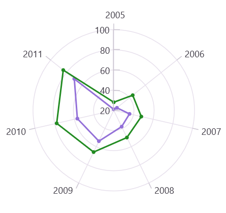

# Tick Lines in .NET MAUI Polar Chart

Tick lines are small lines drawn on the axis line that represent axis labels. By default, tick lines are drawn outside of the axis.

Minor tick lines can be added to the axis by defining the [MinorTicksPerInterval](https://help.syncfusion.com/cr/maui-toolkit/Syncfusion.Maui.Toolkit.Charts.RangeAxisBase.html#Syncfusion_Maui_Toolkit_Charts_RangeAxisBase_MinorTicksPerInterval) property. This property adds minor tick lines to every interval based on the specified value.

N> For category axis, minor tick lines are not applicable as it is rendered based on index positions.





<chart:SfPolarChart>
    . . .
    <chart:SfPolarChart.PrimaryAxis>
        <chart:NumericalAxis/>
    </chart:SfPolarChart.PrimaryAxis>

    <chart:SfPolarChart.SecondaryAxis>
        <chart:NumericalAxis MinorTicksPerInterval="4"/>
    </chart:SfPolarChart.SecondaryAxis>
</chart:SfPolarChart>





SfPolarChart chart = new SfPolarChart();
. . .
NumericalAxis primaryAxis = new NumericalAxis();
chart.PrimaryAxis = primaryAxis;
NumericalAxis secondaryAxis = new NumericalAxis()
{
    MinorTicksPerInterval = 4 // Set the number of minor ticks per interval
};

chart.SecondaryAxis = secondaryAxis;
. . .
this.Content = chart;





## Positioning the Ticks

The tick lines can be positioned inside or outside the chart area using the [TickPosition](https://help.syncfusion.com/cr/maui-toolkit/Syncfusion.Maui.Toolkit.Charts.ChartAxis.html#Syncfusion_Maui_Toolkit_Charts_ChartAxis_TickPosition) property. The default value of [TickPosition](https://help.syncfusion.com/cr/maui-toolkit/Syncfusion.Maui.Toolkit.Charts.ChartAxis.html#Syncfusion_Maui_Toolkit_Charts_ChartAxis_TickPosition) is `AxisElementPosition.Outside`.

N> This is only applicable to the secondary axis of Polar chart.





<chart:SfPolarChart>
    . . .
    <chart:SfPolarChart.SecondaryAxis>
        <chart:NumericalAxis TickPosition="Inside"/>
    </chart:SfPolarChart.SecondaryAxis>
</chart:SfPolarChart>





SfPolarChart chart = new SfPolarChart();
. . .
NumericalAxis secondaryAxis = new NumericalAxis()
{
    TickPosition = AxisElementPosition.Inside // Set the position of the axis ticks 
};

chart.SecondaryAxis = secondaryAxis;
. . .
this.Content = chart;





## Customization

Both major and minor tick lines can be customized using the [MajorTickStyle](https://help.syncfusion.com/cr/maui-toolkit/Syncfusion.Maui.Toolkit.Charts.ChartAxis.html#Syncfusion_Maui_Toolkit_Charts_ChartAxis_MajorTickStyle) and [MinorTickStyle](https://help.syncfusion.com/cr/maui-toolkit/Syncfusion.Maui.Toolkit.Charts.RangeAxisBase.html#Syncfusion_Maui_Toolkit_Charts_RangeAxisBase_MinorTickStyle) properties respectively. They provide options to change the [StrokeWidth](https://help.syncfusion.com/cr/maui-toolkit/Syncfusion.Maui.Toolkit.Charts.ChartAxisTickStyle.html#Syncfusion_Maui_Toolkit_Charts_ChartAxisTickStyle_StrokeWidth), [TickSize](https://help.syncfusion.com/cr/maui-toolkit/Syncfusion.Maui.Toolkit.Charts.ChartAxisTickStyle.html#Syncfusion_Maui_Toolkit_Charts_ChartAxisTickStyle_TickSize), and [Stroke](https://help.syncfusion.com/cr/maui-toolkit/Syncfusion.Maui.Toolkit.Charts.ChartAxisTickStyle.html#Syncfusion_Maui_Toolkit_Charts_ChartAxisTickStyle_Stroke) of tick lines. By default, minor tick lines are not visible.





<chart:SfPolarChart>
    . . .
    <chart:SfPolarChart.PrimaryAxis>
        <chart:NumericalAxis/>
    </chart:SfPolarChart.PrimaryAxis>

    <chart:SfPolarChart.SecondaryAxis>
        <chart:NumericalAxis MinorTicksPerInterval="4">
            <chart:NumericalAxis.MajorTickStyle>
                <chart:ChartAxisTickStyle Stroke="Red" StrokeWidth="1" TickSize="10"/>
            </chart:NumericalAxis.MajorTickStyle>            
            <chart:NumericalAxis.MinorTickStyle>
                <chart:ChartAxisTickStyle Stroke="Red" StrokeWidth="1"/>
            </chart:NumericalAxis.MinorTickStyle>
        </chart:NumericalAxis>
    </chart:SfPolarChart.SecondaryAxis>
</chart:SfPolarChart>





SfPolarChart chart = new SfPolarChart();
. . .
NumericalAxis primaryAxis = new NumericalAxis();
chart.PrimaryAxis = primaryAxis;

NumericalAxis secondaryAxis = new NumericalAxis()
{
    MinorTicksPerInterval = 4,
    // Define the style for major ticks on the secondary axis
    MajorTickStyle = new ChartAxisTickStyle()
    {
        Stroke = Colors.Red,
        StrokeWidth = 1,
        TickSize = 10
    },
    // Define the style for minor ticks on the secondary axis
    MinorTickStyle = new ChartAxisTickStyle()
    {
        Stroke = Colors.Red,
        StrokeWidth = 1
    }
};

chart.SecondaryAxis = secondaryAxis;
. . .
this.Content = chart;



