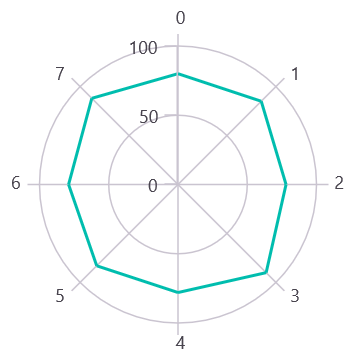
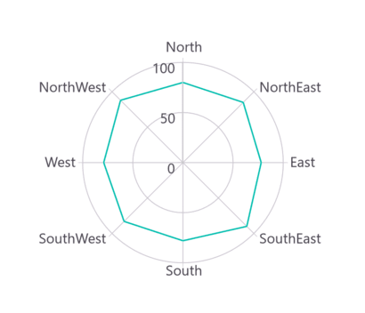
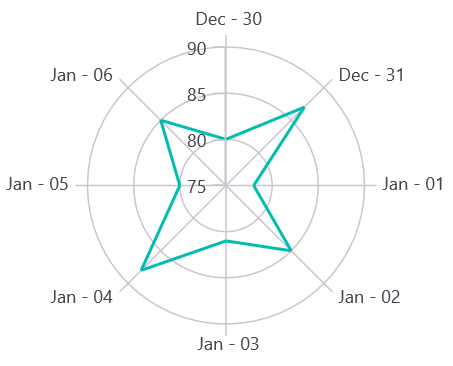

# Types of Axis in .NET MAUI Polar Chart

Polar chart supports the following types of chart axis:

* NumericalAxis
* CategoryAxis
* DateTimeAxis

## Numerical Axis

[NumericalAxis](https://help.syncfusion.com/cr/maui-toolkit/Syncfusion.Maui.Toolkit.Charts.NumericalAxis.html) is used to plot numerical values to the chart. [NumericalAxis](https://help.syncfusion.com/cr/maui-toolkit/Syncfusion.Maui.Toolkit.Charts.NumericalAxis.html) can be defined for both [PrimaryAxis](https://help.syncfusion.com/cr/maui-toolkit/Syncfusion.Maui.Toolkit.Charts.SfPolarChart.html#Syncfusion_Maui_Toolkit_Charts_SfPolarChart_PrimaryAxis) and [SecondaryAxis](https://help.syncfusion.com/cr/maui-toolkit/Syncfusion.Maui.Toolkit.Charts.SfPolarChart.html#Syncfusion_Maui_Toolkit_Charts_SfPolarChart_SecondaryAxis).





<chart:SfPolarChart>
    . . .
    <chart:SfPolarChart.PrimaryAxis>
        <chart:NumericalAxis/>
    </chart:SfPolarChart.PrimaryAxis>

    <chart:SfPolarChart.SecondaryAxis>
        <chart:NumericalAxis/>
    </chart:SfPolarChart.SecondaryAxis>
</chart:SfPolarChart>





SfPolarChart chart = new SfPolarChart();
. . .
// Initialize a NumericalAxis for the primary axis of the Polar Chart
NumericalAxis primaryAxis = new NumericalAxis();
chart.PrimaryAxis = primaryAxis; // Set the primary axis of the chart to the newly created NumericalAxis

// Initialize a NumericalAxis for the secondary axis of the Polar Chart
NumericalAxis secondaryAxis = new NumericalAxis();
chart.SecondaryAxis = secondaryAxis; // Set the secondary axis of the chart to the newly created NumericalAxis
. . .
this.Content = chart;





### Interval

Axis interval can be customized by using the [Interval](https://help.syncfusion.com/cr/maui-toolkit/Syncfusion.Maui.Toolkit.Charts.NumericalAxis.html#Syncfusion_Maui_Toolkit_Charts_NumericalAxis_Interval) property. By default, interval will be calculated based on the minimum and maximum value of the provided data.





<chart:SfPolarChart>
    . . .
    <chart:SfPolarChart.PrimaryAxis>
        <chart:NumericalAxis Interval="10"/>
    </chart:SfPolarChart.PrimaryAxis>

    <chart:SfPolarChart.SecondaryAxis>
        <chart:NumericalAxis/>
    </chart:SfPolarChart.SecondaryAxis>
</chart:SfPolarChart>





SfPolarChart chart = new SfPolarChart();
. . .
NumericalAxis primaryAxis = new NumericalAxis()
{
    Interval = 10 // Set the interval for the primary axis
};

chart.PrimaryAxis = primaryAxis;
NumericalAxis secondaryAxis = new NumericalAxis();
chart.SecondaryAxis = secondaryAxis;
. . .
this.Content = chart;





### Customizing the Range

[Maximum](https://help.syncfusion.com/cr/maui-toolkit/Syncfusion.Maui.Toolkit.Charts.NumericalAxis.html#Syncfusion_Maui_Toolkit_Charts_NumericalAxis_Maximum) and [Minimum](https://help.syncfusion.com/cr/maui-toolkit/Syncfusion.Maui.Toolkit.Charts.NumericalAxis.html#Syncfusion_Maui_Toolkit_Charts_NumericalAxis_Minimum) properties of axis are used for setting the maximum and minimum values of the axis range respectively.

N> If minimum or maximum value is set, the other value is calculated by default internally.





<chart:SfPolarChart.SecondaryAxis>
    <chart:NumericalAxis Maximum="100" Minimum="0" Interval="20"/>
</chart:SfPolarChart.SecondaryAxis>





SfPolarChart chart = new SfPolarChart();
. . .
NumericalAxis secondaryAxis = new NumericalAxis()
{
    Maximum = 100, // Set the maximum value of the axis
    Minimum = 0, // Set the minimum value of the axis 
    Interval = 20 // Set the interval between axis labels
};

chart.SecondaryAxis = secondaryAxis;
. . .
this.Content = chart;





## Category Axis

The [CategoryAxis](https://help.syncfusion.com/cr/maui-toolkit/Syncfusion.Maui.Toolkit.Charts.CategoryAxis.html) is an index-based axis that plots values based on the index of the data point collection. The points are equally spaced here.





<chart:SfPolarChart>
    . . .
    <chart:SfPolarChart.PrimaryAxis>
        <chart:CategoryAxis/>
    </chart:SfPolarChart.PrimaryAxis>
</chart:SfPolarChart>





SfPolarChart chart = new SfPolarChart();
. . .
// Initialize a CategoryAxis for the primary axis of the Polar Chart
CategoryAxis primaryAxis = new CategoryAxis();
// Assign the created CategoryAxis to the PrimaryAxis property of the chart
chart.PrimaryAxis = primaryAxis;
. . .
this.Content = chart;





### Interval

By default, the [CategoryAxis](https://help.syncfusion.com/cr/maui-toolkit/Syncfusion.Maui.Toolkit.Charts.CategoryAxis.html) axis labels are displayed with fixed interval 1. This can be customized by using the [Interval](https://help.syncfusion.com/cr/maui-toolkit/Syncfusion.Maui.Toolkit.Charts.CategoryAxis.html#Syncfusion_Maui_Toolkit_Charts_CategoryAxis_Interval) property of axis.





<chart:SfPolarChart>
    . . .
    <chart:SfPolarChart.PrimaryAxis>
        <chart:CategoryAxis Interval="2"/>
    </chart:SfPolarChart.PrimaryAxis>

    <chart:SfPolarChart.SecondaryAxis>
        <chart:NumericalAxis/>
    </chart:SfPolarChart.SecondaryAxis>
</chart:SfPolarChart>





SfPolarChart chart = new SfPolarChart();
. . .
CategoryAxis primaryAxis = new CategoryAxis()
{
    Interval = 2 // Set the interval between labels on the axis
};

chart.PrimaryAxis = primaryAxis;
NumericalAxis secondaryAxis = new NumericalAxis();
chart.SecondaryAxis = secondaryAxis;
. . .
this.Content = chart;





## DateTime Axis

[DateTimeAxis](https://help.syncfusion.com/cr/maui-toolkit/Syncfusion.Maui.Toolkit.Charts.DateTimeAxis.html) is used to plot `DateTime` values. The [DateTimeAxis](https://help.syncfusion.com/cr/maui-toolkit/Syncfusion.Maui.Toolkit.Charts.DateTimeAxis.html) is widely used to make financial charts in places like the Stock Market, where index plotting is done every day.





<chart:SfPolarChart>
    . . .
    <chart:SfPolarChart.PrimaryAxis>
        <chart:DateTimeAxis/>
    </chart:SfPolarChart.PrimaryAxis>
</chart:SfPolarChart>





SfPolarChart chart = new SfPolarChart();
. . .
// Initialize a DateTimeAxis for the primary axis of the Polar Chart
DateTimeAxis primaryAxis = new DateTimeAxis();
// Assign the created DateTimeAxis to the primary axis of the chart
chart.PrimaryAxis = primaryAxis;
. . .
this.Content = chart;





### Interval

In [DateTimeAxis](https://help.syncfusion.com/cr/maui-toolkit/Syncfusion.Maui.Toolkit.Charts.DateTimeAxis.html), intervals can be customized using the [Interval](https://help.syncfusion.com/cr/maui-toolkit/Syncfusion.Maui.Toolkit.Charts.DateTimeAxis.html#Syncfusion_Maui_Toolkit_Charts_DateTimeAxis_Interval) and [IntervalType](https://help.syncfusion.com/cr/maui-toolkit/Syncfusion.Maui.Toolkit.Charts.DateTimeAxis.html#Syncfusion_Maui_Toolkit_Charts_DateTimeAxis_IntervalType) properties. For example, setting [Interval](https://help.syncfusion.com/cr/maui-toolkit/Syncfusion.Maui.Toolkit.Charts.DateTimeAxis.html#Syncfusion_Maui_Toolkit_Charts_DateTimeAxis_Interval) as 6 and [IntervalType](https://help.syncfusion.com/cr/maui-toolkit/Syncfusion.Maui.Toolkit.Charts.DateTimeAxis.html#Syncfusion_Maui_Toolkit_Charts_DateTimeAxis_IntervalType) as [Months](https://help.syncfusion.com/cr/maui-toolkit/Syncfusion.Maui.Toolkit.Charts.DateTimeIntervalType.html#Syncfusion_Maui_Toolkit_Charts_DateTimeIntervalType_Months) will consider 6 months as interval.





<chart:SfPolarChart>
    ...
    <chart:SfPolarChart.PrimaryAxis>
        <chart:DateTimeAxis Interval="6" IntervalType="Months"/>
    </chart:SfPolarChart.PrimaryAxis>

    <chart:SfPolarChart.SecondaryAxis>
        <chart:NumericalAxis/>
    </chart:SfPolarChart.SecondaryAxis>
</chart:SfPolarChart>





SfPolarChart chart = new SfPolarChart();
. . .
DateTimeAxis primaryAxis = new DateTimeAxis()
{
    Interval = 6, // Set the interval between points on the primary axis
    IntervalType = DateTimeIntervalType.Months // Set the type of interval 
};

chart.PrimaryAxis = primaryAxis;
NumericalAxis secondaryAxis = new NumericalAxis();
chart.SecondaryAxis = secondaryAxis;
. . .
this.Content = chart;





### Customizing the Range

[Minimum](https://help.syncfusion.com/cr/maui-toolkit/Syncfusion.Maui.Toolkit.Charts.DateTimeAxis.html#Syncfusion_Maui_Toolkit_Charts_DateTimeAxis_Minimum) and [Maximum](https://help.syncfusion.com/cr/maui-toolkit/Syncfusion.Maui.Toolkit.Charts.DateTimeAxis.html#Syncfusion_Maui_Toolkit_Charts_DateTimeAxis_Maximum) properties behavior is same as in [NumericalAxis](https://help.syncfusion.com/cr/maui-toolkit/Syncfusion.Maui.Toolkit.Charts.NumericalAxis.html) except that instead of setting numerical values, you have to set date time values.





<chart:SfPolarChart>
    . . .
    <chart:SfPolarChart.PrimaryAxis>
        <chart:DateTimeAxis Minimum="2021/05/10" Maximum="2021/11/01"/>
    </chart:SfPolarChart.PrimaryAxis>
</chart:SfPolarChart>





SfPolarChart chart = new SfPolarChart();
. . .
DateTimeAxis primaryAxis = new DateTimeAxis()
{
    Minimum = new DateTime(2021,05,10), // Set the minimum value for the axis
    Maximum = new DateTime(2021,11,01) // Set the maximum value for the axis
};

chart.PrimaryAxis = primaryAxis;
. . .
this.Content = chart;





## Inversed

Axis can be inverted using the [IsInversed](https://help.syncfusion.com/cr/maui-toolkit/Syncfusion.Maui.Toolkit.Charts.ChartAxis.html#Syncfusion_Maui_Toolkit_Charts_ChartAxis_IsInversed) property. The default value of this property is `False`.





<chart:SfPolarChart>
    . . .
    <chart:SfPolarChart.SecondaryAxis>
        <chart:NumericalAxis IsInversed="True"/>
    </chart:SfPolarChart.SecondaryAxis>
</chart:SfPolarChart>





SfPolarChart chart = new SfPolarChart();
. . .
NumericalAxis secondaryAxis = new NumericalAxis();
secondaryAxis.IsInversed = true; // Set the IsInversed property to true to reverse the axis direction
chart.SecondaryAxis = secondaryAxis;
. . .
this.Content = chart;





## Events

### ActualRangeChanged

The [ActualRangeChanged](https://help.syncfusion.com/cr/maui-toolkit/Syncfusion.Maui.Toolkit.Charts.ChartAxis.html#Syncfusion_Maui_Toolkit_Charts_ChartAxis_ActualRangeChanged) event is triggered when the actual range of the axis is changed. The argument contains the following information:

* [ActualMinimum](https://help.syncfusion.com/cr/maui-toolkit/Syncfusion.Maui.Toolkit.Charts.ActualRangeChangedEventArgs.html#Syncfusion_Maui_Toolkit_Charts_ActualRangeChangedEventArgs_ActualMinimum) - used to get the actual minimum value of the axis.
* [ActualMaximum](https://help.syncfusion.com/cr/maui-toolkit/Syncfusion.Maui.Toolkit.Charts.ActualRangeChangedEventArgs.html#Syncfusion_Maui_Toolkit_Charts_ActualRangeChangedEventArgs_ActualMaximum) - used to get the actual maximum value of the axis.

### LabelCreated

The [LabelCreated](https://help.syncfusion.com/cr/maui-toolkit/Syncfusion.Maui.Toolkit.Charts.ChartAxis.html#Syncfusion_Maui_Toolkit_Charts_ChartAxis_LabelCreated) event is triggered when the axis label is created. The argument contains the following information:

* [Label](https://help.syncfusion.com/cr/maui-toolkit/Syncfusion.Maui.Toolkit.Charts.ChartAxisLabelEventArgs.html#Syncfusion_Maui_Toolkit_Charts_ChartAxisLabelEventArgs_Label) - Used to get or set the text of axis label.
* [Position](https://help.syncfusion.com/cr/maui-toolkit/Syncfusion.Maui.Toolkit.Charts.ChartAxisLabelEventArgs.html#Syncfusion_Maui_Toolkit_Charts_ChartAxisLabelEventArgs_Position) - Used to get the position of label.
* [LabelStyle](https://help.syncfusion.com/cr/maui-toolkit/Syncfusion.Maui.Toolkit.Charts.ChartAxisLabelEventArgs.html#Syncfusion_Maui_Toolkit_Charts_ChartAxisLabelEventArgs_LabelStyle) - Used to customize the appearance of axis labels.