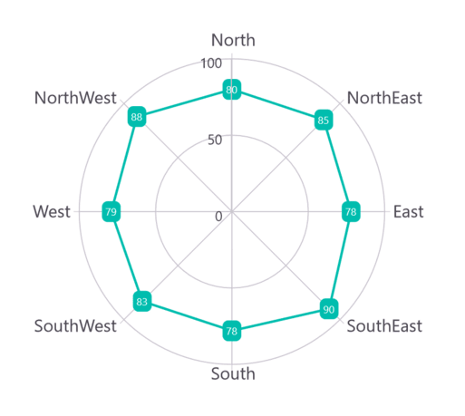
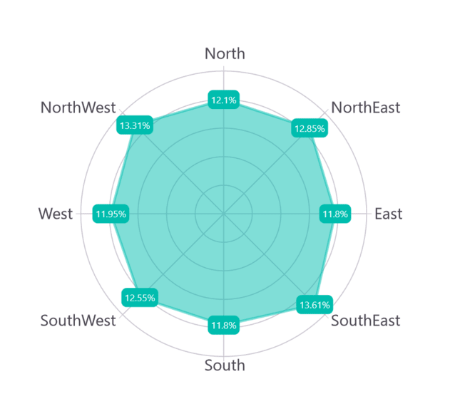
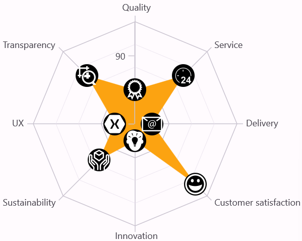

# Data Labels in .NET MAUI Polar Chart

Data labels display values related to a chart segment. They can show values from a data point (x, y) or other custom properties from a data source.

Each data label includes the following:

* Label - Displays the segment label content at the (X, Y) point.

## Enable Data Labels 

The [ShowDataLabels](https://help.syncfusion.com/cr/maui-toolkit/Syncfusion.Maui.Toolkit.Charts.ChartSeries.html#Syncfusion_Maui_Toolkit_Charts_ChartSeries_ShowDataLabels) property of a series enables the data labels.





<chart:SfPolarChart>
    <!-- Other chart settings -->
    <chart:PolarLineSeries ItemsSource="{Binding PlantDetails}" 
                           XBindingPath="Direction" 
                           YBindingPath="Tree"
                           ShowDataLabels="True"/>
</chart:SfPolarChart>





// Create a new instance of SfPolarChart
SfPolarChart chart = new SfPolarChart();
// Other chart settings
// Create a new PolarLineSeries
PolarLineSeries series = new PolarLineSeries()
{
    ItemsSource = viewModel.PlantDetails,
    XBindingPath = "Direction",
    YBindingPath = "Tree",
    ShowDataLabels = true // Enable data labels for the series
};

// Add the series to the chart's Series collection
chart.Series.Add(series);
this.Content = chart;





Data labels can be customized using the [DataLabelSettings](https://help.syncfusion.com/cr/maui-toolkit/Syncfusion.Maui.Toolkit.Charts.PolarSeries.html#Syncfusion_Maui_Toolkit_Charts_PolarSeries_DataLabelSettings) property of chart series. To customize them, create an instance of [PolarDataLabelSettings](https://help.syncfusion.com/cr/maui-toolkit/Syncfusion.Maui.Toolkit.Charts.PolarDataLabelSettings.html) and set it to the DataLabelSettings property. The following properties are available in PolarDataLabelSettings for customization:

* [LabelStyle](https://help.syncfusion.com/cr/maui-toolkit/Syncfusion.Maui.Toolkit.Charts.ChartDataLabelSettings.html#Syncfusion_Maui_Toolkit_Charts_ChartDataLabelSettings_LabelStyle) - Customizes data labels.
* [UseSeriesPalette](https://help.syncfusion.com/cr/maui-toolkit/Syncfusion.Maui.Toolkit.Charts.ChartDataLabelSettings.html#Syncfusion_Maui_Toolkit_Charts_ChartDataLabelSettings_UseSeriesPalette) - Indicates whether the data label should reflect the series interior.

## Applying Series Brush

The [UseSeriesPalette](https://help.syncfusion.com/cr/maui-toolkit/Syncfusion.Maui.Toolkit.Charts.ChartDataLabelSettings.html#Syncfusion_Maui_Toolkit_Charts_ChartDataLabelSettings_UseSeriesPalette) property sets the series interior as the data marker background.





<chart:SfPolarChart>
    <!-- Other chart settings -->
    <chart:PolarLineSeries ShowDataLabels="True">
        <chart:PolarLineSeries.DataLabelSettings>
            <chart:PolarDataLabelSettings UseSeriesPalette="False"/>
        </chart:PolarLineSeries.DataLabelSettings>
    </chart:PolarLineSeries>
</chart:SfPolarChart>





// Create a new instance of SfPolarChart
SfPolarChart chart = new SfPolarChart();

// Create a new instance of PolarLineSeries
PolarLineSeries series = new PolarLineSeries();
// Other series settings
// Configure the data label settings for the series
series.DataLabelSettings = new PolarDataLabelSettings()
{
    // Disable the use of series palette for data labels
    UseSeriesPalette = false
};

// Add the configured series to the chart's collection of series
chart.Series.Add(series);

this.Content = chart;





## Formatting Label Content

Customize the label content using the [LabelContext](https://help.syncfusion.com/cr/maui-toolkit/Syncfusion.Maui.Toolkit.Charts.LabelContext.html) property. The supported options are:

* [Percentage](https://help.syncfusion.com/cr/maui-toolkit/Syncfusion.Maui.Toolkit.Charts.LabelContext.html#Syncfusion_Maui_Toolkit_Charts_LabelContext_Percentage) - Shows the percentage value of the corresponding data point Y value.
* [YValue](https://help.syncfusion.com/cr/maui-toolkit/Syncfusion.Maui.Toolkit.Charts.LabelContext.html#Syncfusion_Maui_Toolkit_Charts_LabelContext_YValue) - Shows the corresponding Y value.





<chart:SfPolarChart>
    <!-- Other chart settings -->
    <chart:PolarAreaSeries ItemsSource="{Binding PlantDetails}" 
                           XBindingPath="Direction" 
                           YBindingPath="Tree"
                           ShowDataLabels="True" 
                           LabelContext="Percentage"/>
</chart:SfPolarChart>





// Create a new instance of SfPolarChart
SfPolarChart chart = new SfPolarChart();
// Other chart settings
// Create a new PolarAreaSeries
PolarAreaSeries series = new PolarAreaSeries()
{
    ItemsSource = new ViewModel().PlantDetails,
    XBindingPath = "Direction",
    YBindingPath = "Tree",
    ShowDataLabels = true,
    LabelContext = LabelContext.Percentage // Set the context for data labels to display percentage values
};

chart.Series.Add(series);
this.Content = chart;





## LabelTemplate

The [SfPolarChart](https://help.syncfusion.com/cr/maui-toolkit/Syncfusion.Maui.Toolkit.Charts.SfPolarChart.html) allows customizing the appearance of data labels using the [LabelTemplate](https://help.syncfusion.com/cr/maui-toolkit/Syncfusion.Maui.Toolkit.Charts.ChartSeries.html#Syncfusion_Maui_Toolkit_Charts_ChartSeries_LabelTemplate) property.





<chart:SfPolarChart>
    <chart:SfPolarChart.Resources>
        <DataTemplate x:Key="labelTemplate">
            <HorizontalStackLayout Spacing="5">
                <Label Text="{Binding Item.Values}" VerticalOptions="Center" FontSize="15"/>
                <Image Source="arrow.png" WidthRequest="15" HeightRequest="15"/>
            </HorizontalStackLayout>
        </DataTemplate>
    </chart:SfPolarChart.Resources>
    <!-- Other chart settings -->
    <chart:PolarAreaSeries ItemsSource="{Binding Data}" XBindingPath="Category" YBindingPath="Values"
                           ShowDataLabels="True" LabelTemplate="{StaticResource labelTemplate}"/>
</chart:SfPolarChart>





// Create a new SfPolarChart instance
SfPolarChart chart = new SfPolarChart();
// Other chart settings
// Create a new PolarAreaSeries
PolarAreaSeries series = new PolarAreaSeries();
series.ItemsSource = new ViewModel().Data;
series.XBindingPath = "Category";
series.YBindingPath = "Values";
series.ShowDataLabels = true;

// Create a custom DataTemplate for the data labels
DataTemplate labelTemplate = new DataTemplate(() =>
{
    var image = new Image
    {
        Source = "arrow.png",
        WidthRequest = 15,
        HeightRequest = 15
    };

    return image;
});

series.LabelTemplate = labelTemplate; // Assign the custom template to the series' LabelTemplate
chart.Series.Add(series);
this.Content = chart;





