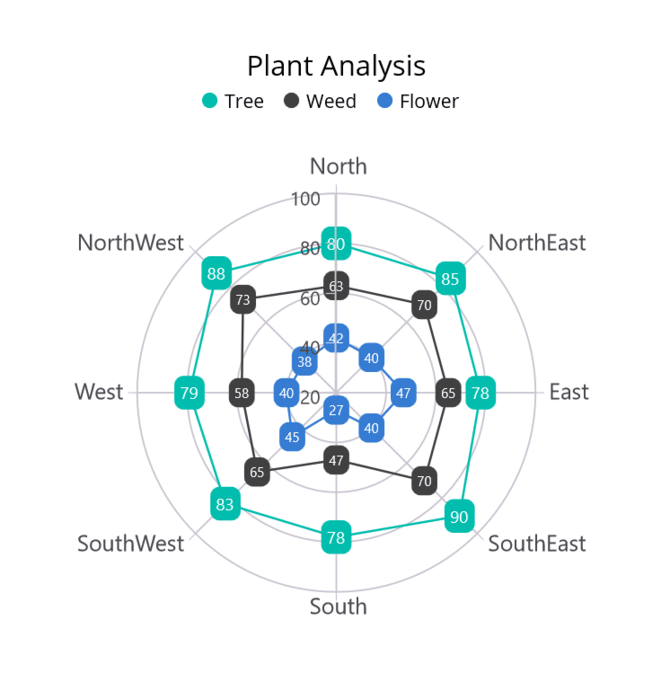

# Getting Started with .NET MAUI Polar Chart

This section explains how to populate the Polar Chart with data, including adding a title, data labels, a legend, tooltips, and markers. It also covers the essential aspects needed to get started with the Polar Chart.

## Prerequisites

Before proceeding, ensure that the following are set up:
1. [.NET 8 SDK](https://dotnet.microsoft.com/en-us/download/dotnet/8.0) or later is installed.
2. A .NET MAUI development environment is configured using either:
    - Visual Studio 2022 (version 17.8 or later), or
    - Visual Studio Code, with the .NET MAUI workload installed and configured. For more information on setting up Visual Studio Code with .NET MAUI, see the official [documentation.](https://learn.microsoft.com/en-us/dotnet/maui/get-started/installation?view=net-maui-8.0&tabs=visual-studio-code)

## Step 1: Create a New .NET MAUI Project

### Visual Studio

1. Go to **File > New > Project** and choose the **.NET MAUI App** template.
2. Name the project and choose a location. Then click **Next**.
3. Select the .NET framework version and click **Create**.

### Visual Studio Code

1. Open the command palette by pressing `Ctrl+Shift+P` and type **.NET:New Project** and enter.
2. Choose the **.NET MAUI App** template.
3. Select the project location, type the project name and press **Enter**.
4. Then choose **Create project.**

## Step 2: Install the Syncfusion .NET MAUI Toolkit Package

### Visual Studio

1. In **Solution Explorer,** `right-click` the project and choose **Manage NuGet Packages.**
2. Search for [Syncfusion.Maui.Toolkit](https://www.nuget.org/packages/Syncfusion.Maui.Toolkit/) and install the latest version.
3. Ensure the necessary dependencies are installed correctly, and the project is restored.

### Visual Studio Code

1. Press <kbd>Ctrl</kbd> + <kbd>`</kbd> (backtick) to open the integrated terminal in Visual Studio Code.
2. Ensure you're in the project root directory where your .csproj file is located.
3. Run the command `dotnet add package Syncfusion.Maui.Toolkit` to install the Syncfusion .NET MAUI Toolkit NuGet package.
4. To ensure all dependencies are installed, run `dotnet restore`.

## Step 3: Register the handler

In the **MauiProgram.cs** file, register the handler for Syncfusion Toolkit.





using Syncfusion.Maui.Toolkit.Hosting;

public static class MauiProgram
{
    public static MauiApp CreateMauiApp()
    {
        var builder = MauiApp.CreateBuilder();

        builder
            .ConfigureSyncfusionToolkit() // Configure Syncfusion Toolkit
            .UseMauiApp<App>()
            .ConfigureFonts(fonts =>
            {
                fonts.AddFont("OpenSans-Regular.ttf", "OpenSansRegular");
                fonts.AddFont("OpenSans-Semibold.ttf", "OpenSansSemibold");
            });

        return builder.Build();
    }
}





## Step 4: Add .NET MAUI Polar Chart

1. Import the `Syncfusion.Maui.Toolkit.Charts` namespace into your code.
2. Initialize an instance of the `SfPolarChart` control.





<ContentPage xmlns="http://schemas.microsoft.com/dotnet/2021/maui"
             xmlns:x="http://schemas.microsoft.com/winfx/2009/xaml"
             xmlns:chart="clr-namespace:Syncfusion.Maui.Toolkit.Charts;assembly=Syncfusion.Maui.Toolkit"
             x:Class="GettingStarted.MainPage">

        <chart:SfPolarChart/>

</ContentPage>





// Import the necessary namespace for Syncfusion Maui Toolkit Charts
using Syncfusion.Maui.Toolkit.Charts;
. . .

public partial class MainPage : ContentPage
{
    public MainPage()
    {
        InitializeComponent();

        // Create a new instance of SfPolarChart
        SfPolarChart chart = new SfPolarChart();

        // Set the chart as the content of the page
        this.Content = chart;
    }
}





### Initialize view model

Define a simple data model to represent a data point in the chart:

  



/// 

/// Represents a model for plant data in different directions.
/// 

public class PlantModel   
{   
     public string? Direction { get; set; }

     public double Tree { get; set; }

     public double Flower { get; set; }

     public double Weed { get; set; }
}

 

 

Next, create a `PlantViewModel` class and initialize a list of `PlantModel` objects:

  



public class PlantViewModel
{
    // Observable collection to store plant details
    public ObservableCollection<PlantModel> PlantDetails { get; set; }

    public PlantViewModel()
    {
        // Initialize the PlantDetails collection with sample data
        PlantDetails = new ObservableCollection<PlantModel>()
        {
            // Create PlantModel objects for different directions
            // Each object contains the direction and counts for trees, flowers, and weeds
            new PlantModel(){ Direction = "North", Tree = 80, Flower = 42, Weed = 63},
            new PlantModel(){ Direction = "NorthEast", Tree = 85, Flower = 40, Weed = 70},
            new PlantModel(){ Direction = "East", Tree = 78 , Flower = 47, Weed = 65},
            new PlantModel(){ Direction = "SouthEast", Tree = 90 , Flower = 40, Weed = 70},
            new PlantModel(){ Direction = "South", Tree = 78 , Flower = 27, Weed = 47},
            new PlantModel(){ Direction = "SouthWest", Tree = 83 , Flower = 45, Weed = 65},
            new PlantModel(){ Direction = "West", Tree = 79 , Flower = 40, Weed = 58},
            new PlantModel(){ Direction = "NorthWest", Tree = 88 , Flower = 38, Weed = 73}
        };
    }
}

 

 

Set the `PlantViewModel` instance as the `BindingContext` of your view to bind the `PlantViewModel` properties to the chart:
 
N> If you prefer to set the `BindingContext` in XAML, make sure to add the appropriate namespace for the `PlantViewModel` class in your XAML page.

 



<ContentPage xmlns="http://schemas.microsoft.com/dotnet/2021/maui"
             xmlns:x="http://schemas.microsoft.com/winfx/2009/xaml"
             xmlns:chart="clr-namespace:Syncfusion.Maui.Toolkit.Charts;assembly=Syncfusion.Maui.Toolkit"
             xmlns:model="clr-namespace:GettingStarted"
             x:Class="GettingStarted.MainPage">

    <ContentPage.BindingContext>
        <model:PlantViewModel/>
    </ContentPage.BindingContext>
    
</ContentPage>





using Syncfusion.Maui.Toolkit.Charts;

. . .

public partial class MainPage : ContentPage
{
    public MainPage()
    {
        InitializeComponent();

        // Set the BindingContext of the current view to a new instance of PlantViewModel
        // This allows data binding between the view and the view model
        this.BindingContext = new PlantViewModel();

         // Create a new instance of SfPolarChart
        SfPolarChart chart = new SfPolarChart();

        // Set the chart as the content of the page
        this.Content = chart;
    }
}



 

### Initialize Chart axis

[ChartAxis](https://help.syncfusion.com/cr/maui-toolkit/Syncfusion.Maui.Toolkit.Charts.ChartAxis.html) is used to locate the data points inside the chart area. The [PrimaryAxis](https://help.syncfusion.com/cr/maui-toolkit/Syncfusion.Maui.Toolkit.Charts.SfPolarChart.html#Syncfusion_Maui_Toolkit_Charts_SfPolarChart_PrimaryAxis) and [SecondaryAxis](https://help.syncfusion.com/cr/maui-toolkit/Syncfusion.Maui.Toolkit.Charts.SfPolarChart.html#Syncfusion_Maui_Toolkit_Charts_SfPolarChart_SecondaryAxis) properties of the chart are used to initialize the axis for the chart.

 

 

<chart:SfPolarChart>                            
    <chart:SfPolarChart.PrimaryAxis>
        <chart:CategoryAxis/>
    </chart:SfPolarChart.PrimaryAxis>

    <chart:SfPolarChart.SecondaryAxis>
        <chart:NumericalAxis/>
    </chart:SfPolarChart.SecondaryAxis>                       
</chart:SfPolarChart>



 

// Create a new instance of SfPolarChart
SfPolarChart chart = new SfPolarChart();

// Create a new CategoryAxis for the primary (radial) axis
CategoryAxis primaryAxis = new CategoryAxis();
chart.PrimaryAxis = primaryAxis;

// Create a new NumericalAxis for the secondary (angular) axis
NumericalAxis secondaryAxis = new NumericalAxis();
chart.SecondaryAxis = secondaryAxis;

// Set the chart as the content of the current view/page
this.Content = chart;



 

### Populate Chart with data

To create a polar chart, you can add a [PolarLineSeries](https://help.syncfusion.com/cr/maui-toolkit/Syncfusion.Maui.Toolkit.Charts.PolarLineSeries.html) to the polar chart [Series](https://help.syncfusion.com/cr/maui-toolkit/Syncfusion.Maui.Toolkit.Charts.SfPolarChart.html#Syncfusion_Maui_Toolkit_Charts_SfPolarChart_Series) property of the chart, and  then bind the `PlantData` property of the above `ViewModel` to the `PolarLineSeries.ItemsSource` as follows.

N> In order to plot the series, the [XBindingPath](https://help.syncfusion.com/cr/maui-toolkit/Syncfusion.Maui.Toolkit.Charts.ChartSeries.html#Syncfusion_Maui_Toolkit_Charts_ChartSeries_XBindingPath) and [YBindingPath](https://help.syncfusion.com/cr/maui-toolkit/Syncfusion.Maui.Toolkit.Charts.XYDataSeries.html#Syncfusion_Maui_Toolkit_Charts_XYDataSeries_YBindingPath) properties need to be configured correctly. These properties allow the chart to retrieve values from the corresponding properties in the data model.

   



<chart:SfPolarChart>
    <chart:SfPolarChart.PrimaryAxis>
        <chart:CategoryAxis>
        </chart:CategoryAxis>
    </chart:SfPolarChart.PrimaryAxis>

    <chart:SfPolarChart.SecondaryAxis>
        <chart:NumericalAxis Maximum="100">
        </chart:NumericalAxis>
    </chart:SfPolarChart.SecondaryAxis>

    <chart:PolarLineSeries ItemsSource="{Binding PlantDetails}" XBindingPath="Direction" YBindingPath="Tree"/>
        
    <chart:PolarLineSeries ItemsSource="{Binding PlantDetails}" XBindingPath="Direction" YBindingPath="Weed"/>

    <chart:PolarLineSeries ItemsSource="{Binding PlantDetails}" XBindingPath="Direction" YBindingPath="Flower"/>

</chart:SfPolarChart>





SfPolarChart chart = new SfPolarChart();

// Initializing primary axis
CategoryAxis primaryAxis = new CategoryAxis();
chart.PrimaryAxis = primaryAxis;

//Initializing secondary Axis
NumericalAxis secondaryAxis = new NumericalAxis()
{
    Maximum = 100,
};
chart.SecondaryAxis = secondaryAxis;

//Initialize the series
PolarLineSeries series1 = new PolarLineSeries();
series1.ItemsSource = (new PlantViewModel()).PlantDetails;
series1.XBindingPath = "Direction";
series1.YBindingPath = "Tree";

PolarLineSeries series2 = new PolarLineSeries();
series2.ItemsSource = (new PlantViewModel()).PlantDetails;
series2.XBindingPath = "Direction";
series2.YBindingPath = "Weed";

PolarLineSeries series3 = new PolarLineSeries();
series3.ItemsSource = (new PlantViewModel()).PlantDetails;
series3.XBindingPath = "Direction";
series3.YBindingPath = "Flower";

//Adding Series to the Chart Series Collection
chart.Series.Add(series1);
chart.Series.Add(series2);
chart.Series.Add(series3);

this.Content = chart;


 

### Add a title

The title of the chart provides quick information to the user about the data being plotted in the chart. The [Title](https://help.syncfusion.com/cr/maui-toolkit/Syncfusion.Maui.Toolkit.Charts.ChartBase.html#Syncfusion_Maui_Toolkit_Charts_ChartBase_Title) property is used to set the title for the chart as follows.

 



<Grid>
    <chart:SfPolarChart>
        <chart:SfPolarChart.Title>
            <Label Text="Plant Analysis" HorizontalTextAlignment="Center"/>
        </chart:SfPolarChart.Title> 
    </chart:SfPolarChart>
</Grid>





// Create a new instance of SfPolarChart
SfPolarChart chart = new SfPolarChart();

// Set the chart title
chart.Title = new Label()
{
    Text = "Plant Analysis", // Specify the title text
    HorizontalTextAlignment = "Center"
};

// ... (Additional chart configuration code would go here)

// Set the chart as the content of the current page/view
this.Content = chart;



  

### Enable the data labels

The [ShowDataLabels](https://help.syncfusion.com/cr/maui-toolkit/Syncfusion.Maui.Toolkit.Charts.ChartSeries.html#Syncfusion_Maui_Toolkit_Charts_ChartSeries_ShowDataLabels) property of series can be used to enable the data labels to enhance the readability of the chart. The label visibility is set to `False` by default.

 



<chart:SfPolarChart>
    . . . 
    <chart:PolarLineSeries ShowDataLabels="True">
    </chart:PolarLineSeries>
</chart:SfPolarChart>





// Create a new instance of SfPolarChart
SfPolarChart chart = new SfPolarChart();
. . .
// Create a new instance of PolarLineSeries
PolarLineSeries series = new PolarLineSeries();

series.ShowDataLabels = true; // Enable data labels for the series

chart.Series.Add(series);
this.Content = chart;



  

### Enable a legend

The legend provides information about the data point displayed in the chart. The [Legend](https://help.syncfusion.com/cr/maui-toolkit/Syncfusion.Maui.Toolkit.Charts.ChartBase.html#Syncfusion_Maui_Toolkit_Charts_ChartBase_Legend) property of the chart was used to enable it.

 



<chart:SfPolarChart>
    . . .
    <chart:SfPolarChart.Legend>
        <chart:ChartLegend/>
    </chart:SfPolarChart.Legend>
    . . .
</chart:SfPolarChart>





// Create a new instance of SfPolarChart
SfPolarChart chart = new SfPolarChart();

// Initialize and assign a new ChartLegend to the chart's Legend property
chart.Legend = new ChartLegend(); 

// ... (other chart configuration code would go here)

this.Content = chart;



  

N> Additionally, set a label for each series using the `Label` property of the chart series, which will be displayed in the corresponding legend.

 



<chart:SfPolarChart>
    . . .
    <chart:PolarLineSeries ItemsSource="{Binding PlantDetails}" XBindingPath="Direction" YBindingPath="Tree"
                            Label="Tree"/>

    <chart:PolarLineSeries ItemsSource="{Binding PlantDetails}" XBindingPath="Direction" YBindingPath="Weed" 
                            Label="Weed"/>

    <chart:PolarLineSeries ItemsSource="{Binding PlantDetails}" XBindingPath="Direction" YBindingPath="Flower" 
                            Label="Flower"/>
</chart:SfPolarChart>





// Create a new instance of SfPolarChart
SfPolarChart chart = new SfPolarChart();

// Create an instance of the view model
var viewModel = new PlantViewModel();

// Create the first polar line series for Tree data
PolarLineSeries series1 = new PolarLineSeries(); 
series1.ItemsSource = viewModel.PlantDetails; // Set the data source
series1.XBindingPath = "Direction"; // Bind X-axis to Direction property
series1.YBindingPath = "Tree"; // Bind Y-axis to Tree property
series1.Label = "Tree"; // Set the label for the series

// Create the second polar line series for Weed data
PolarLineSeries series2 = new PolarLineSeries();
series2.ItemsSource = viewModel.PlantDetails;
series2.XBindingPath = "Direction";
series2.YBindingPath = "Weed";
series2.Label = "Weed";

// Create the third polar line series for Flower data
PolarLineSeries series3 = new PolarLineSeries();
series3.ItemsSource = viewModel.PlantDetails; 
series3.XBindingPath = "Direction";
series3.YBindingPath = "Flower";
series3.Label = "Flower";

// Add all three series to the chart
chart.Series.Add(series1);
chart.Series.Add(series2);
chart.Series.Add(series3);

// Set the chart as the content of the current page/view
this.Content = chart;



  

### Enable tooltip

Tooltips are used to display information about a segment when a user hovers over it. Enable the tooltip by setting the series [EnableTooltip](https://help.syncfusion.com/cr/maui-toolkit/Syncfusion.Maui.Toolkit.Charts.ChartSeries.html#Syncfusion_Maui_Toolkit_Charts_ChartSeries_EnableTooltip) property to true.

 



<chart:SfPolarChart>
    ...
    <chart:PolarLineSeries EnableTooltip="True"/>
    ...
</chart:SfPolarChart> 





// Create a new instance of SfPolarChart
SfPolarChart chart = new SfPolarChart();

// Create a new instance of PolarLineSeries
PolarLineSeries series = new PolarLineSeries();

series1.EnableTooltip = true; // Enable tooltips for the series

// ... (other series configuration)

chart.Series.Add(series);
this.Content = chart;





The following code example gives you the complete code of above configurations.

 



<ContentPage xmlns="http://schemas.microsoft.com/dotnet/2021/maui"
             xmlns:x="http://schemas.microsoft.com/winfx/2009/xaml"
             xmlns:chart="clr-namespace:Syncfusion.Maui.Toolkit.Charts;assembly=Syncfusion.Maui.Toolkit"
             xmlns:model="clr-namespace:GettingStarted"
             x:Class="GettingStarted.MainPage">

    <ContentPage.BindingContext>
        <model:PlantViewModel/>
    </ContentPage.BindingContext>

 <chart:SfPolarChart>
        <chart:SfPolarChart.Title>
            <Label Text="Plant Analysis" HorizontalTextAlignment="Center"/>
        </chart:SfPolarChart.Title>

        <chart:SfPolarChart.Legend>
            <chart:ChartLegend/>
        </chart:SfPolarChart.Legend>

        <chart:SfPolarChart.PrimaryAxis>
            <chart:CategoryAxis/>
        </chart:SfPolarChart.PrimaryAxis>

        <chart:SfPolarChart.SecondaryAxis>
            <chart:NumericalAxis Maximum="100"/>
        </chart:SfPolarChart.SecondaryAxis>

        <chart:PolarLineSeries ItemsSource="{Binding PlantDetails}" XBindingPath="Direction"
                         YBindingPath="Tree" Label="Tree" EnableTooltip="True" ShowDataLabels="True"/>

        <chart:PolarLineSeries ItemsSource="{Binding PlantDetails}" XBindingPath="Direction" 
                         YBindingPath="Weed" Label="Weed" EnableTooltip="True" ShowDataLabels="True"/>

        <chart:PolarLineSeries ItemsSource="{Binding PlantDetails}" XBindingPath="Direction"
                         YBindingPath="Flower" Label="Flower" EnableTooltip="True" ShowDataLabels="True"/>
    </chart:SfPolarChart>
</ContentPage>
 




using Syncfusion.Maui.Toolkit.Charts;

namespace ChartGettingStarted
{
    public partial class MainPage : ContentPage
    {
        public MainPage()
        {
            InitializeComponent();            
            
            // Create a new SfPolarChart instance
            SfPolarChart chart = new SfPolarChart();

            // Set the chart title
            chart.Title = new Label()
            {
                Text = "Plant Analysis",
                HorizontalTextAlignment = "Center"
            };

            // Create and set the primary axis (CategoryAxis)
            CategoryAxis primaryAxis = new CategoryAxis();
            chart.PrimaryAxis = primaryAxis;

            // Create and set the secondary axis (NumericalAxis)
            NumericalAxis secondaryAxis = new NumericalAxis()
            {
                Maximum="100"
            };
            chart.SecondaryAxis = secondaryAxis;

            // Create the first PolarLineSeries for Tree data
            PolarLineSeries  series1 = new PolarLineSeries()
            {
                ItemsSource = (new PlantViewModel()).PlantDetails,
                XBindingPath = "Direction",
                YBindingPath = "Tree",
                Label = "Tree", 
                EnableTooltip = true, 
                ShowDataLabels= true
            }; 

            // Create the second PolarLineSeries for Weed data
            PolarLineSeries  series2 = new PolarLineSeries()
            {
                ItemsSource = (new PlantViewModel()).PlantDetails,
                XBindingPath = "Direction",
                YBindingPath = "Weed",
                Label = "Weed", 
                EnableTooltip = true, 
                ShowDataLabels = true,
            }; 

            // Create the third PolarLineSeries for Flower data
            PolarLineSeries series3 = new PolarLineSeries()
            {
                ItemsSource = (new PlantViewModel()).PlantDetails,
                XBindingPath = "Direction",
                YBindingPath = "Flower",
                Label = "Flower", 
                EnableTooltip = true, 
                ShowDataLabels = true,
            };   

            // Add all series to the chart
            chart.Series.Add(series1);
            chart.Series.Add(series2);
            chart.Series.Add(series3);

            // Set the chart as the content of the page
            this.Content = chart;
        }
    }   
}





The following chart is created as a result of the previous codes.

You can find the complete getting started sample from this [link](https://github.com/SyncfusionExamples/maui-toolkit-samples/tree/master/PolarChart/GettingStarted).