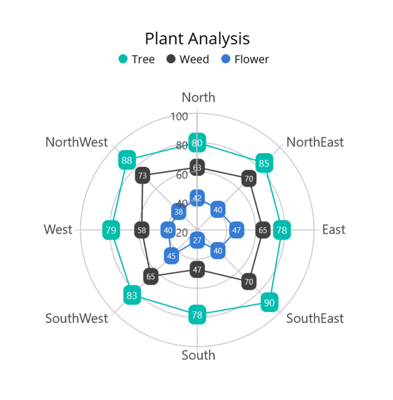

# Getting Started with .NET MAUI Polar Chart

This section explains how to populate the Polar Chart with data, including adding a title, data labels, a legend, tooltips, and markers. It also covers the essential aspects needed to get started with the [Polar Chart](https://help.syncfusion.com/cr/maui-toolkit/Syncfusion.Maui.Toolkit.Charts.SfPolarChart.html).




## Prerequisites

Before proceeding, ensure the following are set up:

1. Install [.NET 9 SDK](https://dotnet.microsoft.com/en-us/download/dotnet/9.0) or later.
2. Set up a .NET MAUI environment with Visual Studio 2022 v17.12 or later.

## Step 1: Create a new .NET MAUI project

1. Go to **File > New > Project** and choose the **.NET MAUI App** template.
2. Name the project and choose a location. Then click **Next**.
3. Select the .NET framework version and click **Create**.

## Step 2: Install the Syncfusion&reg; .NET MAUI Toolkit NuGet package

1. In **Solution Explorer,** right-click the project and choose **Manage NuGet Packages.**
2. Search for [Syncfusion.Maui.Toolkit](https://www.nuget.org/packages/Syncfusion.Maui.Toolkit/) and install the latest version.
3. Ensure the necessary dependencies are installed correctly, and the project is restored.




## Prerequisites

Before proceeding, ensure the following are set up:

1. Install [.NET 9 SDK](Download .NET 9.0 (Linux, macOS, and Windows) | .NET) or later.
2. Set up a .NET MAUI environment with Visual Studio Code.
3. Ensure that the .NET MAUI workloads are installed and configured as described [here](https://learn.microsoft.com/en-us/dotnet/maui/get-started/installation?view=net-maui-9.0&tabs=visual-studio-code).

## Step 1: Create a new .NET MAUI project

1. Open the command palette by pressing `Ctrl+Shift+P` and type **.NET:New Project** and enter.
2. Choose the **.NET MAUI App** template.
3. Select the project location, type the project name and press **Enter**.
4. Then choose **Create project.**

## Step 2: Install the Syncfusion&reg; .NET MAUI Toolkit NuGet package

1. Press <kbd>Ctrl</kbd> + <kbd>`</kbd> (backtick) to open the integrated terminal in Visual Studio Code.
2. Ensure you're in the project root directory where your .csproj file is located.
3. Run the command `dotnet add package Syncfusion.Maui.Toolkit` to install the Syncfusion® .NET MAUI Toolkit NuGet package.
4. To ensure all dependencies are installed, run `dotnet restore`.




## Prerequisites

Before proceeding, ensure the following are set up:

1. Install [.NET 9 SDK](Download .NET 9.0 (Linux, macOS, and Windows) | .NET) or later.
2. Set up a .NET MAUI environment with JetBrains Rider 2024.3 or later.
3. Make sure the MAUI workloads are installed and configured as described [here.](https://www.jetbrains.com/help/rider/MAUI.html#before-you-start)

## Step 1: Create a new .NET MAUI project

1. Go to **File > New Solution,** Select .NET (C#) and choose the .NET MAUI App template.
2. Enter the Project Name, Solution Name, and Location.
3. Select the .NET framework version and click Create.

## Step 2: Install the Syncfusion® MAUI Toolkit NuGet package

1. In **Solution Explorer,** right-click the project and choose **Manage NuGet Packages.**
2. Search for [Syncfusion.Maui.Toolkit](https://www.nuget.org/packages/Syncfusion.Maui.Toolkit/) and install the latest version.
3. Ensure the necessary dependencies are installed correctly, and the project is restored. If not, Open the Terminal in Rider and manually run: `dotnet restore`




## Step 3: Register the handler

Make sure to add the namespace.
 


using Syncfusion.Maui.Toolkit.Hosting;

 
Register the Syncfusion core handler in your CreateMauiApp method of `MauiProgram.cs` file to use Syncfusion controls.
 

builder.ConfigureSyncfusionToolkit();


## Step 4: Create the Model

Define a simple data model to represent a data point in the chart:

  


public class PlantModel   
{   
     public string? Direction { get; set; }
     public double Tree { get; set; }
     public double Flower { get; set; }
     public double Weed { get; set; }
}

 
 

## Step 5: Initialize the ViewModel

Next, create a `PlantViewModel` class and initialize a list of `PlantModel` objects:

  


public class PlantViewModel
{
    public ObservableCollection<PlantModel> PlantDetails { get; set; }

    public PlantViewModel()
    {
        PlantDetails = new ObservableCollection<PlantModel>()
        {
            new PlantModel(){ Direction = "North", Tree = 80, Flower = 42, Weed = 63},
            new PlantModel(){ Direction = "NorthEast", Tree = 85, Flower = 40, Weed = 70},
            new PlantModel(){ Direction = "East", Tree = 78 , Flower = 47, Weed = 65},
            new PlantModel(){ Direction = "SouthEast", Tree = 90 , Flower = 40, Weed = 70},
            new PlantModel(){ Direction = "South", Tree = 78 , Flower = 27, Weed = 47},
            new PlantModel(){ Direction = "SouthWest", Tree = 83 , Flower = 45, Weed = 65},
            new PlantModel(){ Direction = "West", Tree = 79 , Flower = 40, Weed = 58},
            new PlantModel(){ Direction = "NorthWest", Tree = 88 , Flower = 38, Weed = 73}
        };
    }
}

 
 

## Step 6: Import Polar Chart namespace

Add the following namespace in your XAML or C#.



xmlns:chart="clr-namespace:Syncfusion.Maui.Toolkit.Charts;assembly=Syncfusion.Maui.Toolkit"




using Syncfusion.Maui.Toolkit.Charts;




## Step 7: Add the Polar Chart component

[ChartAxis](https://help.syncfusion.com/cr/maui-toolkit/Syncfusion.Maui.Toolkit.Charts.ChartAxis.html) is used to locate the data points inside the chart area. The [PrimaryAxis](https://help.syncfusion.com/cr/maui-toolkit/Syncfusion.Maui.Toolkit.Charts.SfPolarChart.html#Syncfusion_Maui_Toolkit_Charts_SfPolarChart_PrimaryAxis) and [SecondaryAxis](https://help.syncfusion.com/cr/maui-toolkit/Syncfusion.Maui.Toolkit.Charts.SfPolarChart.html#Syncfusion_Maui_Toolkit_Charts_SfPolarChart_SecondaryAxis) properties of the chart are used to initialize the axis for the chart.

To create a polar chart, you can add a [PolarLineSeries](https://help.syncfusion.com/cr/maui-toolkit/Syncfusion.Maui.Toolkit.Charts.PolarLineSeries.html) to the polar chart [Series](https://help.syncfusion.com/cr/maui-toolkit/Syncfusion.Maui.Toolkit.Charts.SfPolarChart.html#Syncfusion_Maui_Toolkit_Charts_SfPolarChart_Series) property of the chart, and  then bind the `PlantData` property of the above `ViewModel` to the `PolarLineSeries.ItemsSource` as follows.

N> In order to plot the series, the [XBindingPath](https://help.syncfusion.com/cr/maui-toolkit/Syncfusion.Maui.Toolkit.Charts.ChartSeries.html#Syncfusion_Maui_Toolkit_Charts_ChartSeries_XBindingPath) and [YBindingPath](https://help.syncfusion.com/cr/maui-toolkit/Syncfusion.Maui.Toolkit.Charts.XYDataSeries.html#Syncfusion_Maui_Toolkit_Charts_XYDataSeries_YBindingPath) properties need to be configured correctly. These properties allow the chart to retrieve values from the corresponding properties in the data model.

 



<chart:SfPolarChart>
    <chart:SfPolarChart.Title>
        <Label Text="Plant Analysis" HorizontalTextAlignment="Center"/>
    </chart:SfPolarChart.Title>
    <chart:SfPolarChart.Legend>
        <chart:ChartLegend/>
    </chart:SfPolarChart.Legend>
    <chart:SfPolarChart.PrimaryAxis>
        <chart:CategoryAxis/>
    </chart:SfPolarChart.PrimaryAxis>
    <chart:SfPolarChart.SecondaryAxis>
        <chart:NumericalAxis Maximum="100"/>
    </chart:SfPolarChart.SecondaryAxis>
    <chart:PolarLineSeries ItemsSource="{Binding PlantDetails}" XBindingPath="Direction"
                           YBindingPath="Tree" Label="Tree" EnableTooltip="True" ShowDataLabels="True"/>
    <chart:PolarLineSeries ItemsSource="{Binding PlantDetails}" XBindingPath="Direction" 
                           YBindingPath="Weed" Label="Weed" EnableTooltip="True" ShowDataLabels="True"/>
    <chart:PolarLineSeries ItemsSource="{Binding PlantDetails}" XBindingPath="Direction"
                           YBindingPath="Flower" Label="Flower" EnableTooltip="True" ShowDataLabels="True"/>
</chart:SfPolarChart>
 




SfPolarChart chart = new SfPolarChart();
chart.Title = new Label()
{
    Text = "Plant Analysis",
    HorizontalTextAlignment = "Center"
};

CategoryAxis primaryAxis = new CategoryAxis();
chart.PrimaryAxis = primaryAxis;

NumericalAxis secondaryAxis = new NumericalAxis()
{
    Maximum="100"
};
chart.SecondaryAxis = secondaryAxis;

PolarLineSeries  series1 = new PolarLineSeries()
{
    ItemsSource = (new PlantViewModel()).PlantDetails,
    XBindingPath = "Direction",
    YBindingPath = "Tree",
    Label = "Tree", 
    EnableTooltip = true, 
    ShowDataLabels= true
}; 

PolarLineSeries  series2 = new PolarLineSeries()
{
    ItemsSource = (new PlantViewModel()).PlantDetails,
    XBindingPath = "Direction",
    YBindingPath = "Weed",
    Label = "Weed", 
    EnableTooltip = true, 
    ShowDataLabels = true,
}; 

PolarLineSeries series3 = new PolarLineSeries()
{
    ItemsSource = (new PlantViewModel()).PlantDetails,
    XBindingPath = "Direction",
    YBindingPath = "Flower",
    Label = "Flower", 
    EnableTooltip = true, 
    ShowDataLabels = true,
};   

chart.Series.Add(series1);
chart.Series.Add(series2);
chart.Series.Add(series3);

this.Content = chart;





The following chart is created as a result of the previous codes.

You can download the Polar Chart Getting Started sample from [here](https://github.com/SyncfusionExamples/maui-toolkit-samples/tree/master/PolarChart/GettingStarted).