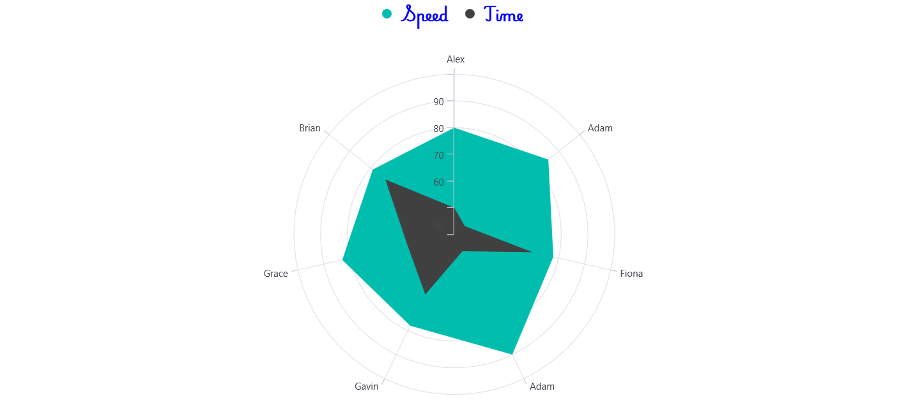
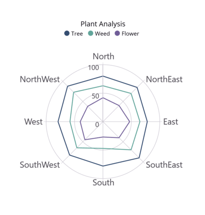

# Legend in .NET MAUI Chart (SfPolarChart)
The [Legend](https://help.syncfusion.com/cr/maui-toolkit/Syncfusion.Maui.Toolkit.Charts.ChartBase.html#Syncfusion_Maui_Toolkit_Charts_ChartBase_Legend) provides a list of polar series, helping to identify the corresponding data series in the chart. Here's a detailed guide on how to define and customize the legend in the polar chart.

## Defining the legend
To define the legend in the chart, initialize the [ChartLegend](https://help.syncfusion.com/cr/maui-toolkit/Syncfusion.Maui.Toolkit.Charts.ChartLegend.html) class and assign it to the [Legend](https://help.syncfusion.com/cr/maui-toolkit/Syncfusion.Maui.Toolkit.Charts.ChartBase.html#Syncfusion_Maui_Toolkit_Charts_ChartBase_Legend) property.





<chart:SfPolarChart>
    . . .
    <chart:SfPolarChart.Legend>
        <chart:ChartLegend/>
    </chart:SfPolarChart.Legend>
    . . .
</chart:SfPolarChart>





// Create a new instance of SfPolarChart
SfPolarChart chart = new SfPolarChart();

// Create and assign a new ChartLegend to the chart's Legend property
chart.Legend = new ChartLegend();

// Set the chart as the content of the current view/page
this.Content = chart;





## Legend visibility
The visibility of the chart legend can be controlled using the [IsVisible](https://help.syncfusion.com/cr/maui-toolkit/Syncfusion.Maui.Toolkit.Charts.ChartLegend.html#Syncfusion_Maui_Toolkit_Charts_ChartLegend_IsVisible) property. By default, the IsVisible property is set to `true`.




    
<chart:SfPolarChart>
    ...
    <chart:SfPolarChart.Legend>
        <chart:ChartLegend IsVisible = "True"/>
    </chart:SfPolarChart.Legend>
    ...
</chart:SfPolarChart>





SfPolarChart chart = new SfPolarChart();

// Configure the chart's legend
chart.Legend = new ChartLegend()
{ 
    // Set the visibility of the legend to true
    IsVisible = true 
};
. . .
this.Content = chart;




## Legend item visibility
The visibility of individual legend items for specific series can be controlled using the [IsVisibleOnLegend](https://help.syncfusion.com/cr/maui-toolkit/Syncfusion.Maui.Toolkit.Charts.ChartSeries.html#Syncfusion_Maui_Toolkit_Charts_ChartSeries_IsVisibleOnLegend) property of the series. The default value for IsVisibleOnLegend is `true`.




    
<chart:SfPolarChart>
    ...
    <chart:SfPolarChart.Legend>
        <chart:ChartLegend/>
    </chart:SfPolarChart.Legend> 

    <chart:PolarAreaSeries ItemsSource="{Binding  PlantDetails}" 
                           IsVisibleOnLegend="True"  Label="Tree"
                           XBindingPath="Direction" YBindingPath="Tree"/>

    <chart:PolarAreaSeries ItemsSource="{Binding PlantDetails}" 
                           XBindingPath="Direction" YBindingPath="Weed"
                           IsVisibleOnLegend="False" Label="Weed"/>
</chart:SfPolarChart>





// Create a new SfPolarChart instance
SfPolarChart chart = new SfPolarChart();

// Create a new PolarViewModel instance
PolarViewModel polarViewModel = new PolarViewModel();

chart.Legend = new ChartLegend(); // Add a legend to the chart

// Create the first PolarAreaSeries
PolarAreaSeries series1 = new PolarAreaSeries()
{
    XBindingPath = "Direction", 
    YBindingPath = "Tree", 
    ItemsSource = polarViewModel.PlantDetails, 
    Label = "Tree",              // Set the label for this series
    IsVisibleOnLegend =  true, 
};

// Create the second PolarAreaSeries
PolarAreaSeries series2 = new PolarAreaSeries()
{
    XBindingPath = "Direction", 
    YBindingPath = "Tree",  
    ItemsSource = polarViewModel.PlantDetails, 
    Label = "Weed",              // Set the label for this series
    IsVisibleOnLegend =  false,  // Hide this series from the legend
};

// Add both series to the chart
chart.Series.Add(series1);
chart.Series.Add(series2);

// Set the chart as the content of the current page or control
this.Content = chart;





## Customizing labels

The [`Label`](https://help.syncfusion.com/cr/maui-toolkit/Syncfusion.Maui.Toolkit.Charts.PolarSeries.html#Syncfusion_Maui_Toolkit_Charts_PolarSeries_Label) property of [`PolarSeries`](https://help.syncfusion.com/cr/maui-toolkit/Syncfusion.Maui.Toolkit.Charts.PolarSeries.html) is used to define the label for the corresponding polar series legend item. The appearance of the label can be customized using the [`LabelStyle`](https://help.syncfusion.com/cr/maui-toolkit/Syncfusion.Maui.Toolkit.Charts.ChartLegend.html#Syncfusion_Maui_Toolkit_Charts_ChartLegend_LabelStyle) property. 

* [`TextColor`](https://help.syncfusion.com/cr/maui-toolkit/Syncfusion.Maui.Toolkit.Charts.ChartLegendLabelStyle.html#Syncfusion_Maui_Toolkit_Charts_ChartLegendLabelStyle_TextColor) – Gets or sets the color of the label.
* [`FontFamily`](https://help.syncfusion.com/cr/maui-toolkit/Syncfusion.Maui.Toolkit.Charts.ChartLegendLabelStyle.html#Syncfusion_Maui_Toolkit_Charts_ChartLegendLabelStyle_FontFamily) - Gets or sets the font family for the legend label. 
* [`FontAttributes`](https://help.syncfusion.com/cr/maui-toolkit/Syncfusion.Maui.Toolkit.Charts.ChartLegendLabelStyle.html#Syncfusion_Maui_Toolkit_Charts_ChartLegendLabelStyle_FontAttributes) - Gets or sets the font style for the legend label. 
* [`FontSize`](https://help.syncfusion.com/cr/maui-toolkit/Syncfusion.Maui.Toolkit.Charts.ChartLegendLabelStyle.html#Syncfusion_Maui_Toolkit_Charts_ChartLegendLabelStyle_FontSize) - Gets or sets the font size for the legend label.
* [`Margin`](https://help.syncfusion.com/cr/maui-toolkit/Syncfusion.Maui.Toolkit.Charts.ChartLegendLabelStyle.html#Syncfusion_Maui_Toolkit_Charts_ChartLegendLabelStyle_Margin) - Gets or sets the margin size of labels.

 



<chart:SfPolarChart>
    <chart:SfPolarChart.Legend>
        <chart:ChartLegend>
            <chart:ChartLegend.LabelStyle>
                <chart:ChartLegendLabelStyle TextColor="Blue" Margin="5" FontSize="18" FontAttributes="Bold" FontFamily="PlaywriteAR-Regular"/>
            </chart:ChartLegend.LabelStyle>
        </chart:ChartLegend>
    </chart:SfPolarChart.Legend>
</chart:SfPolarChart>





// Create a new SfPolarChart instance
SfPolarChart chart = new SfPolarChart();
... 
// Create a new ChartLegend instance
ChartLegend legend = new ChartLegend();

// Create and configure the ChartLegendLabelStyle
ChartLegendLabelStyle labelStyle = new ChartLegendLabelStyle()
{
    TextColor = Color.Blue, 
    Margin = new Thickness(5), 
    FontSize = 18, 
    FontAttributes = FontAttributes.Bold, 
    FontFamily = "PlaywriteAR-Regular" 
};

// Assign the configured labelStyle to the legend
legend.LabelStyle = labelStyle;
chart.Legend = legend;
. . .
this.Content = chart;




## Legend icon
To specify the legend icon based on the associated series type, use the [LegendIcon](https://help.syncfusion.com/cr/maui-toolkit/Syncfusion.Maui.Toolkit.Charts.ChartSeries.html#Syncfusion_Maui_Toolkit_Charts_ChartSeries_LegendIcon) property and change its type using the [ChartLegendIconType](https://help.syncfusion.com/cr/maui-toolkit/Syncfusion.Maui.Toolkit.Charts.ChartLegendIconType.html) enum values. The default value of the LegendIcon property is `Circle`.





<chart:SfPolarChart>
    ...
    <chart:SfPolarChart.Legend>
        <chart:ChartLegend/>
    </chart:SfPolarChart.Legend> 

    <chart:PolarAreaSeries ItemsSource="{Binding  PlantDetails}" 
                           LegendIcon = "Diamond" Label="Tree"
                           XBindingPath="Direction" 
                           YBindingPath="Tree"/>
</chart:SfPolarChart>





// Create a new SfPolarChart instance
SfPolarChart chart = new SfPolarChart();

// Create a new PolarViewModel instance
PolarViewModel polarViewModel = new PolarViewModel();

// Add a legend to the chart
chart.Legend = new ChartLegend();

// Create a new PolarAreaSeries
PolarAreaSeries series = new PolarAreaSeries()
{
    XBindingPath = "Direction",
    YBindingPath = "Tree",
    ItemsSource = polarViewModel.PlantDetails,
    Label = "Tree",
    LegendIcon = ChartLegendIconType.Diamond, // Set the legend icon type to Diamond
};

// Add the series to the chart
chart.Series.Add(series);
this.Content = chart;





## Placement
The legend can be positioned to the left, right, top, or bottom of the chart area using the [Placement](https://help.syncfusion.com/cr/maui-toolkit/Syncfusion.Maui.Toolkit.Charts.ChartLegend.html#Syncfusion_Maui_Toolkit_Charts_ChartLegend_Placement) property in the ChartLegend class. The default placement is `Top`.





<chart:SfPolarChart>
    ...
    <chart:SfPolarChart.Legend>
        <chart:ChartLegend Placement="Bottom"/>
    </chart:SfPolarChart.Legend>
    ...
</chart:SfPolarChart>





SfPolarChart chart = new SfPolarChart();

// Configure the chart legend
chart.Legend = new ChartLegend()
{ 
    Placement = LegendPlacement.Bottom // Set the placement of the legend to the bottom of the chart
};

this.Content = chart;





## Toggle the series visibility
The visibility of polar series can be controlled by tapping the legend item using the [ToggleSeriesVisibility](https://help.syncfusion.com/cr/maui-toolkit/Syncfusion.Maui.Toolkit.Charts.ChartLegend.html#Syncfusion_Maui_Toolkit_Charts_ChartLegend_ToggleSeriesVisibility) property. The default value of ToggleSeriesVisibility is `false`.




    
<chart:SfPolarChart>
    ...
    <chart:SfPolarChart.Legend>
        <chart:ChartLegend ToggleSeriesVisibility="True"/>
    </chart:SfPolarChart.Legend> 
    
    <chart:PolarAreaSeries ItemsSource="{Binding  PlantDetails}" 
                           IsVisibleOnLegend="True"  Label="Tree"
                           XBindingPath="Direction" YBindingPath="Tree"/>

    <chart:PolarAreaSeries ItemsSource="{Binding PlantDetails}" 
                           XBindingPath="Direction" 
                           YBindingPath="Weed" 
                           IsVisibleOnLegend="False" Label="Weed"/>
</chart:SfPolarChart>





// Create a new instance of SfPolarChart
SfPolarChart chart = new SfPolarChart();

// Create a new instance of PolarViewModel
PolarViewModel polarViewModel = new PolarViewModel();

// Configure the chart legend
chart.Legend = new ChartLegend()
{ 
    ToggleSeriesVisibility = true // Enable toggling series visibility from the legend
};

// Create and configure the first PolarAreaSeries
PolarAreaSeries series1 = new PolarAreaSeries()
{
    // ... (Series1 configuration details)
};

// Create and configure the second PolarAreaSeries
PolarAreaSeries series2 = new PolarAreaSeries()
{
    // ... (Series2 configuration details)
};

chart.Series.Add(series1);
chart.Series.Add(series2);
this.Content = chart;





## Legend maximum size request
To set the maximum size request for the legend view, override the [GetMaximumSizeCoefficient](https://help.syncfusion.com/cr/maui-toolkit/Syncfusion.Maui.Toolkit.Charts.ChartLegend.html#Syncfusion_Maui_Toolkit_Charts_ChartLegend_GetMaximumSizeCoefficient) protected method in [ChartLegend](https://help.syncfusion.com/cr/maui-toolkit/Syncfusion.Maui.Toolkit.Charts.ChartLegend.html) class. The value should be between 0 and 1, representing the maximum size request, not the desired size for the legend items layout.





<chart:SfPolarChart>
    . . .
    <chart:SfPolarChart.Legend>
        <chart:LegendExt/>
    </chart:SfPolarChart.Legend>
    . . .
</chart:SfPolarChart>





// Define a custom legend class that extends ChartLegend
public class LegendExt : ChartLegend
{
    // Override the GetMaximumSizeCoefficient method to customize the legend size
    protected override double GetMaximumSizeCoefficient()
    {
        // Return a custom size coefficient of 0.7 (70% of available space)
        return 0.7;
    }
}

// Create a new instance of SfPolarChart
SfPolarChart chart = new SfPolarChart();

// Set the chart's legend to use the custom LegendExt class
chart.Legend = new LegendExt();





## Items layout
An [ItemsLayout](https://help.syncfusion.com/cr/maui-toolkit/Syncfusion.Maui.Toolkit.Charts.ChartLegend.html#Syncfusion_Maui_Toolkit_Charts_ChartLegend_ItemsLayout) property is used to customize the arrangement and position for each legend item. The default value is `null`. It accepts any layout type in ItemsLayout property.





<chart:SfPolarChart>
    ...
    <chart:SfPolarChart.Legend>
        <chart:ChartLegend>
            <chart:ChartLegend.ItemsLayout>
                    <FlexLayout  HorizontalOptions="Start" 
                                 Margin="10"
                                 WidthRequest="{Binding Width, Source={x:Reference Chart1}}">
                    </FlexLayout>
            </chart:ChartLegend.ItemsLayout>
        </chart:ChartLegend>
    </chart:SfPolarChart.Legend>

    <chart:PolarAreaSeries ItemsSource="{Binding  PlantDetails}" 
                           Label="Tree"
                           XBindingPath="Direction"
                           YBindingPath="Tree"/>

    <chart:PolarAreaSeries ItemsSource="{Binding PlantDetails}"
                           XBindingPath="Direction" 
                           YBindingPath="Weed" 
                           Label="Weed"/>

    <chart:PolarLineSeries ItemsSource="{Binding PlantDetails}" 
                           XBindingPath="Direction"
                           YBindingPath="Flower" 
                           Label="Flower"/>
</chart:SfPolarChart>





// Create a new instance of SfPolarChart
SfPolarChart chart = new SfPolarChart();
    
// Create a new instance of ChartLegend
ChartLegend legend = new ChartLegend();

// Create a new FlexLayout for the legend items
FlexLayout layout = new FlexLayout();
layout.Wrap = FlexWrap.Wrap;
layout.HorizontalOptions = LayoutOptions.Start;
layout.SetBinding(WidthRequestProperty, nameof(SfPolarChart.WidthProperty));
legend.ItemsLayout = layout;

// ... (other legend configurations)

// Set the configured legend to the chart
chart.Legend = legend;
this.Content = chart;
        




## Item template
The [ChartLegend](https://help.syncfusion.com/cr/maui-toolkit/Syncfusion.Maui.Toolkit.Charts.ChartLegend.html) supports customizing the appearance of legend items using the [ItemTemplate](https://help.syncfusion.com/cr/maui-toolkit/Syncfusion.Maui.Toolkit.Charts.ChartLegend.html#Syncfusion_Maui_Toolkit_Charts_ChartLegend_ItemTemplate) property. The default value of ItemsTemplate is `null`.

N> The BindingContext of the template is the corresponding underlying legend item provided in the ChartLegendItem class.





<chart:SfPolarChart >
    <chart:SfPolarChart.Resources>
        <DataTemplate x:Key="legendTemplate">
            <StackLayout Orientation="Horizontal">
                <Rectangle HeightRequest="12" 
                           WidthRequest="12" Margin="3"
                           Background="{Binding IconBrush}"/>
                <Label Text="{Binding Text}" 
                       Margin="3"/>
            </StackLayout>
        </DataTemplate>
    </chart:SfPolarChart.Resources>  
    
    <chart:SfPolarChart.Legend>
        <chart:ChartLegend ItemTemplate="{StaticResource legendTemplate}">
        </chart:ChartLegend>
    </chart:SfPolarChart.Legend>

    <chart:PolarAreaSeries ItemsSource="{Binding  PlantDetails}" 
                           Label="Tree"
                           XBindingPath="Direction"
                           YBindingPath="Tree"/>

    <chart:PolarAreaSeries ItemsSource="{Binding PlantDetails}" 
                           XBindingPath="Direction" 
                           YBindingPath="Weed" 
                           Label="Weed"/>
</chart:SfPolarChart>





// Create a new instance of SfPolarChart
SfPolarChart chart = new SfPolarChart();
// ... (Additional chart configuration)

// Create a new instance of ChartLegend
ChartLegend legend = new ChartLegend();

// Set the ItemTemplate of the legend to a DataTemplate resource named "legendTemplate"
legend.ItemTemplate = chart.Resources["legendTemplate"] as DataTemplate;
// ... (Additional legend configuration)

// Assign the configured legend to the chart's Legend property
chart.Legend = legend;

// Set the chart as the content of the current control/page
this.Content = chart;
        




## Event 

**LegendItemCreated**

The [`LegendItemCreated`](https://help.syncfusion.com/cr/maui-toolkit/Syncfusion.Maui.Toolkit.Charts.ChartLegend.html#Syncfusion_Maui_Toolkit_Charts_ChartLegend_LegendItemCreated) event is triggered when the chart legend item is created. The argument contains the [`LegendItem`](https://help.syncfusion.com/cr/maui-toolkit/Syncfusion.Maui.Toolkit.LegendItemEventArgs.html#Syncfusion_Maui_Toolkit_LegendItemEventArgs_LegendItem) object. The following properties are present in [`LegendItem`](https://help.syncfusion.com/cr/maui-toolkit/Syncfusion.Maui.Toolkit.LegendItemEventArgs.html#Syncfusion_Maui_Toolkit_LegendItemEventArgs_LegendItem).

* [`Text`](https://help.syncfusion.com/cr/maui-toolkit/Syncfusion.Maui.Toolkit.ILegendItem.html#Syncfusion_Maui_Toolkit_ILegendItem_Text) – used to get or set the text of the label.
* [`TextColor`](https://help.syncfusion.com/cr/maui-toolkit/Syncfusion.Maui.Toolkit.ILegendItem.html#Syncfusion_Maui_Toolkit_ILegendItem_TextColor) – used to get or set the color of the label.
* [`FontFamily`](https://help.syncfusion.com/cr/maui-toolkit/Syncfusion.Maui.Toolkit.ILegendItem.html#Syncfusion_Maui_Toolkit_ILegendItem_FontFamily) - used to get or set the font family for the legend label. 
* [`FontAttributes`](https://help.syncfusion.com/cr/maui-toolkit/Syncfusion.Maui.Toolkit.ILegendItem.html#Syncfusion_Maui_Toolkit_ILegendItem_FontAttributes) - used to get or set the font style for the legend label. 
* [`FontSize`](https://help.syncfusion.com/cr/maui-toolkit/Syncfusion.Maui.Toolkit.ILegendItem.html#Syncfusion_Maui_Toolkit_ILegendItem_FontSize) - used to get or set the font size for the legend label.
* [`TextMargin`](https://help.syncfusion.com/cr/maui-toolkit/Syncfusion.Maui.Toolkit.ILegendItem.html#Syncfusion_Maui_Toolkit_ILegendItem_TextMargin) - used to get or set the margin size of labels.
* [`IconBrush`](https://help.syncfusion.com/cr/maui-toolkit/Syncfusion.Maui.Toolkit.ILegendItem.html#Syncfusion_Maui_Toolkit_ILegendItem_IconBrush) - used to change the color of the legend icon.
* [`IconType`](https://help.syncfusion.com/cr/maui-toolkit/Syncfusion.Maui.Toolkit.ILegendItem.html#Syncfusion_Maui_Toolkit_ILegendItem_IconType) - used to get or set the icon type for the legend icon.
* [`IconHeight`](https://help.syncfusion.com/cr/maui-toolkit/Syncfusion.Maui.Toolkit.ILegendItem.html#Syncfusion_Maui_Toolkit_ILegendItem_IconHeight) - used to get or set the icon height of the legend icon.
* [`IconWidth`](https://help.syncfusion.com/cr/maui-toolkit/Syncfusion.Maui.Toolkit.ILegendItem.html#Syncfusion_Maui_Toolkit_ILegendItem_IconWidth) - used to get or set the icon width of the legend icon.
* [`IsToggled`](https://help.syncfusion.com/cr/maui-toolkit/Syncfusion.Maui.Toolkit.ILegendItem.html#Syncfusion_Maui_Toolkit_ILegendItem_IsToggled) - used to get or set the toggle visibility of the legend.
* [`DisableBrush`](https://help.syncfusion.com/cr/maui-toolkit/Syncfusion.Maui.Toolkit.ILegendItem.html#Syncfusion_Maui_Toolkit_ILegendItem_DisableBrush) - used to get or set the color of the legend when toggled.
* [`Index`](https://help.syncfusion.com/cr/maui-toolkit/Syncfusion.Maui.Toolkit.ILegendItem.html#Syncfusion_Maui_Toolkit_ILegendItem_Index) - used to get index position of the legend.
* [`Item`](https://help.syncfusion.com/cr/maui-toolkit/Syncfusion.Maui.Toolkit.ILegendItem.html#Syncfusion_Maui_Toolkit_ILegendItem_Item) - used to get the corresponding series for the legend item.

## Limitations
* Do not add items explicitly.
* When using BindableLayouts, do not bind ItemsSource explicitly.
* For better UX, arrange items vertically for left and right dock positions, and horizontally for top and bottom dock positions.
* If the layout's measured size is larger than the MaximumHeightRequest, scrolling will be enabled.
* If MaximumHeightRequest is set to 1 and the chart's available size is smaller than the layout's measured size, the series may not have enough space to draw properly.