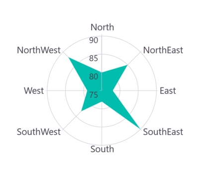
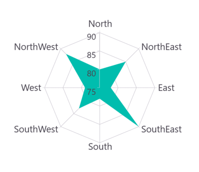
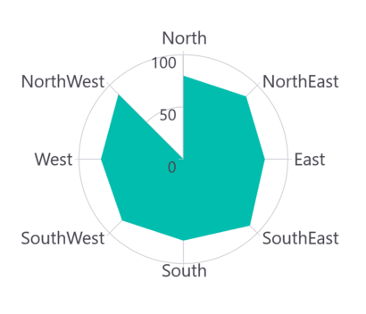

# Polar Area Chart in .NET MAUI Chart

## Polar Area Chart

To display an area series in a polar chart, instantiate the [PolarAreaSeries](https://help.syncfusion.com/cr/maui-toolkit/Syncfusion.Maui.Toolkit.Charts.PolarAreaSeries.html) and include it in the [Series](https://help.syncfusion.com/cr/maui-toolkit/Syncfusion.Maui.Toolkit.Charts.SfPolarChart.html#Syncfusion_Maui_Toolkit_Charts_SfPolarChart_Series) collection property of [SfPolarChart](https://help.syncfusion.com/cr/maui-toolkit/Syncfusion.Maui.Toolkit.Charts.SfPolarChart.html).





<chart:SfPolarChart> 
    <chart:SfPolarChart.PrimaryAxis>
        <chart:CategoryAxis/>
    </chart:SfPolarChart.PrimaryAxis>

    <chart:SfPolarChart.SecondaryAxis>
        <chart:NumericalAxis/>
    </chart:SfPolarChart.SecondaryAxis>   

    <chart:PolarAreaSeries ItemsSource="{Binding PlantDetails}" XBindingPath="Direction" YBindingPath="Tree"/>  
</chart:SfPolarChart>





// Create a new instance of SfPolarChart
SfPolarChart chart = new SfPolarChart();

CategoryAxis primaryAxis = new CategoryAxis(); // Create a primary axis (CategoryAxis) for the chart
chart.PrimaryAxis = primaryAxis;

NumericalAxis secondaryAxis = new NumericalAxis(); // Create a secondary axis (NumericalAxis) for the chart
chart.SecondaryAxis = secondaryAxis;

// Create a new PolarAreaSeries and configure its properties
PolarAreaSeries series = new PolarAreaSeries()
{
    ItemsSource = new ViewModel().PlantDetails, // Set the data source for the series
    XBindingPath = "Direction", // Specify the property to be used for X-axis values
    YBindingPath = "Tree" // Specify the property to be used for Y-axis values
};

// Add the series to the chart's collection of series
chart.Series.Add(series);
this.Content = chart;





## Grid Line Type

The [GridLineType](https://help.syncfusion.com/cr/maui-toolkit/Syncfusion.Maui.Toolkit.Charts.SfPolarChart.html#Syncfusion_Maui_Toolkit_Charts_SfPolarChart_GridLineType) property is used to customize the rendering style of axis grid lines. The default [GridLineType](https://help.syncfusion.com/cr/maui-toolkit/Syncfusion.Maui.Toolkit.Charts.SfPolarChart.html#Syncfusion_Maui_Toolkit_Charts_SfPolarChart_GridLineType) is [Circle](https://help.syncfusion.com/cr/maui-toolkit/Syncfusion.Maui.Toolkit.Charts.PolarChartGridLineType.html#Syncfusion_Maui_Toolkit_Charts_PolarChartGridLineType_Circle). Switching to the [Polygon](https://help.syncfusion.com/cr/maui-toolkit/Syncfusion.Maui.Toolkit.Charts.PolarChartGridLineType.html#Syncfusion_Maui_Toolkit_Charts_PolarChartGridLineType_Polygon) grid line type transforms the polar chart appearance, resembling a spider or web chart.





<chart:SfPolarChart GridLineType="Polygon"> 
    . . .
    <chart:PolarAreaSeries ItemsSource="{Binding PlantDetails}" XBindingPath="Direction" YBindingPath="Tree"/>  
</chart:SfPolarChart>





// Create a new SfPolarChart instance
SfPolarChart chart = new SfPolarChart();

// Set the grid line type to Polygon
chart.GridLineType = PolarChartGridLineType.Polygon;

// ... (other chart configurations)

// Create a new PolarAreaSeries
PolarAreaSeries series = new PolarAreaSeries()
{
    ItemsSource = new ViewModel().PlantDetails,
    XBindingPath = "Direction",
    YBindingPath = "Tree"
};

// Add the series to the chart's Series collection
chart.Series.Add(series);
this.Content = chart;





## Closed Series

The [IsClosed](https://help.syncfusion.com/cr/maui-toolkit/Syncfusion.Maui.Toolkit.Charts.PolarSeries.html#Syncfusion_Maui_Toolkit_Charts_PolarSeries_IsClosed) property is used to render the series with or without a closed path. The default value of [IsClosed](https://help.syncfusion.com/cr/maui-toolkit/Syncfusion.Maui.Toolkit.Charts.PolarSeries.html#Syncfusion_Maui_Toolkit_Charts_PolarSeries_IsClosed) is `true`.





<chart:SfPolarChart> 
    . . .
    <chart:PolarAreaSeries ItemsSource="{Binding PlantDetails}" 
        XBindingPath="Direction" 
        YBindingPath="Tree" 
        IsClosed="False"/>  
</chart:SfPolarChart>





// Create a new instance of SfPolarChart
SfPolarChart chart = new SfPolarChart();
. . .
// Create a new PolarAreaSeries
PolarAreaSeries series = new PolarAreaSeries()
{
    ItemsSource = new ViewModel().PlantDetails,
    XBindingPath = "Direction",
    YBindingPath = "Tree",
    
    // Set whether the series should be closed or open
    // False means the series will not be closed (no line connecting start and end points)
    IsClosed = false
};

// Add the series to the chart's Series collection
chart.Series.Add(series);
this.Content = chart;





## Enable Marker

A marker, also known as a symbol, is used to determine or highlight the position of the data point. To enable markers in the series, set the [ShowMarkers](https://help.syncfusion.com/cr/maui-toolkit/Syncfusion.Maui.Toolkit.Charts.PolarSeries.html#Syncfusion_Maui_Toolkit_Charts_PolarSeries_ShowMarkers) property to true.





<chart:SfPolarChart>
    ...
    <chart:PolarAreaSeries ItemsSource="{Binding PlantDetails}" XBindingPath="Direction"
            YBindingPath="Tree" 
            ShowMarkers="True"/>
</chart:SfPolarChart>





// Create a new instance of SfPolarChart
SfPolarChart chart = new SfPolarChart();
...
// Create a new PolarAreaSeries
PolarAreaSeries series = new PolarAreaSeries()
{
    ItemsSource = new ViewModel().PlantDetails,
    XBindingPath = "Direction",
    YBindingPath = "Tree",
    ShowMarkers = true // Enable markers for data points
};

// Add the series to the chart's Series collection
chart.Series.Add(series);
this.Content = chart;





### Marker customization

In order to change the series markers appearance, create an instance of the [MarkerSettings](https://help.syncfusion.com/cr/maui-toolkit/Syncfusion.Maui.Toolkit.Charts.PolarSeries.html#Syncfusion_Maui_Toolkit_Charts_PolarSeries_MarkerSettings) property. The following properties are used to customize marker appearance.

* [Type](https://help.syncfusion.com/cr/maui-toolkit/Syncfusion.Maui.Toolkit.Charts.ChartMarkerSettings.html#Syncfusion_Maui_Toolkit_Charts_ChartMarkerSettings_Type), of type `ShapeType`, describes the shape of the series marker. The default value of this property is `ShapeType.Circle`.
* [Stroke](https://help.syncfusion.com/cr/maui-toolkit/Syncfusion.Maui.Toolkit.Charts.ChartMarkerSettings.html#Syncfusion_Maui_Toolkit_Charts_ChartMarkerSettings_Stroke), of type `Brush`, indicates the brush used to paint the marker border.
* [StrokeWidth](https://help.syncfusion.com/cr/maui-toolkit/Syncfusion.Maui.Toolkit.Charts.ChartMarkerSettings.html#Syncfusion_Maui_Toolkit_Charts_ChartMarkerSettings_StrokeWidth), of type `double`, indicates the width of the marker border.
* [Fill](https://help.syncfusion.com/cr/maui-toolkit/Syncfusion.Maui.Toolkit.Charts.ChartMarkerSettings.html#Syncfusion_Maui_Toolkit_Charts_ChartMarkerSettings_Fill), of type `Brush`, indicates the color of the marker.
* [Width](https://help.syncfusion.com/cr/maui-toolkit/Syncfusion.Maui.Toolkit.Charts.ChartMarkerSettings.html#Syncfusion_Maui_Toolkit_Charts_ChartMarkerSettings_Width), of type `double`, indicates the width of the marker.
* [Height](https://help.syncfusion.com/cr/maui-toolkit/Syncfusion.Maui.Toolkit.Charts.ChartMarkerSettings.html#Syncfusion_Maui_Toolkit_Charts_ChartMarkerSettings_Height), of type `double`, indicates the height of the marker.





<chart:SfPolarChart>
    ...
    <chart:PolarAreaSeries ItemsSource="{Binding PlantDetails}" XBindingPath="Direction" YBindingPath="Tree"
                           ShowMarkers="True">
        <chart:PolarAreaSeries.MarkerSettings>
            <chart:ChartMarkerSettings Type="Diamond" Fill="Brown" Stroke="Black"
                                       StrokeWidth="1" Height="8" Width="8"/>
        </chart:PolarAreaSeries.MarkerSettings>
    </chart:PolarAreaSeries>
</chart:SfPolarChart>





// Create a new instance of SfPolarChart
SfPolarChart chart = new SfPolarChart();
...

// Create and configure chart marker settings
ChartMarkerSettings chartMarker = new ChartMarkerSettings();
chartMarker.Type = ShapeType.Diamond;  // Set marker shape to diamond
chartMarker.Fill = Colors.Brown; // Set fill color of markers
chartMarker.Stroke = Colors.Black; // Set outline color of markers
chartMarker.StrokeWidth = 1; // Set outline width of markers
chartMarker.Height = 8; // Set height of markers
chartMarker.Width = 8; // Set width of markers

// Create a new PolarAreaSeries
PolarAreaSeries series = new PolarAreaSeries()
{
    ItemsSource = new ViewModel().PlantDetails,
    XBindingPath = "Direction",
    YBindingPath = "Tree",
    ShowMarkers = true,  // Enable markers for data points
    MarkerSettings = chartMarker // Apply marker settings
};

// Add the series to the chart
chart.Series.Add(series);
this.Content = chart;



