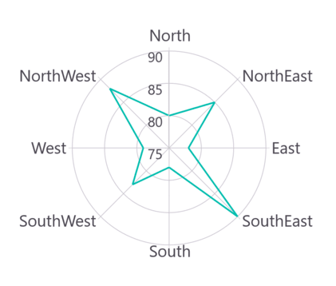
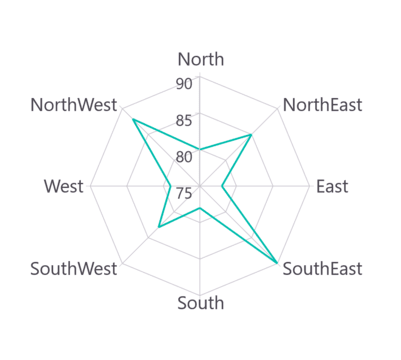
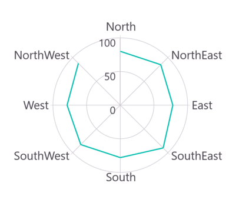

# Polar Line Chart in .NET MAUI Chart

## Polar Line Chart

To display a line series in a polar chart, instantiate the [PolarLineSeries](https://help.syncfusion.com/cr/maui-toolkit/Syncfusion.Maui.Toolkit.Charts.PolarLineSeries.html) and add it to the [Series](https://help.syncfusion.com/cr/maui-toolkit/Syncfusion.Maui.Toolkit.Charts.SfPolarChart.html#Syncfusion_Maui_Toolkit_Charts_SfPolarChart_Series) collection property of [SfPolarChart](https://help.syncfusion.com/cr/maui-toolkit/Syncfusion.Maui.Toolkit.Charts.SfPolarChart.html).





<chart:SfPolarChart>
    <chart:SfPolarChart.PrimaryAxis>
        <chart:CategoryAxis/>
    </chart:SfPolarChart.PrimaryAxis>

    <chart:SfPolarChart.SecondaryAxis>
        <chart:NumericalAxis/>
    </chart:SfPolarChart.SecondaryAxis>   

    <chart:PolarLineSeries ItemsSource="{Binding PlantDetails}" XBindingPath="Direction" YBindingPath="Tree"/>  
</chart:SfPolarChart>





// Create a new instance of SfPolarChart
SfPolarChart chart = new SfPolarChart();

// Create and set the primary axis (X-axis) as a CategoryAxis
CategoryAxis primaryAxis = new CategoryAxis();
chart.PrimaryAxis = primaryAxis;

// Create and set the secondary axis (Y-axis) as a NumericalAxis
NumericalAxis secondaryAxis = new NumericalAxis();
chart.SecondaryAxis = secondaryAxis;

// Create a new PolarLineSeries and configure its properties
PolarLineSeries series = new PolarLineSeries()
{
    ItemsSource = new ViewModel().PlantDetails,
    XBindingPath = "Direction",
    YBindingPath = "Tree"
};

// Add the configured series to the chart's Series collection
chart.Series.Add(series);
this.Content = chart;





## Grid Line Type

The [GridLineType](https://help.syncfusion.com/cr/maui-toolkit/Syncfusion.Maui.Toolkit.Charts.SfPolarChart.html#Syncfusion_Maui_Toolkit_Charts_SfPolarChart_GridLineType) property is used to customize the rendering style of axis grid lines. The default value is [Circle](https://help.syncfusion.com/cr/maui-toolkit/Syncfusion.Maui.Toolkit.Charts.PolarChartGridLineType.html#Syncfusion_Maui_Toolkit_Charts_PolarChartGridLineType_Circle). Switching to the [Polygon](https://help.syncfusion.com/cr/maui-toolkit/Syncfusion.Maui.Toolkit.Charts.PolarChartGridLineType.html#Syncfusion_Maui_Toolkit_Charts_PolarChartGridLineType_Polygon) grid line type transforms the polar chart appearance, resembling a spider or web chart.





<chart:SfPolarChart GridLineType="Polygon"> 
    . . .
    <chart:PolarLineSeries ItemsSource="{Binding PlantDetails}" XBindingPath="Direction" YBindingPath="Tree"/>  
</chart:SfPolarChart>





// Create a new instance of SfPolarChart
SfPolarChart chart = new SfPolarChart();

// Set the grid line type to Polygon
chart.GridLineType = PolarChartGridLineType.Polygon;

// ... (other chart configurations)

// Create a new PolarLineSeries
PolarLineSeries series = new PolarLineSeries()
{
    ItemsSource = new ViewModel().PlantDetails,
    XBindingPath = "Direction",
    YBindingPath = "Tree"
};

// Add the series to the chart's Series collection
chart.Series.Add(series);
this.Content = chart;





## Closed Series

The [IsClosed](https://help.syncfusion.com/cr/maui-toolkit/Syncfusion.Maui.Toolkit.Charts.PolarSeries.html#Syncfusion_Maui_Toolkit_Charts_PolarSeries_IsClosed) property determines whether the series renders with a closed path. The default value is `true`.





<chart:SfPolarChart> 
    . . .
    <chart:PolarLineSeries ItemsSource="{Binding PlantDetails}" XBindingPath="Direction" YBindingPath="Tree"
                           IsClosed="False"/>  
</chart:SfPolarChart>





// Create a new instance of SfPolarChart
SfPolarChart chart = new SfPolarChart();
. . .

// Create a new PolarLineSeries
PolarLineSeries series = new PolarLineSeries()
{
    ItemsSource = new ViewModel().PlantDetails,
    XBindingPath = "Direction",
    YBindingPath = "Tree",
    // Set whether the line series should be closed or open
    // False means the start and end points won't be connected
    IsClosed = false
};

// Add the series to the chart's Series collection
chart.Series.Add(series);
this.Content = chart;





## Enable Marker

A marker (or symbol) highlights the position of data points. To enable markers in a series, set the [ShowMarkers](https://help.syncfusion.com/cr/maui-toolkit/Syncfusion.Maui.Toolkit.Charts.PolarSeries.html#Syncfusion_Maui_Toolkit_Charts_PolarSeries_ShowMarkers) property to true.





<chart:SfPolarChart>
    ...
    <chart:PolarLineSeries ItemsSource="{Binding PlantDetails}" XBindingPath="Direction" YBindingPath="Tree" 
                           ShowMarkers="True"/>
</chart:SfPolarChart>





// Create a new instance of SfPolarChart
SfPolarChart chart = new SfPolarChart();
...

// Create a new PolarLineSeries
PolarLineSeries series = new PolarLineSeries()
{
    ItemsSource = new ViewModel().PlantDetails,
    XBindingPath = "Direction",
    YBindingPath = "Tree",
    ShowMarkers = true // Enable markers at data points
};

// Add the series to the chart's collection of series
chart.Series.Add(series);
this.Content = chart;





### Marker Customization

To change the marker appearance, create an instance of the [MarkerSettings](https://help.syncfusion.com/cr/maui-toolkit/Syncfusion.Maui.Toolkit.Charts.PolarSeries.html#Syncfusion_Maui_Toolkit_Charts_PolarSeries_MarkerSettings) property. The following properties are used to customize marker appearance:

* [Type](https://help.syncfusion.com/cr/maui-toolkit/Syncfusion.Maui.Toolkit.Charts.ChartMarkerSettings.html#Syncfusion_Maui_Toolkit_Charts_ChartMarkerSettings_Type) - Specifies the shape of the marker (default is `ShapeType.Circle`).
* [Stroke](https://help.syncfusion.com/cr/maui-toolkit/Syncfusion.Maui.Toolkit.Charts.ChartMarkerSettings.html#Syncfusion_Maui_Toolkit_Charts_ChartMarkerSettings_Stroke) - Defines the brush used for the marker border.
* [StrokeWidth](https://help.syncfusion.com/cr/maui-toolkit/Syncfusion.Maui.Toolkit.Charts.ChartMarkerSettings.html#Syncfusion_Maui_Toolkit_Charts_ChartMarkerSettings_StrokeWidth) - Sets the width of the marker border.
* [Fill](https://help.syncfusion.com/cr/maui-toolkit/Syncfusion.Maui.Toolkit.Charts.ChartMarkerSettings.html#Syncfusion_Maui_Toolkit_Charts_ChartMarkerSettings_Fill) - Specifies the color of the marker.
* [Width](https://help.syncfusion.com/cr/maui-toolkit/Syncfusion.Maui.Toolkit.Charts.ChartMarkerSettings.html#Syncfusion_Maui_Toolkit_Charts_ChartMarkerSettings_Width) - Sets the width of the marker.
* [Height](https://help.syncfusion.com/cr/maui-toolkit/Syncfusion.Maui.Toolkit.Charts.ChartMarkerSettings.html#Syncfusion_Maui_Toolkit_Charts_ChartMarkerSettings_Height) - Sets the height of the marker.





<chart:SfPolarChart>
    ...
    <chart:PolarLineSeries ItemsSource="{Binding PlantDetails}" XBindingPath="Direction" YBindingPath="Tree"
                           ShowMarkers="True">
        <chart:PolarLineSeries.MarkerSettings>
            <chart:ChartMarkerSettings Type="Diamond" Fill="Brown" Stroke="Black"
                                       StrokeWidth="1" Height="8" Width="8"/>
        </chart:PolarLineSeries.MarkerSettings>
    </chart:PolarLineSeries>
</chart:SfPolarChart>





// Create a new SfPolarChart instance
SfPolarChart chart = new SfPolarChart();
...

// Create and configure ChartMarkerSettings
ChartMarkerSettings chartMarker = new ChartMarkerSettings();
chartMarker.Type = ShapeType.Diamond; // Set marker shape to diamond
chartMarker.Fill = Colors.Brown; // Set fill color for markers
chartMarker.Stroke = Colors.Black; // Set outline color for markers
chartMarker.StrokeWidth = 1; // Set outline width for markers
chartMarker.Height = 8; // Set marker height
chartMarker.Width = 8; // Set marker width

// Create a new PolarLineSeries
PolarLineSeries series = new PolarLineSeries()
{
    ItemsSource = new ViewModel().PlantDetails,
    XBindingPath = "Direction",
    YBindingPath = "Tree",
    ShowMarkers = true, // Enable markers for data points
    MarkerSettings = chartMarker // Apply marker settings to the series
};

// Add the series to the chart
chart.Series.Add(series);
this.Content = chart;



