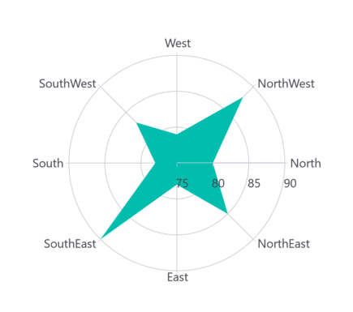

# Rendering Position in .NET MAUI Chart

## Start Angle

Adjust the rendering position of series on polar chart by leveraging the [StartAngle](https://help.syncfusion.com/cr/maui-toolkit/Syncfusion.Maui.Toolkit.Charts.SfPolarChart.html#Syncfusion_Maui_Toolkit_Charts_SfPolarChart_StartAngle) property, offering four degree values: 0, 90, 180, and 270. The default setting for the [StartAngle](https://help.syncfusion.com/cr/maui-toolkit/Syncfusion.Maui.Toolkit.Charts.SfPolarChart.html#Syncfusion_Maui_Toolkit_Charts_SfPolarChart_StartAngle) property is [Rotate270](https://help.syncfusion.com/cr/maui-toolkit/Syncfusion.Maui.Toolkit.Charts.ChartPolarAngle.html#Syncfusion_Maui_Toolkit_Charts_ChartPolarAngle_Rotate270).





<chart:SfPolarChart StartAngle="Rotate0">
    <chart:SfPolarChart.PrimaryAxis>
        <chart:CategoryAxis/>
    </chart:SfPolarChart.PrimaryAxis>

    <chart:SfPolarChart.SecondaryAxis>
        <chart:NumericalAxis/>
    </chart:SfPolarChart.SecondaryAxis>   

    <chart:PolarAreaSeries ItemsSource="{Binding PlantDetails}" XBindingPath="Direction" YBindingPath="Tree"/>  
</chart:SfPolarChart>





// Create a new instance of SfPolarChart
SfPolarChart chart = new SfPolarChart();

chart.StartAngle = ChartPolarAngle.Rotate0; // Set the start angle of the chart to 0 degrees

// Create and set the primary (X) axis as a CategoryAxis
CategoryAxis primaryAxis = new CategoryAxis();
chart.PrimaryAxis = primaryAxis;

// Create and set the secondary (Y) axis as a NumericalAxis
NumericalAxis secondaryAxis = new NumericalAxis();
chart.SecondaryAxis = secondaryAxis;

// Create a new PolarAreaSeries
PolarAreaSeries series = new PolarAreaSeries()
{
    . . .
};

// Add the series to the chart's collection of series
chart.Series.Add(series);
this.Content = chart;





