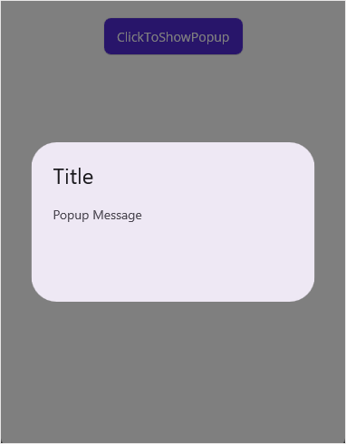

# Getting Started with .NET MAUI Popup

This section guides you through setting up and configuring a `Popup` in your .NET MAUI application. Follow the steps below to add a basic Popup to your project.







## Prerequisites

Before proceeding, ensure the following are set up:

1. Install [.NET 9 SDK](https://dotnet.microsoft.com/en-us/download/dotnet/9.0) or later.
2. Set up a .NET MAUI environment with Visual Studio 2022 v17.12 or later.
Download .NET 9.0 (Linux, macOS, and Windows) | .NET
.NET 9.0 downloads for Linux, macOS, and Windows. .NET is a free, cross-platform, open-source developer platform for building many different types of applications.

## Step 1: Create a new .NET MAUI project

1. Go to **File > New > Project** and choose the **.NET MAUI App** template.
2. Name the project and choose a location. Then click **Next**.
3. Select the .NET framework version and click **Create**.

## Step 2: Install the Syncfusion&reg; .NET MAUI Toolkit NuGet package

1. In **Solution Explorer,** right-click the project and choose **Manage NuGet Packages.**
2. Search for [Syncfusion.Maui.Toolkit](https://www.nuget.org/packages/Syncfusion.Maui.Toolkit/) and install the latest version.
3. Ensure the necessary dependencies are installed correctly, and the project is restored.




## Prerequisites

Before proceeding, ensure the following are set up:

1. Install [.NET 9 SDK](Download .NET 9.0 (Linux, macOS, and Windows) | .NET) or later.
2. Set up a .NET MAUI environment with Visual Studio Code.
3. Ensure that the .NET MAUI workloads are installed and configured as described [here](https://learn.microsoft.com/en-us/dotnet/maui/get-started/installation?view=net-maui-9.0&tabs=visual-studio-code).

## Step 1: Create a new .NET MAUI project

1. Open the command palette by pressing `Ctrl+Shift+P` and type **.NET:New Project** and enter.
2. Choose the **.NET MAUI App** template.
3. Select the project location, type the project name and press **Enter**.
4. Then choose **Create project.**

## Step 2: Install the Syncfusion&reg; .NET MAUI Toolkit NuGet package

1. Press <kbd>Ctrl</kbd> + <kbd>`</kbd> (backtick) to open the integrated terminal in Visual Studio Code.
2. Ensure you're in the project root directory where your .csproj file is located.
3. Run the command `dotnet add package Syncfusion.Maui.Toolkit` to install the Syncfusion® .NET MAUI Toolkit NuGet package.
4. To ensure all dependencies are installed, run `dotnet restore`.




## Prerequisites

Before proceeding, ensure the following are set up:

1. Install [.NET 9 SDK](Download .NET 9.0 (Linux, macOS, and Windows) | .NET) or later.
2. Set up a .NET MAUI environment with JetBrains Rider 2024.3 or later.
3. Make sure the MAUI workloads are installed and configured as described [here.](https://www.jetbrains.com/help/rider/MAUI.html#before-you-start)

## Step 1: Create a new .NET MAUI project

1. Go to **File > New Solution,** Select .NET (C#) and choose the .NET MAUI App template.
2. Enter the Project Name, Solution Name, and Location.
3. Select the .NET framework version and click Create.

## Step 2: Install the Syncfusion® MAUI Toolkit NuGet package

1. In **Solution Explorer,** right-click the project and choose **Manage NuGet Packages.**
2. Search for [Syncfusion.Maui.Toolkit](https://www.nuget.org/packages/Syncfusion.Maui.Toolkit/) and install the latest version.
3. Ensure the necessary dependencies are installed correctly, and the project is restored. If not, Open the Terminal in Rider and manually run: `dotnet restore`




## Step 3: Register the handler

Make sure to add the namespace.
 


using Syncfusion.Maui.Toolkit.Hosting;

 
Register the Syncfusion core handler in your CreateMauiApp method of `MauiProgram.cs` file to use Syncfusion controls.
 

builder.ConfigureSyncfusionToolkit();



## Step 4: Import PullToRefresh namespace

Add the following namespace in your XAML or C#.



xmlns:syncfusion="clr-namespace:Syncfusion.Maui.Toolkit.Popup;assembly=Syncfusion.Maui.Toolkit"




using Syncfusion.Maui.Toolkit.Popup;




## Step 5: Displaying popup

Display a popup over your view by calling the `Show` method.

Refer to the following code example for displaying popup using Button's Click event.





<StackLayout x:Name="mainLayout">
    <Button x:Name="clickToShowPopup" Text="ClickToShowPopup" 
            VerticalOptions="Start" HorizontalOptions="Center"
            Clicked="ClickToShowPopup_Clicked" />
        <syncfusion:SfPopup x:Name="popup" />
</StackLayout>





private void ClickToShowPopup_Clicked(object sender, EventArgs e)
{
    popup.Show();
}







You can download the Popup Getting Started sample from [here](https://github.com/SyncfusionExamples/getting-started-.net-maui-popup).
