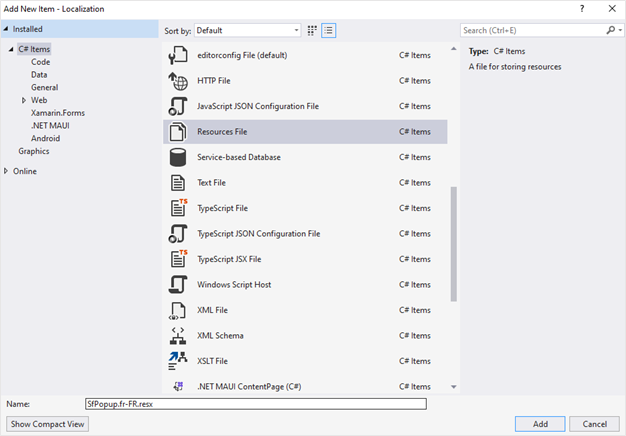

# Localization in .NET MAUI Popup (SfPopup)

Localization is the process of translating the application resources into different languages for specific cultures. The `SfPopup` can be localized by adding a `resource` file.

## Setting CurrentUICulture to the application

Application culture can be changed by setting the `CurrentUICulture` in the `App.xaml.cs` file.




using Syncfusion.Maui.Toolkit.Popup;
using System.Resources;

public partial class App : Application
{
   public App()
   {
      InitializeComponent();
      CultureInfo.CurrentUICulture = new CultureInfo("fr-FR");
      //// ResXPath => Full path of the resx file; For example : //SfPopupResources.ResourceManager = new ResourceManager
      // ("MauiPopupDemo.Resources.SfPopup", Application.Current.GetType().Assembly);

      SfPopupResources.ResourceManager = new ResourceManager(ResXPath, Application.Current.GetType().Assembly);
      MainPage = new MainPage();
   }
}




N>
The required `resx` files with `Build Action` as `EmbeddedResource` (File name should contain culture code) into the `Resources` folder.

## Localize application level

To localize the `Popup` based on the `CurrentUICulture` using the `resource` files, follow these steps.

   1. Create a new folder named `Resources` in the application.

   2. Right-click on the `Resources` folder, select `Add`, then `NewItem`.

   3. In the Add New Item wizard, select the Resource File option and name the filename as `SfPopup.<culture name>.resx`. For example, give the name as `SfPopup.fr-FR.resx` for French culture.

   4. The culture name indicates the name of the language and country.

   

   5. Now, select `Add` option to add the resource file in the **Resources** folder.

   

   6. Add the Name or Value pair in the Resource Designer of `SfPopup.fr-FR.resx` file and change its corresponding value to corresponding culture.

   