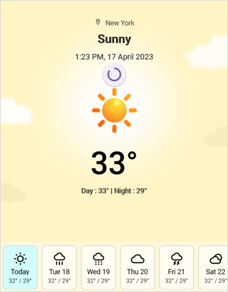
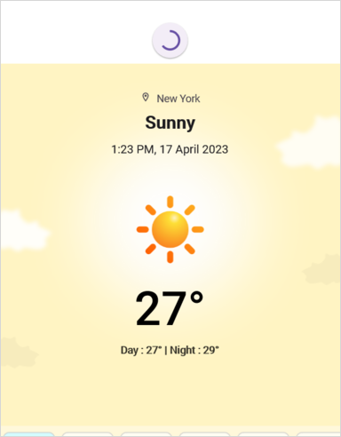

# Customization in .NET MAUI PullToRefresh (SfPullToRefresh)

The .NET MAUI PullToRefresh control supports customization of various features, including TransitionMode, PullingThreshold, ProgressBackground, ProgressColor, and more. The control can be personalized using the following properties.

## PullableContent

The [PullableContent](https://help.syncfusion.com/cr/maui-toolkit/Syncfusion.Maui.Toolkit.PullToRefresh.SfPullToRefresh.html#Syncfusion_Maui_Toolkit_PullToRefresh_SfPullToRefresh_PullableContent) is the main view of the [PullToRefresh](https://help.syncfusion.com/cr/maui/Syncfusion.Maui.PullToRefresh.SfPullToRefresh.html) control on which the desired items can be placed.




<PullToRefreshControl:SfPullToRefresh x:Name="pullToRefresh"
                                      PullingThreshold="120"
                                      RefreshViewHeight="30"
                                      RefreshViewThreshold="30"
                                      RefreshViewWidth="30">
    <PullToRefreshControl:SfPullToRefresh.PullableContent>
            <Label x:Name="Monthlabel" 
                    TextColor="White" 
                    HorizontalTextAlignment="Center"   
                    VerticalTextAlignment="Start" />
    </PullToRefreshControl:SfPullToRefresh.PullableContent>
</PullToRefreshControl:SfPullToRefresh>




## TransitionMode

The [TransitionMode](https://help.syncfusion.com/cr/maui/Syncfusion.Maui.PullToRefresh.SfPullToRefresh.html#Syncfusion_Maui_PullToRefresh_SfPullToRefresh_TransitionMode) property specifies the mode of the animations. It has the following two modes:

* [SlideOnTop](https://help.syncfusion.com/cr/maui-toolkit/Syncfusion.Maui.Toolkit.PullToRefresh.SfPullToRefresh.html#Syncfusion_Maui_Toolkit_PullToRefresh_SfPullToRefresh_TransitionMode)
* [Push](https://help.syncfusion.com/cr/maui-toolkit/Syncfusion.Maui.Toolkit.PullToRefresh.PullToRefreshTransitionType.html#Syncfusion_Maui_Toolkit_PullToRefresh_PullToRefreshTransitionType_Push)

The default transition is `SlideOnTop` that draws the RefreshView on top of the `PullableContent`.




<PullToRefreshControl:SfPullToRefresh x:Name="pullToRefresh" 
                                      TransitionMode="SlideOnTop" />




pullToRefresh.TransitionMode = PullToRefreshTransitionType.SlideOnTop;




The following code example shows how to set the `TransitionMode` as `Push` to PullToRefresh. This transition moves the refresh content and main content simultaneously.




<PullToRefreshControl:SfPullToRefresh x:Name=" pullToRefresh" 
                                      TransitionMode="Push" />




pullToRefresh.TransitionMode = PullToRefreshTransitionType.Push;




## RefreshViewThreshold

The threshold value for the refresh view, indicating the starting position of the progress indicator within the view.




<PullToRefreshControl:SfPullToRefresh x:Name="pullToRefresh" 
                                      RefreshViewThreshold="50"/>




pullToRefresh.RefreshViewThreshold = 50d;




## PullingThreshold

The threshold value for the refresh view, indicating the progress indicator's maximum pulling position in view.




<PullToRefreshControl:SfPullToRefresh x:Name="pullToRefresh" 
                            PullingThreshold="200"/>




pullToRefresh.PullingThreshold = 200d;




## IsRefreshing

The view will get refresh while the [IsRefreshing](https://help.syncfusion.com/cr/maui-toolkit/Syncfusion.Maui.Toolkit.PullToRefresh.SfPullToRefresh.html#Syncfusion_Maui_Toolkit_PullToRefresh_SfPullToRefresh_IsRefreshing) property is set to `true,` and View refreshing will be stopped when you set the `IsRefreshing` to `false.`
 



<PullToRefreshControl:SfPullToRefresh x:Name="pullToRefresh" 
                                      IsRefreshing="True"/>




pullToRefresh.IsRefreshing = true;




## ProgressBackground

The color to the progress indicator's background.




<PullToRefreshControl:SfPullToRefresh x:Name="pullToRefresh" 
                                      ProgressBackground = "White"/>




pullToRefresh.ProgressBackground = Color.White;




## ProgressColor

The color to the progress indicator's arc. 




<PullToRefreshControl:SfPullToRefresh x:Name="pullToRefresh" 
                                      ProgressColor = "Blue"/>




pullToRefresh.ProgressColor = Color.Blue;





## ProgressThickness

The width of the progress indicator's arc. 




<PullToRefreshControl:SfPullToRefresh x:Name="pullToRefresh" 
                                      ProgressThickness="5"/>




pullToRefresh.ProgressThickness = 5d;




## RefreshViewWidth

The width of the refresh view.




<PullToRefreshControl:SfPullToRefresh x:Name="pullToRefresh" 
                                      RefreshViewWidth="50"/>




pullToRefresh.RefreshViewWidth = 50d;





## RefreshViewHeight

The height to the refresh View.




<PullToRefreshControl:SfPullToRefresh x:Name="pullToRefresh" 
                                      RefreshViewHeight="50"/>




pullToRefresh.RefreshViewHeight = 50d;




## Programmatic Support 

### StartRefreshing()

The [StartRefreshing](https://help.syncfusion.com/cr/maui-toolkit/Syncfusion.Maui.Toolkit.PullToRefresh.SfPullToRefresh.html#Syncfusion_Maui_Toolkit_PullToRefresh_SfPullToRefresh_StartRefreshing) method is used to refresh the content without interaction in pullable content. When you invoke this StartRefreshing() method,then the Progress indicator will be shown. 




pullToRefresh.StartRefreshing();




### EndRefreshing()

The [EndRefreshing](https://help.syncfusion.com/cr/maui-toolkit/Syncfusion.Maui.Toolkit.PullToRefresh.SfPullToRefresh.html#Syncfusion_Maui_Toolkit_PullToRefresh_SfPullToRefresh_EndRefreshing) method is used to end the progress animation of the `PullToRefresh`.




pullToRefresh.EndRefreshing();


