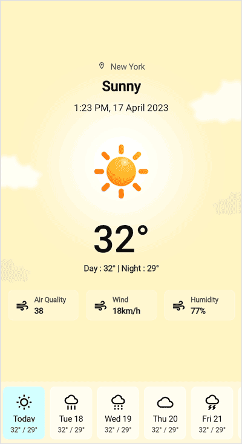
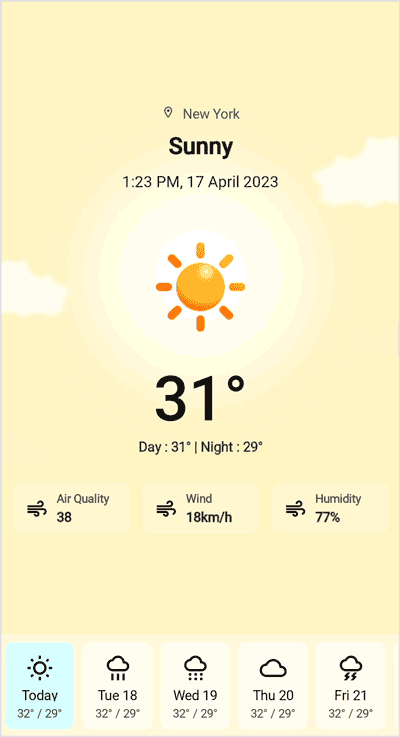

# Getting Started with .NET MAUI PullToRefresh Control

This section provides instructions for setting up and configuring PullToRefresh control (SfPullToRefresh) in your .NET MAUI application. Follow the steps below to integrate a basic PullToRefresh component into your project.

## Prerequisites
Before proceeding, ensure the following are in place:

 1. Install [.NET 8 SDK](https://dotnet.microsoft.com/en-us/download/dotnet/8.0) or later.
 2. Set up a .NET MAUI environment with Visual Studio 2022 (v17.8 or later) or Visual Studio Code. For Visual Studio Code users, ensure that the .NET MAUI workload is installed and configured as described [here](https://learn.microsoft.com/en-us/dotnet/maui/get-started/installation?view=net-maui-8.0&tabs=visual-studio-code).

## Step 1: Create a .NET MAUI project

### Visual Studio

1. Go to **File > New > Project** and choose the **.NET MAUI App** template.
2. Name the project and choose a location. Then, click **Next**.
3. Select the .NET framework version and click **Create**.

### Visual Studio Code

1. Open the Command Palette by pressing **Ctrl+Shift+P** and type **.NET:New Project** and press Enter.
2. Choose the **.NET MAUI App** template.
3. Select the project location, type the project name and press **Enter**.
4. Then choose **Create project**
 
## Step 2: Install the Syncfusion .NET MAUI Toolkit Package
 
### Visual Studio
1. In **Solution Explorer**, right-click the project and choose **Manage NuGet Packages**.
2. Search for [Syncfusion.Maui.Toolkit](https://www.nuget.org/packages/Syncfusion.Maui.Toolkit/) and install the latest version.
3. Ensure the necessary dependencies are installed correctly, and the project is restored.

### Visual Studio Code
1. Press <kbd>Ctrl</kbd> + <kbd>`</kbd> (backtick) to open the integrated terminal in Visual Studio Code.
2. Ensure you're in the project root directory where your .csproj file is located.
3. Run the command `dotnet add package Syncfusion.Maui.Toolkit` to install the Syncfusion .NET MAUI Toolkit NuGet package.
4. To ensure all dependencies are installed, run `dotnet restore`.

## Step 3: Register the handler

In the **MauiProgram.cs file**, register the handler for Syncfusion Toolkit.




using Syncfusion.Maui.Toolkit.Hosting;

public class MauiProgram 
{
    public static MauiApp CreateMauiApp()
    {
        var builder = MauiApp.CreateBuilder();
        builder
        .UseMauiApp<App>()
        .ConfigureFonts(fonts =>
        {
            fonts.AddFont("OpenSans-Regular.ttf", "OpenSansRegular");
        });

        builder.ConfigureSyncfusionToolkit();
        return builder.Build();
    }
}

 

 
## Step 4: Add a .NET MAUI PullToRefresh control
 
Step 1. To initialize the control, import the `Syncfusion.Maui.Toolkit.PullToRefresh` namespace into your code.

Step 2. Initialize `SfPullToRefresh` class.




<ContentPage xmlns:PullToRefreshControl="clr-namespace:Syncfusion.Maui.Toolkit.PullToRefresh;assembly=Syncfusion.Maui.Toolkit">
    <ContentPage.Content> 
        <PullToRefreshControl:SfPullToRefresh />
    </ContentPage.Content> 
</ContentPage>




using Syncfusion.Maui.Toolkit.PullToRefresh;
. . .

public partial class MainPage : ContentPage
{
    public MainPage()
    {
        InitializeComponent();
        SfPullToRefresh pullToRefresh = new SfPullToRefresh();
        this.Content = pullToRefresh;
    }
}




## Step 5: Define the PullableContent

The `PullableContent` view serves as the designated area where users can initiate the pull-to-refresh action, enabling them to refresh and update the content within the view.

To show the progress indicator while updating the view, set `IsRefreshing` property to `True` using `Refreshing` event. Once view is updated, remove the progress indicator by setting `IsRefreshing` property to `False`.




<ContentPage xmlns="http://schemas.microsoft.com/dotnet/2021/maui"
             xmlns:x="http://schemas.microsoft.com/winfx/2009/xaml"
             x:Class="GettingStarted.MainPage"
             xmlns:PullToRefreshControl="clr-namespace:Syncfusion.Maui.Toolkit.PullToRefresh;assembly=Syncfusion.Maui.Toolkit">
    <PullToRefreshControl:SfPullToRefresh x:Name="pullToRefresh">
        <PullToRefreshControl:SfPullToRefresh.PullableContent>
            <StackLayout>
                <Label Text="sample page" />
            </StackLayout>
        </PullToRefreshControl:SfPullToRefresh.PullableContent>
    </PullToRefreshControl:SfPullToRefresh>
</ContentPage>




public partial class MainPage : ContentPage
{
    public MainPage()
    {
        InitializeComponent();
        this.pullToRefresh.Refreshing += PullToRefresh_Refreshing;
    }

    private async void PullToRefresh_Refreshing(object sender, EventArgs e)
    {
        this.pullToRefresh.IsRefreshing = true;
        await Task.Delay(2000);
        this.pullToRefresh.IsRefreshing = false;
    }
}




## Step 6: Running the Application

Press **F5** to build and run the application. Once compiled, perform pull-to-refresh action on pullable content view to refresh the view.

N> [View sample in GitHub](https://github.com/SyncfusionExamples/getting-started-with-.net-maui-pull-to-refresh/tree/master).

If we run the above sample with `TransitionMode` set to `Push`, the output will be as shown in the following.

.

N> PullToRefresh does not have a view. So, it is mandatory to set size or LayoutOptions when loaded inside any layouts.