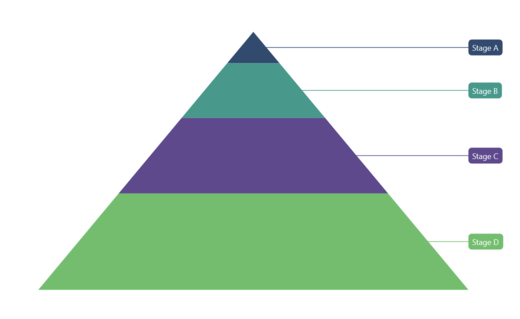

# Data Labels in .NET MAUI Pyramid Chart

Data labels are used to display values related to a chart segment. Values from data points (x, y) or other custom properties from a data source can be displayed.

## Enable Data Labels 

To display data labels in the chart, set the [ShowDataLabels](https://help.syncfusion.com/cr/maui-toolkit/Syncfusion.Maui.Toolkit.Charts.SfPyramidChart.html#Syncfusion_Maui_Toolkit_Charts_SfPyramidChart_ShowDataLabels) property to true. The default value of the [ShowDataLabels](https://help.syncfusion.com/cr/maui-toolkit/Syncfusion.Maui.Toolkit.Charts.SfPyramidChart.html#Syncfusion_Maui_Toolkit_Charts_SfPyramidChart_ShowDataLabels) property is false.





<chart:SfPyramidChart ShowDataLabels="True">
. . .
</chart:SfPyramidChart>





SfPyramidChart chart = new SfPyramidChart();
. . .
chart.ShowDataLabels = true; // Enable data labels for the chart.
this.Content = chart;



 

## Data Label Customization

Data labels can be customized using the [DataLabelSettings](https://help.syncfusion.com/cr/maui-toolkit/Syncfusion.Maui.Toolkit.Charts.SfPyramidChart.html#Syncfusion_Maui_Toolkit_Charts_SfPyramidChart_DataLabelSettings) property of the chart. For customization, you need to create an instance of [PyramidDataLabelSettings](https://help.syncfusion.com/cr/maui-toolkit/Syncfusion.Maui.Toolkit.Charts.PyramidDataLabelSettings.html) and assign it to the [DataLabelSettings](https://help.syncfusion.com/cr/maui-toolkit/Syncfusion.Maui.Toolkit.Charts.SfPyramidChart.html#Syncfusion_Maui_Toolkit_Charts_SfPyramidChart_DataLabelSettings) property. The following properties available in [PyramidDataLabelSettings](https://help.syncfusion.com/cr/maui-toolkit/Syncfusion.Maui.Toolkit.Charts.PyramidDataLabelSettings.html) are used to customize the data labels:

* [LabelPlacement](https://help.syncfusion.com/cr/maui-toolkit/Syncfusion.Maui.Toolkit.Charts.ChartDataLabelSettings.html#Syncfusion_Maui_Toolkit_Charts_ChartDataLabelSettings_LabelPlacement) - Positions the pyramid chart data labels at [Auto](https://help.syncfusion.com/cr/maui-toolkit/Syncfusion.Maui.Toolkit.Charts.DataLabelPlacement.html#Syncfusion_Maui_Toolkit_Charts_DataLabelPlacement_Auto), [Inner](https://help.syncfusion.com/cr/maui-toolkit/Syncfusion.Maui.Toolkit.Charts.DataLabelPlacement.html#Syncfusion_Maui_Toolkit_Charts_DataLabelPlacement_Inner), [Center](https://help.syncfusion.com/cr/maui-toolkit/Syncfusion.Maui.Toolkit.Charts.DataLabelPlacement.html#Syncfusion_Maui_Toolkit_Charts_DataLabelPlacement_Center), or [Outer](https://help.syncfusion.com/cr/maui-toolkit/Syncfusion.Maui.Toolkit.Charts.DataLabelPlacement.html#Syncfusion_Maui_Toolkit_Charts_DataLabelPlacement_Outer).
* [UseSeriesPalette](https://help.syncfusion.com/cr/maui-toolkit/Syncfusion.Maui.Toolkit.Charts.ChartDataLabelSettings.html#Syncfusion_Maui_Toolkit_Charts_ChartDataLabelSettings_UseSeriesPalette) - Sets the interior of the chart segment as the data label background.
* [Context](https://help.syncfusion.com/cr/maui-toolkit/Syncfusion.Maui.Toolkit.Charts.PyramidDataLabelSettings.html#Syncfusion_Maui_Toolkit_Charts_PyramidDataLabelSettings_Context) - Of type `PyramidDataLabelContext`, indicates whether to show X or Y value in the label content.
* [LabelStyle](https://help.syncfusion.com/cr/maui-toolkit/Syncfusion.Maui.Toolkit.Charts.ChartDataLabelSettings.html#Syncfusion_Maui_Toolkit_Charts_ChartDataLabelSettings_LabelStyle) - Customizes the data label's appearance. The following properties are available in [LabelStyle](https://help.syncfusion.com/cr/maui-toolkit/Syncfusion.Maui.Toolkit.Charts.ChartDataLabelSettings.html#Syncfusion_Maui_Toolkit_Charts_ChartDataLabelSettings_LabelStyle):
    * [Margin](https://help.syncfusion.com/cr/maui-toolkit/Syncfusion.Maui.Toolkit.Charts.ChartLabelStyle.html#Syncfusion_Maui_Toolkit_Charts_ChartLabelStyle_Margin) - Of type `Thickness`, indicates the label's margin.
    * [Background](https://help.syncfusion.com/cr/maui-toolkit/Syncfusion.Maui.Toolkit.Charts.ChartLabelStyle.html#Syncfusion_Maui_Toolkit_Charts_ChartLabelStyle_Background) - Of type `Brush`, indicates the label background color.
    * [FontAttributes](https://help.syncfusion.com/cr/maui-toolkit/Syncfusion.Maui.Toolkit.Charts.ChartLabelStyle.html#Syncfusion_Maui_Toolkit_Charts_ChartLabelStyle_FontAttributes) - Of type `FontAttributes`, indicates the font style of the data label.
    * [FontSize](https://help.syncfusion.com/cr/maui-toolkit/Syncfusion.Maui.Toolkit.Charts.ChartLabelStyle.html#Syncfusion_Maui_Toolkit_Charts_ChartLabelStyle_FontSize) - Of type `double`, indicates the font size.
    * [Stroke](https://help.syncfusion.com/cr/maui-toolkit/Syncfusion.Maui.Toolkit.Charts.ChartLabelStyle.html#Syncfusion_Maui_Toolkit_Charts_ChartLabelStyle_Stroke) - Of type `Brush`, indicates the brush used to paint the border of the data label.
    * [StrokeWidth](https://help.syncfusion.com/cr/maui-toolkit/Syncfusion.Maui.Toolkit.Charts.ChartLabelStyle.html#Syncfusion_Maui_Toolkit_Charts_ChartLabelStyle_StrokeWidth) - Of type `double`, indicates the width of the label's border.
    * [CornerRadius](https://help.syncfusion.com/cr/maui-toolkit/Syncfusion.Maui.Toolkit.Charts.ChartLabelStyle.html#Syncfusion_Maui_Toolkit_Charts_ChartLabelStyle_CornerRadius) - Of type `CornerRadius`, indicates the rounded corner for the label.
    * [TextColor](https://help.syncfusion.com/cr/maui-toolkit/Syncfusion.Maui.Toolkit.Charts.ChartLabelStyle.html#Syncfusion_Maui_Toolkit_Charts_ChartLabelStyle_TextColor) - Of type `Color`, indicates the color of the displayed text.





<chart:SfPyramidChart ShowDataLabels="True">
    . . .
    <chart:SfPyramidChart.DataLabelSettings>
        <chart:PyramidDataLabelSettings LabelPlacement="Outer" 
                                        Context="XValue" 
                                        UseSeriesPalette="True">
            <chart:PyramidDataLabelSettings.LabelStyle>
                <chart:ChartDataLabelStyle Margin="2"/>
            </chart:PyramidDataLabelSettings.LabelStyle>
        </chart:PyramidDataLabelSettings>
    </chart:SfPyramidChart.DataLabelSettings>
</chart:SfPyramidChart>





SfPyramidChart chart = new SfPyramidChart();
. . .
chart.ShowDataLabels = true;

// Define the style for data labels.
ChartDataLabelStyle labelStyle = new ChartDataLabelStyle()
{
    Margin = 2,
};

// Configure data label settings for the chart.
chart.DataLabelSettings = new PyramidDataLabelSettings()
{
    Context = PyramidDataLabelContext.XValue, // Show X value in the label content.
    LabelPlacement = DataLabelPlacement.Outer, // Position the data labels at the outer side of the chart.
    UseSeriesPalette = true, // Set the interior of the chart to the data label background.
    LabelStyle = labelStyle, // Apply the style for data labels.
};

this.Content = chart;


 

