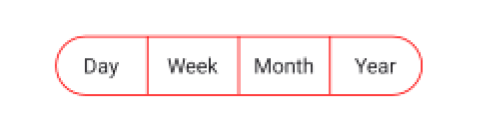
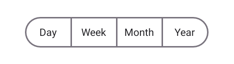
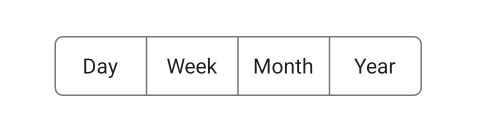
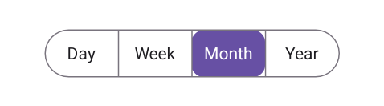
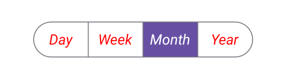
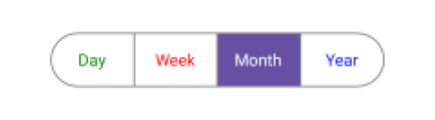
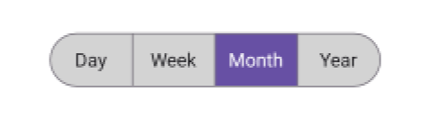
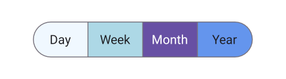
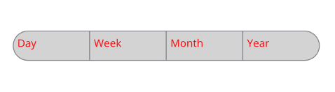

 
# Appearance Customization of .NET MAUI Segmented Control
The .NET MAUI Segmented control allows you to customize the background, text color, selection style, and more.

## Customize the border color
You can use the [Stroke](https://help.syncfusion.com/cr/maui-toolkit/Syncfusion.Maui.Toolkit.SegmentedControl.SfSegmentedControl.html#Syncfusion_Maui_Toolkit_SegmentedControl_SfSegmentedControl_Stroke) property of [SfSegmentedControl](https://help.syncfusion.com/cr/maui-toolkit/Syncfusion.Maui.Toolkit.SegmentedControl.SfSegmentedControl.html) to customize the border color of the segmented control.




<ContentPage
    xmlns:segmentedControl="clr-namespace:Syncfusion.Maui.Toolkit.SegmentedControl;assembly=Syncfusion.Maui.Toolkit">
    <segmentedControl:SfSegmentedControl Stroke="Red">
        <segmentedControl:SfSegmentedControl.ItemsSource>
            <x:Array Type="{x:Type x:String}">
                <x:String>Day</x:String>
                <x:String>Week</x:String>
                <x:String>Month</x:String>
                <x:String>Year</x:String>
            </x:Array>
        </segmentedControl:SfSegmentedControl.ItemsSource>
    </segmentedControl:SfSegmentedControl>
</ContentPage>




using Syncfusion.Maui.Toolkit.SegmentedControl;
. . .

public partial class MainPage : ContentPage
{
    public MainPage()
    {
        InitializeComponent();
        SfSegmentedControl segmentedControl = new SfSegmentedControl();
        segmentedControl.Stroke = Colors.Red;
        this.Content = segmentedControl;
    }
}




## Customize the border thickness

You can use the [StrokeThickness](https://help.syncfusion.com/cr/maui-toolkit/Syncfusion.Maui.Toolkit.SegmentedControl.SfSegmentedControl.html#Syncfusion_Maui_Toolkit_SegmentedControl_SfSegmentedControl_StrokeThickness) property of [SfSegmentedControl](https://help.syncfusion.com/cr/maui-toolkit/Syncfusion.Maui.Toolkit.SegmentedControl.SfSegmentedControl.html) to customize the border thickness of the segmented control.




<ContentPage
    xmlns:segmentedControl="clr-namespace:Syncfusion.Maui.Toolkit.SegmentedControl;assembly=Syncfusion.Maui.Toolkit">
    <segmentedControl:SfSegmentedControl StrokeThickness="2">
        <segmentedControl:SfSegmentedControl.ItemsSource>
            <x:Array Type="{x:Type x:String}">
                <x:String>Day</x:String>
                <x:String>Week</x:String>
                <x:String>Month</x:String>
                <x:String>Year</x:String>
            </x:Array>
        </segmentedControl:SfSegmentedControl.ItemsSource>
    </segmentedControl:SfSegmentedControl>
</ContentPage>




using Syncfusion.Maui.Toolkit.SegmentedControl;
. . .

public partial class MainPage : ContentPage
{
    public MainPage()
    {
        InitializeComponent();
        SfSegmentedControl segmentedControl = new SfSegmentedControl();
        segmentedControl.StrokeThickness = 2;
        this.Content = segmentedControl;
    }
}




## Customize the border corner radius

Use the [CornerRadius](https://help.syncfusion.com/cr/maui-toolkit/Syncfusion.Maui.Toolkit.SegmentedControl.SfSegmentedControl.html#Syncfusion_Maui_Toolkit_SegmentedControl_SfSegmentedControl_CornerRadius) property of [SfSegmentedControl](https://help.syncfusion.com/cr/maui-toolkit/Syncfusion.Maui.Toolkit.SegmentedControl.SfSegmentedControl.html) to customize the corner radius of the segmented control.




<ContentPage
    xmlns:segmentedControl="clr-namespace:Syncfusion.Maui.Toolkit.SegmentedControl;assembly=Syncfusion.Maui.Toolkit">
    <segmentedControl:SfSegmentedControl CornerRadius="5">
        <segmentedControl:SfSegmentedControl.ItemsSource>
            <x:Array Type="{x:Type x:String}">
                <x:String>Day</x:String>
                <x:String>Week</x:String>
                <x:String>Month</x:String>
                <x:String>Year</x:String>
            </x:Array>
        </segmentedControl:SfSegmentedControl.ItemsSource>                
    </segmentedControl:SfSegmentedControl>
</ContentPage>




using Syncfusion.Maui.Toolkit.SegmentedControl;
. . .

public partial class MainPage : ContentPage
{
    public MainPage()
    {
        InitializeComponent();
        SfSegmentedControl segmentedControl = new SfSegmentedControl();
        segmentedControl.CornerRadius = 5;
        this.Content = segmentedControl;
    }
}




N> The `CornerRadius` property will be applicable only for the first and last segment items. To set corner radius for all segments, use `SegmentCornerRadius`.

## Customize the segment corner radius

Use the [SegmentCornerRadius](https://help.syncfusion.com/cr/maui-toolkit/Syncfusion.Maui.Toolkit.SegmentedControl.SfSegmentedControl.html#Syncfusion_Maui_Toolkit_SegmentedControl_SfSegmentedControl_SegmentCornerRadius) property of [SfSegmentedControl](https://help.syncfusion.com/cr/maui-toolkit/Syncfusion.Maui.Toolkit.SegmentedControl.SfSegmentedControl.html) to customize the segment corner radius of the segmented control.




<ContentPage
    xmlns:segmentedControl="clr-namespace:Syncfusion.Maui.Toolkit.SegmentedControl;assembly=Syncfusion.Maui.Toolkit">
    <segmentedControl:SfSegmentedControl SegmentCornerRadius="5">
        <segmentedControl:SfSegmentedControl.ItemsSource>
            <x:Array Type="{x:Type x:String}">
                <x:String>Day</x:String>
                <x:String>Week</x:String>
                <x:String>Month</x:String>
                <x:String>Year</x:String>
            </x:Array>
        </segmentedControl:SfSegmentedControl.ItemsSource>
    </segmentedControl:SfSegmentedControl>
</ContentPage>




using Syncfusion.Maui.Toolkit.SegmentedControl;
. . .

public partial class MainPage : ContentPage
{
    public MainPage()
    {
        InitializeComponent();
        SfSegmentedControl segmentedControl = new SfSegmentedControl();
        segmentedControl.SegmentCornerRadius = 5;
        this.Content = segmentedControl;
    }
}




## Customize the text style
You can customize the text style of the segmented control and each segment item.

### Customize the text style of segmented Control
Use the [TextStyle](https://help.syncfusion.com/cr/maui-toolkit/Syncfusion.Maui.Toolkit.SegmentedControl.SfSegmentedControl.html#Syncfusion_Maui_Toolkit_SegmentedControl_SfSegmentedControl_TextStyle) property of [SfSegmentedControl](https://help.syncfusion.com/cr/maui-toolkit/Syncfusion.Maui.Toolkit.SegmentedControl.SfSegmentedControl.html) to customize the text style of the segmented control.




<ContentPage
    xmlns:segmentedControl="clr-namespace:Syncfusion.Maui.Toolkit.SegmentedControl;assembly=Syncfusion.Maui.Toolkit">
    <segmentedControl:SfSegmentedControl>
        <segmentedControl:SfSegmentedControl.TextStyle>
            <segmentedControl:SegmentTextStyle TextColor="Red" FontAttributes="Italic" FontSize="20"/>
        </segmentedControl:SfSegmentedControl.TextStyle>
        <segmentedControl:SfSegmentedControl.ItemsSource>
            <x:Array Type="{x:Type x:String}">
                <x:String>Day</x:String>
                <x:String>Week</x:String>
                <x:String>Month</x:String>
                <x:String>Year</x:String>
            </x:Array>
        </segmentedControl:SfSegmentedControl.ItemsSource>
    </segmentedControl:SfSegmentedControl>
</ContentPage>




using Syncfusion.Maui.Toolkit.SegmentedControl;
. . .

public partial class MainPage : ContentPage
{
    public MainPage()
    {
        InitializeComponent();
        SfSegmentedControl segmentedControl = new SfSegmentedControl();
        segmentedControl.TextStyle = new SegmentTextStyle()
        {
            TextColor = Colors.Red,
            FontAttributes = FontAttributes.Italic,
            FontSize = 20,
        };
        this.Content = segmentedControl;
    }
}




### Customize the text style of each segment item

Customize the text style of each segment item using the [TextStyle](https://help.syncfusion.com/cr/maui-toolkit/Syncfusion.Maui.Toolkit.SegmentedControl.SfSegmentItem.html#Syncfusion_Maui_Toolkit_SegmentedControl_SfSegmentItem_TextStyle) property of [SfSegmentItem](https://help.syncfusion.com/cr/maui-toolkit/Syncfusion.Maui.Toolkit.SegmentedControl.SfSegmentItem.html).




using Syncfusion.Maui.Toolkit.SegmentedControl;
. . .

public partial class MainPage : ContentPage
{
    public MainPage()
    {
        InitializeComponent();
        SfSegmentedControl segmentedControl = new SfSegmentedControl();
        List<SfSegmentItem> segmentItems = new List<SfSegmentItem>
            {
                new SfSegmentItem() {Text="Day", TextStyle = new SegmentTextStyle(){TextColor = Colors.Green}},
                new SfSegmentItem() {Text="Week", TextStyle = new SegmentTextStyle(){TextColor = Colors.Red}},
                new SfSegmentItem() {Text="Month", TextStyle = new SegmentTextStyle(){TextColor = Colors.Yellow}},
                new SfSegmentItem() {Text="Year", TextStyle = new SegmentTextStyle(){TextColor = Colors.Blue}},
            };
        segmentedControl.ItemsSource = segmentItems;
        this.Content = segmentedControl;
    }
}




## Customize the segment background
You can customize the segmented background of the segmented control and each segment item.

### Customize the segment background of segmented control
Use the [SegmentBackground](https://help.syncfusion.com/cr/maui-toolkit/Syncfusion.Maui.Toolkit.SegmentedControl.SfSegmentedControl.html#Syncfusion_Maui_Toolkit_SegmentedControl_SfSegmentedControl_SegmentBackground) property of [SfSegmentedControl](https://help.syncfusion.com/cr/maui-toolkit/Syncfusion.Maui.Toolkit.SegmentedControl.SfSegmentedControl.html) to customize the segmented background of the segmented control.




<ContentPage
    xmlns:segmentedControl="clr-namespace:Syncfusion.Maui.Toolkit.SegmentedControl;assembly=Syncfusion.Maui.Toolkit">
    <segmentedControl:SfSegmentedControl SegmentBackground="LightGray">
        <segmentedControl:SfSegmentedControl.ItemsSource>
            <x:Array Type="{x:Type x:String}">
                <x:String>Day</x:String>
                <x:String>Week</x:String>
                <x:String>Month</x:String>
                <x:String>Year</x:String>
            </x:Array>
        </segmentedControl:SfSegmentedControl.ItemsSource>
    </segmentedControl:SfSegmentedControl>
</ContentPage>




using Syncfusion.Maui.Toolkit.SegmentedControl;
. . .

public partial class MainPage : ContentPage
{
    public MainPage()
    {
        InitializeComponent();
        SfSegmentedControl segmentedControl = new SfSegmentedControl();
        segmentedControl.SegmentBackground = Colors.LightGray;
        this.Content = segmentedControl;
    }
}




### Customize the segment background of each segment item

Customize the background of each segment item using the [Background](https://help.syncfusion.com/cr/maui-toolkit/Syncfusion.Maui.Toolkit.SegmentedControl.SfSegmentItem.html#Syncfusion_Maui_Toolkit_SegmentedControl_SfSegmentItem_Background) property of [SfSegmentItem](https://help.syncfusion.com/cr/maui-toolkit/Syncfusion.Maui.Toolkit.SegmentedControl.SfSegmentItem.html).




using Syncfusion.Maui.Toolkit.SegmentedControl;
. . .

public partial class MainPage : ContentPage
{
    public MainPage()
    {
        InitializeComponent();
        SfSegmentedControl segmentedControl = new SfSegmentedControl();
        List<SfSegmentItem> segmentItems = new List<SfSegmentItem>
            {
                new SfSegmentItem() {Text="Day", Background = Colors.LightBlue},
                new SfSegmentItem() {Text="Week", Background = Colors.LightBlue},
                new SfSegmentItem() {Text="Month", Background = Colors.LightBlue},
                new SfSegmentItem() {Text="Year", Background = Colors.LightBlue},
            };
        segmentedControl.ItemsSource = segmentItems;
        this.Content = segmentedControl;
    }
}




## Customize segment items appearance using DataTemplate

Use the [SegmentTemplate](https://help.syncfusion.com/cr/maui-toolkit/Syncfusion.Maui.Toolkit.SegmentedControl.SfSegmentedControl.html#Syncfusion_Maui_Toolkit_SegmentedControl_SfSegmentedControl_SegmentTemplate) property of [SfSegmentedControl](https://help.syncfusion.com/cr/maui-toolkit/Syncfusion.Maui.Toolkit.SegmentedControl.SfSegmentedControl.html) to create custom segmented control. The following example code shows how to create a custom segmented control using a data template.




<ContentPage   
    xmlns:segmentedControl="clr-namespace:Syncfusion.Maui.Toolkit.SegmentedControl;assembly=Syncfusion.Maui.Toolkit">
    <segmentedControl:SfSegmentedControl>
        <segmentedControl:SfSegmentedControl.ItemsSource>
            <x:Array Type="{x:Type x:String}">                
                <x:String>Day</x:String>                
                <x:String>Week</x:String>
                <x:String>Month</x:String>
                <x:String>Year</x:String>
            </x:Array>
        </segmentedControl:SfSegmentedControl.ItemsSource>
        <segmentedControl:SfSegmentedControl.SegmentTemplate>
            <DataTemplate>
                <Grid Background="LightGray">
                    <Label Text="{Binding Text}"
                           TextColor="Red"
                           Margin="6"/>
                </Grid>
            </DataTemplate>
        </segmentedControl:SfSegmentedControl.SegmentTemplate>
    </segmentedControl:SfSegmentedControl>
</ContentPage>




