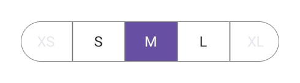
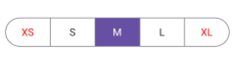
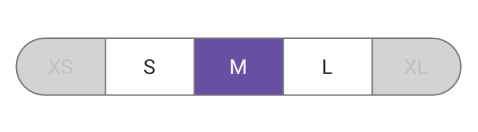

 
# Disabled Segmented Item in .NET MAUI Segmented Control

This section describes the features of the Segmented Control that help with disabling segmented item, customization of the disabled item, and associated operations.

## Enable or Disable segment

Restrict selection and interaction of segment items by setting the [IsEnabled](https://help.syncfusion.com/cr/maui-toolkit/Syncfusion.Maui.Toolkit.SegmentedControl.SfSegmentItem.html#Syncfusion_Maui_Toolkit_SegmentedControl_SfSegmentItem_IsEnabled) property of [SfSegmentItem](https://help.syncfusion.com/cr/maui-toolkit/Syncfusion.Maui.Toolkit.SegmentedControl.SfSegmentItem.html) to `false`. The value of `IsEnabled` property is `true` by default.




using Syncfusion.Maui.Toolkit.SegmentedControl;
. . .

public partial class MainPage : ContentPage
{
    public MainPage()
    {
        InitializeComponent();
        SfSegmentedControl segmentedControl = new SfSegmentedControl();
        List<SfSegmentItem> segmentItems = new List<SfSegmentItem>
            {
               new SfSegmentItem() {Text = "XS",  IsEnabled = false},
               new SfSegmentItem() {Text = "S" },
               new SfSegmentItem() {Text = "M" },
               new SfSegmentItem() {Text = "L"},
               new SfSegmentItem() {Text = "XL", IsEnabled = false},
            };
        segmentedControl.ItemsSource = segmentItems;
        this.Content = segmentedControl;
    }
}




### Programmatically Enable or Disable segment using Method
Set the enabled state of a specific segment at the specified index using the [SetSegmentEnabled](https://help.syncfusion.com/cr/maui-toolkit/Syncfusion.Maui.Toolkit.SegmentedControl.SfSegmentedControl.html#Syncfusion_Maui_Toolkit_SegmentedControl_SfSegmentedControl_SetSegmentEnabled_System_Int32_System_Boolean_) method of [SfSegmentedControl](https://help.syncfusion.com/cr/maui-toolkit/Syncfusion.Maui.Toolkit.SegmentedControl.SfSegmentedControl.html).




<ContentPage
    xmlns:local="clr-namespace:SegmentSample"
    xmlns:segmentedControl="clr-namespace:Syncfusion.Maui.Toolkit.SegmentedControl;assembly=Syncfusion.Maui.Toolkit.SegmentedControl">
    <ContentPage.BindingContext>
        <local:ViewModel/>
    </ContentPage.BindingContext>
    <segmentedControl:SfSegmentedControl ItemsSource="{Binding SegmentItems}"/>
</ContentPage>




using Syncfusion.Maui.Toolkit.SegmentedControl;
. . .

public partial class MainPage : ContentPage
{
    public MainPage()
    {
        InitializeComponent();
        ViewModel viewModel = new ViewModel();
        SfSegmentedControl segmentedControl = new SfSegmentedControl();
        segmentedControl.ItemsSource = viewModel.SegmentItems;
        this.segmentedControl.SetSegmentEnabled(4, true);
        this.Content = segmentedControl;
    }
}




public class ViewModel
{
   public List<SfSegmentItem> SegmentItems { get; set; }

    public ViewModel()
    {
        SegmentItems = new List<SfSegmentItem>()
        {
               new SfSegmentItem() {Text = "XS"},
               new SfSegmentItem() {Text = "S"},
               new SfSegmentItem() {Text = "M"},
               new SfSegmentItem() {Text = "L"},
               new SfSegmentItem() {Text = "XL", IsEnabled = false},
        };
    }
}




## Customizing disabled segment item
You can customize the disabled segment text color and background of the segmented control

### Customizing the disabled segment text color

Use the [DisabledSegmentTextColor](https://help.syncfusion.com/cr/maui-toolkit/Syncfusion.Maui.Toolkit.SegmentedControl.SfSegmentedControl.html#Syncfusion_Maui_Toolkit_SegmentedControl_SfSegmentedControl_DisabledSegmentTextColor) property of [SfSegmentedControl](https://help.syncfusion.com/cr/maui-toolkit/Syncfusion.Maui.Toolkit.SegmentedControl.SfSegmentedControl.html) to customize the disabled segment text color of the segmented control.




<ContentPage
    xmlns:segmentedControl="clr-namespace:Syncfusion.Maui.Toolkit.SegmentedControl;assembly=Syncfusion.Maui.Toolkit.SegmentedControl">
    <segmentedControl:SfSegmentedControl DisabledSegmentTextColor="Red"/>
</ContentPage>




using Syncfusion.Maui.Toolkit.SegmentedControl;
. . .

public partial class MainPage : ContentPage
{
    public MainPage()
    {
        InitializeComponent();
        SfSegmentedControl segmentedControl = new SfSegmentedControl();
        segmentedControl.DisabledSegmentTextColor = Colors.Red;
        this.Content = segmentedControl;
    }
}




N> The `DisabledSegmentTextColor` will be applicable only when the `IsEnabled` property of `SfSegmentItem`, or `SfSegmentedControl` is set to `false`.

### Customizing the disabled segment background

Use the [DisabledSegmentBackground](https://help.syncfusion.com/cr/maui-toolkit/Syncfusion.Maui.Toolkit.SegmentedControl.SfSegmentedControl.html#Syncfusion_Maui_Toolkit_SegmentedControl_SfSegmentedControl_DisabledSegmentBackground) property of [SfSegmentedControl](https://help.syncfusion.com/cr/maui-toolkit/Syncfusion.Maui.Toolkit.SegmentedControl.SfSegmentedControl.html) to customize the disabled segment background of the segmented control.




<ContentPage
    xmlns:segmentedControl="clr-namespace:Syncfusion.Maui.Toolkit.SegmentedControl;assembly=Syncfusion.Maui.Toolkit.SegmentedControl">
    <segmentedControl:SfSegmentedControl DisabledSegmentBackground="LightGray"/>
</ContentPage>




using Syncfusion.Maui.Toolkit.SegmentedControl;
. . .

public partial class MainPage : ContentPage
{
    public MainPage()
    {
        InitializeComponent();
        SfSegmentedControl segmentedControl = new SfSegmentedControl();
        segmentedControl.DisabledSegmentBackground = Colors.LightGray;
        this.Content = segmentedControl;
    }
}




N> The `DisabledSegmentBackground` will be applicable only when the `IsEnabled` property of `SfSegmentItem`, or `SfSegmentedControl` is set to `false`.