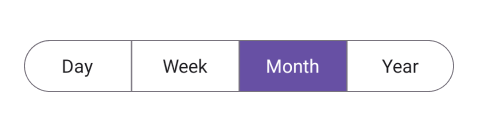

# Getting Started with .NET MAUI Segmented Control

This section provides a quick overview of how to get started with the .NET MAUI Segmented control (SfSegmentedControl) for .NET MAUI and a walk-through to configure the .NET MAUI Segmented control in a real-time scenario. Follow the steps below to add .NET MAUI Segmented control to your project.




## Prerequisites

Before proceeding, ensure the following are set up:

1. Install [.NET 9 SDK](https://dotnet.microsoft.com/en-us/download/dotnet/9.0) or later.
2. Set up a .NET MAUI environment with Visual Studio 2022 v17.12 or later.

## Step 1: Create a new .NET MAUI project

1. Go to **File > New > Project** and choose the **.NET MAUI App** template.
2. Name the project and choose a location. Then click **Next**.
3. Select the .NET framework version and click **Create**.

## Step 2: Install the Syncfusion&reg; .NET MAUI Toolkit NuGet package

1. In **Solution Explorer,** right-click the project and choose **Manage NuGet Packages.**
2. Search for [Syncfusion.Maui.Toolkit](https://www.nuget.org/packages/Syncfusion.Maui.Toolkit/) and install the latest version.
3. Ensure the necessary dependencies are installed correctly, and the project is restored.




## Prerequisites

Before proceeding, ensure the following are set up:

1. Install [.NET 9 SDK](https://dotnet.microsoft.com/en-us/download/dotnet/9.0) or later.
2. Set up a .NET MAUI environment with Visual Studio Code.
3. Ensure that the .NET MAUI workloads are installed and configured as described [here](https://learn.microsoft.com/en-us/dotnet/maui/get-started/installation?view=net-maui-9.0&tabs=visual-studio-code).

## Step 1: Create a new .NET MAUI project

1. Open the command palette by pressing `Ctrl+Shift+P` and type **.NET:New Project** and enter.
2. Choose the **.NET MAUI App** template.
3. Select the project location, type the project name and press **Enter**.
4. Then choose **Create project.**

## Step 2: Install the Syncfusion&reg; .NET MAUI Toolkit NuGet package

1. Press <kbd>Ctrl</kbd> + <kbd>`</kbd> (backtick) to open the integrated terminal in Visual Studio Code.
2. Ensure you're in the project root directory where your .csproj file is located.
3. Run the command `dotnet add package Syncfusion.Maui.Toolkit` to install the Syncfusion® .NET MAUI Toolkit NuGet package.
4. To ensure all dependencies are installed, run `dotnet restore`.




## Prerequisites

Before proceeding, ensure the following are set up:

1. Install [.NET 9 SDK](https://dotnet.microsoft.com/en-us/download/dotnet/9.0) or later.
2. Set up a .NET MAUI environment with JetBrains Rider 2024.3 or later.
3. Make sure the MAUI workloads are installed and configured as described [here.](https://www.jetbrains.com/help/rider/MAUI.html#before-you-start)

## Step 1: Create a new .NET MAUI project

1. Go to **File > New Solution,** Select .NET (C#) and choose the .NET MAUI App template.
2. Enter the Project Name, Solution Name, and Location.
3. Select the .NET framework version and click Create.

## Step 2: Install the Syncfusion® MAUI Toolkit NuGet package

1. In **Solution Explorer,** right-click the project and choose **Manage NuGet Packages.**
2. Search for [Syncfusion.Maui.Toolkit](https://www.nuget.org/packages/Syncfusion.Maui.Toolkit/) and install the latest version.
3. Ensure the necessary dependencies are installed correctly, and the project is restored. If not, Open the Terminal in Rider and manually run: `dotnet restore`




## Step 3: Register Syncfusion handler
 
Make sure to add the namespace.
 


using Syncfusion.Maui.Toolkit.Hosting;


 
Register the Syncfusion toolkit handler in your `CreateMauiApp` method of `MauiProgram.cs` file to use Syncfusion controls.
 


builder.ConfigureSyncfusionToolkit();



## Step 4: Import Segmented Control namespace

Add the following namespace in your XAML or C#.



xmlns:segmentedControl="clr-namespace:Syncfusion.Maui.Toolkit.SegmentedControl;assembly=Syncfusion.Maui.Toolkit"




using Syncfusion.Maui.Toolkit.SegmentedControl;




## Step 5: Add the Segmented Control component

You can use [ItemsSource](https://help.syncfusion.com/cr/maui-toolkit/Syncfusion.Maui.Toolkit.SegmentedControl.SfSegmentedControl.html#Syncfusion_Maui_Toolkit_SegmentedControl_SfSegmentedControl_ItemsSource ) property of [SfSegmentedControl](https://help.syncfusion.com/cr/maui-toolkit/Syncfusion.Maui.Toolkit.SegmentedControl.SfSegmentedControl.html) to populate the segmented items.




<segmentedControl:SfSegmentedControl>
    <segmentedControl:SfSegmentedControl.ItemsSource>
        <x:Array Type="{x:Type x:String}">
            <x:String>Day</x:String>
            <x:String>Week</x:String>
            <x:String>Month</x:String>
            <x:String>Year</x:String>
        </x:Array>
    </segmentedControl:SfSegmentedControl.ItemsSource>
</segmentedControl:SfSegmentedControl>




SfSegmentedControl segmentedControl = new SfSegmentedControl();
segmentedControl.ItemsSource = new List<SfSegmentItem>
{
    new SfSegmentItem { Text = "Day" },
    new SfSegmentItem { Text = "Week" },
    new SfSegmentItem { Text = "Month" },
    new SfSegmentItem { Text = "Year" }
};
this.Content = segmentedControl;




You can download the Segmented Control Getting Started sample from [here](https://github.com/SyncfusionExamples/net-maui-segmented-control-examples/tree/master/GettingStarted).