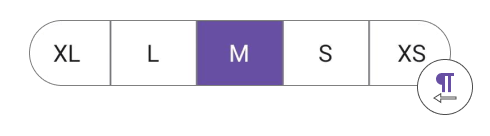

 
# Right To Left Flow Direction in .NET MAUI Segmented control

The `SfSegmentedControl` supports changing the flow direction of items rendering in the right-to-left order by setting the `FlowDirection` to `RightToLeft`.



<ContentPage 
xmlns:segmentedControl="clr-namespace:Syncfusion.Maui.Toolkit.SegmentedControl;assembly=Syncfusion.Maui.Toolkit">
    <segmentedControl:SfSegmentedControl x:Name="segmentedControl" FlowDirection="RightToLeft"/>
</ContentPage>




using Syncfusion.Maui.Toolkit.SegmentedControl;

SfSegmentedControl segmentedControl = new SfSegmentedControl();
segmentedControl.FlowDirection = FlowDirection.RightToLeft;
this.Content = segmentedControl;




