 
# Selection in .NET MAUI Segmented Control (SfSegmentedControl)

This section describes the features of the Segmented Control that help with item selection, customization of the selected item, and associated operations.

## Programmatically set selected index

Programmatically set the default value for the selection to be placed. The selection is updated based on the given index value for the [SelectedIndex](https://help.syncfusion.com/cr/maui-toolkit/Syncfusion.Maui.Toolkit.SegmentedControl.html#Syncfusion_Maui_Toolkit_SegmentedControl_SelectedIndex).




<ContentPage   
    xmlns:segmentedControl="clr-namespace:Syncfusion.Maui.Toolkit.SegmentedControl;assembly=Syncfusion.Maui.Toolkit">
    <segmentedControl:SfSegmentedControl SelectedIndex="1"/>
</ContentPage>




using Syncfusion.Maui.Toolkit.SegmentedControl;
. . .

public partial class MainPage : ContentPage
{
    public MainPage()
    {
        InitializeComponent();
        SfSegmentedControl segmentedControl = new SfSegmentedControl();
        segmentedControl.SelectedIndex = 1;
        this.Content = segmentedControl;
    }
}




## Selection indicator placements

The Segmented control provides four types of selection indicator placement: Fill, border, top, and bottom border.

### Fill
The selection indicator will fill the selected segment, if the [SelectionIndicatorPlacement](https://help.syncfusion.com/cr/maui-toolkit/Syncfusion.Maui.Toolkit.SegmentedControl.SelectionIndicatorSettings.html#Syncfusion_Maui_Toolkit_SegmentedControl_SelectionIndicatorSettings_SelectionIndicatorPlacement) property of [SelectionIndicatorSettings](https://help.syncfusion.com/cr/maui-toolkit/Syncfusion.Maui.Toolkit.SegmentedControl.SelectionIndicatorSettings.html) is set to [Fill](https://help.syncfusion.com/cr/maui-toolkit/Syncfusion.Maui.Toolkit.SegmentedControl.SelectionIndicatorPlacement.html#Syncfusion_Maui_Toolkit_SegmentedControl_SelectionIndicatorPlacement_Fill).




<ContentPage   
    xmlns:segmentedControl="clr-namespace:Syncfusion.Maui.Toolkit.SegmentedControl;assembly=Syncfusion.Maui.Toolkit">
    <segmentedControl:SfSegmentedControl>
        <segmentedControl:SfSegmentedControl.SelectionIndicatorSettings>
            <segmentedControl:SelectionIndicatorSettings SelectionIndicatorPlacement="Fill"/>
        </segmentedControl:SfSegmentedControl.SelectionIndicatorSettings>
    </segmentedControl:SfSegmentedControl>
</ContentPage>




using Syncfusion.Maui.Toolkit.SegmentedControl;
. . .

public partial class MainPage : ContentPage
{
    public MainPage()
    {
        InitializeComponent();
        SfSegmentedControl segmentedControl = new SfSegmentedControl();
        segmentedControl.SelectionIndicatorSettings = new SelectionIndicatorSettings()
        {
            SelectionIndicatorPlacement = SelectionIndicatorPlacement.Fill,
        };
        this.Content = segmentedControl;
    }
}




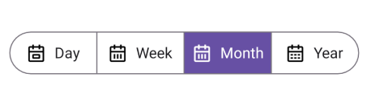

### Border
The selection indicator will be highlighted with the border of the selected segment, if the [SelectionIndicatorPlacement](https://help.syncfusion.com/cr/maui-toolkit/Syncfusion.Maui.Toolkit.SegmentedControl.SelectionIndicatorSettings.html#Syncfusion_Maui_Toolkit_SegmentedControl_SelectionIndicatorSettings_SelectionIndicatorPlacement) property of [SelectionIndicatorSettings](https://help.syncfusion.com/cr/maui-toolkit/Syncfusion.Maui.Toolkit.SegmentedControl.SelectionIndicatorSettings.html) is set to [Border](https://help.syncfusion.com/cr/maui-toolkit/Syncfusion.Maui.Toolkit.SegmentedControl.SelectionIndicatorPlacement.html#Syncfusion_Maui_Toolkit_SegmentedControl_SelectionIndicatorPlacement_Border).




<ContentPage   
    xmlns:segmentedControl="clr-namespace:Syncfusion.Maui.Toolkit.SegmentedControl;assembly=Syncfusion.Maui.Toolkit">
    <segmentedControl:SfSegmentedControl>
        <segmentedControl:SfSegmentedControl.SelectionIndicatorSettings>
            <segmentedControl:SelectionIndicatorSettings 
                SelectionIndicatorPlacement="Border"/>
        </segmentedControl:SfSegmentedControl.SelectionIndicatorSettings>
    </segmentedControl:SfSegmentedControl>
</ContentPage>




using Syncfusion.Maui.Toolkit.SegmentedControl;
. . .

public partial class MainPage : ContentPage
{
    public MainPage()
    {
        InitializeComponent();
        SfSegmentedControl segmentedControl = new SfSegmentedControl();
        segmentedControl.SelectionIndicatorSettings = new SelectionIndicatorSettings()
        {
            SelectionIndicatorPlacement = SelectionIndicatorPlacement.Border,
        };
        this.Content = segmentedControl;
    }
}




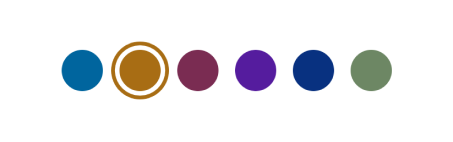

### Top border
The selection indicator will be placed at the top of the selected segment, if the [SelectionIndicatorPlacement](https://help.syncfusion.com/cr/maui-toolkit/Syncfusion.Maui.Toolkit.SegmentedControl.SelectionIndicatorSettings.html#Syncfusion_Maui_Toolkit_SegmentedControl_SelectionIndicatorSettings_SelectionIndicatorPlacement) property of [SelectionIndicatorSettings](https://help.syncfusion.com/cr/maui-toolkit/Syncfusion.Maui.Toolkit.SegmentedControl.SelectionIndicatorSettings.html) is set to [TopBorder](https://help.syncfusion.com/cr/maui-toolkit/Syncfusion.Maui.Toolkit.SegmentedControl.SelectionIndicatorPlacement.html#Syncfusion_Maui_Toolkit_SegmentedControl_SelectionIndicatorPlacement_TopBorder).




<ContentPage   
    xmlns:segmentedControl="clr-namespace:Syncfusion.Maui.Toolkit.SegmentedControl;assembly=Syncfusion.Maui.Toolkit">
    <segmentedControl:SfSegmentedControl>
        <segmentedControl:SfSegmentedControl.SelectionIndicatorSettings>
            <segmentedControl:SelectionIndicatorSettings 
                SelectionIndicatorPlacement="TopBorder"/>
        </segmentedControl:SfSegmentedControl.SelectionIndicatorSettings>
    </segmentedControl:SfSegmentedControl>
</ContentPage>




using Syncfusion.Maui.Toolkit.SegmentedControl;
. . .

public partial class MainPage : ContentPage
{
    public MainPage()
    {
        InitializeComponent();
        SfSegmentedControl segmentedControl = new SfSegmentedControl();
        segmentedControl.SelectionIndicatorSettings = new SelectionIndicatorSettings()
        {
            SelectionIndicatorPlacement = SelectionIndicatorPlacement.TopBorder,
        };
        this.Content = segmentedControl;
    }
}




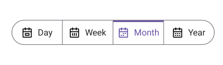

### Bottom border
The selection indicator will be placed at the bottom of the selected segment, if the [SelectionIndicatorPlacement](https://help.syncfusion.com/cr/maui-toolkit/Syncfusion.Maui.Toolkit.SegmentedControl.SelectionIndicatorSettings.html#Syncfusion_Maui_Toolkit_SegmentedControl_SelectionIndicatorSettings_SelectionIndicatorPlacement) property of [SelectionIndicatorSettings](https://help.syncfusion.com/cr/maui-toolkit/Syncfusion.Maui.Toolkit.SegmentedControl.SelectionIndicatorSettings.html) is set to [BottomBorder](https://help.syncfusion.com/cr/maui-toolkit/Syncfusion.Maui.Toolkit.SegmentedControl.SelectionIndicatorPlacement.html#Syncfusion_Maui_Toolkit_SegmentedControl_SelectionIndicatorPlacement_BottomBorder).




<ContentPage   
    xmlns:segmentedControl="clr-namespace:Syncfusion.Maui.Toolkit.SegmentedControl;assembly=Syncfusion.Maui.Toolkit">
    <segmentedControl:SfSegmentedControl>
        <segmentedControl:SfSegmentedControl.SelectionIndicatorSettings>
            <segmentedControl:SelectionIndicatorSettings 
                SelectionIndicatorPlacement="BottomBorder"/>
        </segmentedControl:SfSegmentedControl.SelectionIndicatorSettings>
    </segmentedControl:SfSegmentedControl>
</ContentPage>




using Syncfusion.Maui.Toolkit.SegmentedControl;
. . .

public partial class MainPage : ContentPage
{
    public MainPage()
    {
        InitializeComponent();
        SfSegmentedControl segmentedControl = new SfSegmentedControl();
        segmentedControl.SelectionIndicatorSettings = new SelectionIndicatorSettings()
        {
            SelectionIndicatorPlacement = SelectionIndicatorPlacement.BottomBorder,
        };
        this.Content = segmentedControl;
    }
}




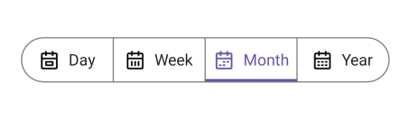

## Customize selected segment
The selected segment of the Segmented control is customized using the [SelectionIndicatorSettings](https://help.syncfusion.com/cr/maui-toolkit/Syncfusion.Maui.Toolkit.SegmentedControl.html#Syncfusion_Maui_Toolkit_SegmentedControl_SelectionIndicatorSettings) property of [SfSegmentedControl](https://help.syncfusion.com/cr/maui-toolkit/Syncfusion.Maui.Toolkit.SegmentedControl.html).

### Customize selected segment background
You can customize the selected segment background of the segmented control and each segment item.

#### Customize selected segment background of segmented control
Customize the selected segment background using the [Background](https://help.syncfusion.com/cr/maui-toolkit/Syncfusion.Maui.Toolkit.SegmentedControl.SelectionIndicatorSettings.html#Syncfusion_Maui_Toolkit_SegmentedControl_SelectionIndicatorSettings_Background) property of [SelectionIndicatorSettings](https://help.syncfusion.com/cr/maui-toolkit/Syncfusion.Maui.Toolkit.SegmentedControl.SelectionIndicatorSettings.html).




<ContentPage   
    xmlns:segmentedControl="clr-namespace:Syncfusion.Maui.Toolkit.SegmentedControl;assembly=Syncfusion.Maui.Toolkit">
    <segmentedControl:SfSegmentedControl>
        <segmentedControl:SfSegmentedControl.SelectionIndicatorSettings>
            <segmentedControl:SelectionIndicatorSettings 
                SelectionIndicatorPlacement="Fill"
                Background="Blue"/>
        </segmentedControl:SfSegmentedControl.SelectionIndicatorSettings>
    </segmentedControl:SfSegmentedControl>
</ContentPage>




using Syncfusion.Maui.Toolkit.SegmentedControl;
. . .

public partial class MainPage : ContentPage
{
    public MainPage()
    {
        InitializeComponent();
        SfSegmentedControl segmentedControl = new SfSegmentedControl();
        segmentedControl.SelectionIndicatorSettings = new SelectionIndicatorSettings()
        {
            SelectionIndicatorPlacement = SelectionIndicatorPlacement.Fill,
            Background = Colors.Blue,
        };
        this.Content = segmentedControl;
    }
}




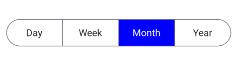

N> The `Background` property of `SelectionIndicatorSettings` is applicable only for [SelectionIndicatorPlacement.Fill](https://help.syncfusion.com/cr/maui-toolkit/Syncfusion.Maui.Toolkit.SegmentedControl.SelectionIndicatorPlacement.html#Syncfusion_Maui_Toolkit_SegmentedControl_SelectionIndicatorPlacement_Fill).

#### Customize selected segment background of each segment item
Customize the selected segment background of each segment item using the [SelectedSegmentBackground](https://help.syncfusion.com/cr/maui-toolkit/Syncfusion.Maui.Toolkit.SegmentedControl.SfSegmentItem.html#Syncfusion_Maui_Toolkit_SegmentedControl_SfSegmentItem_SelectedSegmentBackground) property of [SfSegmentItem](https://help.syncfusion.com/cr/maui-toolkit/Syncfusion.Maui.Toolkit.SegmentedControl.SfSegmentItem.html).




using Syncfusion.Maui.Toolkit.SegmentedControl;
. . .

public partial class MainPage : ContentPage
{
    public MainPage()
    {
        InitializeComponent();
        SfSegmentedControl segmentedControl = new SfSegmentedControl();
        List<SfSegmentItem> segmentItems = new List<SfSegmentItem>
            {
                new SfSegmentItem() {Text="Day", SelectedSegmentBackground = Colors.LightBlue},
                new SfSegmentItem() {Text="Week", SelectedSegmentBackground = Colors.Blue},
                new SfSegmentItem() {Text="Month", SelectedSegmentBackground = Colors.SkyBlue},
                new SfSegmentItem() {Text="Year", SelectedSegmentBackground = Colors.DarkBlue},
            };
        segmentedControl.ItemsSource = segmentItems;
        this.Content = segmentedControl;
    }
}




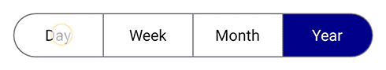

### Customize selected segment text color
You can customize the selected segment text color of the segmented control and each segment item.

#### Customize selected segment text color of segmented control
Customize the selected segment text color using the [TextColor](https://help.syncfusion.com/cr/maui-toolkit/Syncfusion.Maui.Toolkit.SegmentedControl.SelectionIndicatorSettings.html#Syncfusion_Maui_Toolkit_SegmentedControl_SelectionIndicatorSettings_TextColor) property of [SelectionIndicatorSettings](https://help.syncfusion.com/cr/maui-toolkit/Syncfusion.Maui.Toolkit.SegmentedControl.SelectionIndicatorSettings.html).




<ContentPage   
    xmlns:segmentedControl="clr-namespace:Syncfusion.Maui.Toolkit.SegmentedControl;assembly=Syncfusion.Maui.Toolkit">
    <segmentedControl:SfSegmentedControl>
        <segmentedControl:SfSegmentedControl.SelectionIndicatorSettings>
            <segmentedControl:SelectionIndicatorSettings 
                TextColor="Red"/>
        </segmentedControl:SfSegmentedControl.SelectionIndicatorSettings>
    </segmentedControl:SfSegmentedControl>
</ContentPage>




using Syncfusion.Maui.Toolkit.SegmentedControl;
. . .

public partial class MainPage : ContentPage
{
    public MainPage()
    {
        InitializeComponent();
        SfSegmentedControl segmentedControl = new SfSegmentedControl();
        segmentedControl.SelectionIndicatorSettings = new SelectionIndicatorSettings()
        {
            TextColor = Colors.Red,
        };
        this.Content = segmentedControl;
    }
}




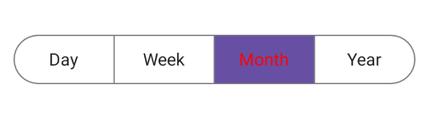

#### Customize selected segment text color of each segment item
Customize the selected segment text color of each segment item using the [SelectedSegmentTextColor](https://help.syncfusion.com/cr/maui-toolkit/Syncfusion.Maui.Toolkit.SegmentedControl.SfSegmentItem.html#Syncfusion_Maui_Toolkit_SegmentedControl_SfSegmentItem_SelectedSegmentTextColor) property of [SfSegmentItem](https://help.syncfusion.com/cr/maui-toolkit/Syncfusion.Maui.Toolkit.SegmentedControl.SfSegmentItem.html).




using Syncfusion.Maui.Toolkit.SegmentedControl;
. . .

public partial class MainPage : ContentPage
{
    public MainPage()
    {
        InitializeComponent();
        SfSegmentedControl segmentedControl = new SfSegmentedControl();
        List<SfSegmentItem> segmentItems = new List<SfSegmentItem>
            {
                new SfSegmentItem() {Text="Day", SelectedSegmentTextColor = Colors.LightBlue},
                new SfSegmentItem() {Text="Week", SelectedSegmentTextColor = Colors.Blue},
                new SfSegmentItem() {Text="Month", SelectedSegmentTextColor = Colors.SkyBlue},
                new SfSegmentItem() {Text="Year", SelectedSegmentTextColor = Colors.DarkBlue},
            };
        segmentedControl.ItemsSource = segmentItems;
        this.Content = segmentedControl;
    }
}




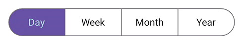

### Customize selected segment border color
Customize the selected segment border color using the [Stroke](https://help.syncfusion.com/cr/maui-toolkit/Syncfusion.Maui.Toolkit.SegmentedControl.SelectionIndicatorSettings.html#Syncfusion_Maui_Toolkit_SegmentedControl_SelectionIndicatorSettings_Stroke) property of [SelectionIndicatorSettings](https://help.syncfusion.com/cr/maui-toolkit/Syncfusion.Maui.Toolkit.SegmentedControl.SelectionIndicatorSettings.html).




<ContentPage   
    xmlns:segmentedControl="clr-namespace:Syncfusion.Maui.Toolkit.SegmentedControl;assembly=Syncfusion.Maui.Toolkit">
    <segmentedControl:SfSegmentedControl>
        <segmentedControl:SfSegmentedControl.SelectionIndicatorSettings>
            <segmentedControl:SelectionIndicatorSettings 
                SelectionIndicatorPlacement="BottomBorder"
                Stroke="DodgerBlue"/>
        </segmentedControl:SfSegmentedControl.SelectionIndicatorSettings>
    </segmentedControl:SfSegmentedControl>
</ContentPage>




using Syncfusion.Maui.Toolkit.SegmentedControl;
. . .

public partial class MainPage : ContentPage
{
    public MainPage()
    {
        InitializeComponent();
        SfSegmentedControl segmentedControl = new SfSegmentedControl();
        segmentedControl.SelectionIndicatorSettings = new SelectionIndicatorSettings()
        {
            SelectionIndicatorPlacement = SelectionIndicatorPlacement.BottomBorder,
            Stroke = Colors.DodgerBlue,
        };
        this.Content = segmentedControl;
    }
}




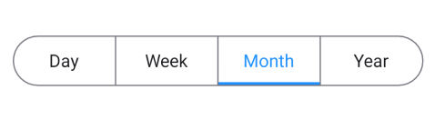

N> The `Stroke` property of `SelectionIndicatorSettings` is applicable only when the selection mode is set to [SelectionIndicatorPlacement.Border](https://help.syncfusion.com/cr/maui-toolkit/Syncfusion.Maui.Toolkit.SegmentedControl.SelectionIndicatorPlacement.html#Syncfusion_Maui_Toolkit_SegmentedControl_SelectionIndicatorPlacement_Border), [SelectionIndicatorPlacement.TopBorder](https://help.syncfusion.com/cr/maui-toolkit/Syncfusion.Maui.Toolkit.SegmentedControl.SelectionIndicatorPlacement.html#Syncfusion_Maui_Toolkit_SegmentedControl_SelectionIndicatorPlacement_TopBorder), or [SelectionIndicatorPlacement.BottomBorder](https://help.syncfusion.com/cr/maui-toolkit/Syncfusion.Maui.Toolkit.SegmentedControl.SelectionIndicatorPlacement.html#Syncfusion_Maui_Toolkit_SegmentedControl_SelectionIndicatorPlacement_BottomBorder).

### Customize selected segment border thickness
Customize the selected segment border thickness using the [StrokeThickness](https://help.syncfusion.com/cr/maui-toolkit/Syncfusion.Maui.Toolkit.SegmentedControl.SelectionIndicatorSettings.html#Syncfusion_Maui_Toolkit_SegmentedControl_SelectionIndicatorSettings_StrokeThickness) property of [SelectionIndicatorSettings](https://help.syncfusion.com/cr/maui-toolkit/Syncfusion.Maui.Toolkit.SegmentedControl.SelectionIndicatorSettings.html).




<ContentPage   
    xmlns:segmentedControl="clr-namespace:Syncfusion.Maui.Toolkit.SegmentedControl;assembly=Syncfusion.Maui.Toolkit">
    <segmentedControl:SfSegmentedControl>
        <segmentedControl:SfSegmentedControl.SelectionIndicatorSettings>
            <segmentedControl:SelectionIndicatorSettings
                SelectionIndicatorPlacement="BottomBorder"
                StrokeThickness="5"/>
        </segmentedControl:SfSegmentedControl.SelectionIndicatorSettings>
    </segmentedControl:SfSegmentedControl>
</ContentPage>




using Syncfusion.Maui.Toolkit.SegmentedControl;
. . .

public partial class MainPage : ContentPage
{
    public MainPage()
    {
        InitializeComponent();
        SfSegmentedControl segmentedControl = new SfSegmentedControl();
        segmentedControl.SelectionIndicatorSettings = new SelectionIndicatorSettings()
        {
            SelectionIndicatorPlacement = SelectionIndicatorPlacement.BottomBorder,
            StrokeThickness = 5,
        };
        this.Content = segmentedControl;
    }
}




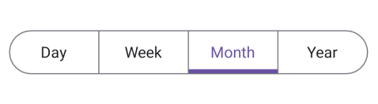

## Enable or Disable Ripple Animation

The [SfSegmentedControl](https://help.syncfusion.com/cr/maui-toolkit/Syncfusion.Maui.Toolkit.SegmentedControl.SfSegmentedControl.html?tabs=tabid-34%2Ctabid-30%2Ctabid-19%2Ctabid-16%2Ctabid-3%2Ctabid-24%2Ctabid-32%2Ctabid-8%2Ctabid-36%2Ctabid-10%2Ctabid-6%2Ctabid-14%2Ctabid-37%2Ctabid-26%2Ctabid-28%2Ctabid-22%2Ctabid-12%2Ctabid-1) provides a ripple animation that visually highlights a segment when it is tapped. This effect applies to both default segment items and items defined using custom data templates. You can enable or disable this animation using the `EnableRippleEffect` property. Set `EnableRippleEffect` to true to display the ripple effect when a segment is selected. Set it to false to disable the ripple animation.




<ContentPage   
    xmlns:segmentedControl="clr-namespace:Syncfusion.Maui.Toolkit.SegmentedControl;assembly=Syncfusion.Maui.Toolkit">

<segmentedControl:SfSegmentedControl x:Name="segmentedControl"
                                     EnableRippleEffect="False">
    <button:SfSegmentedControl.ItemsSource>
        <x:Array Type="{x:Type x:String}">
                <x:String>Day</x:String>
                <x:String>Week</x:String>
                <x:String>Month</x:String>
                <x:String>Year</x:String>
        </x:Array>
    </segmentedControl:SfSegmentedControl.ItemsSource>
</segmentedControl:SfSegmentedControl>

</ContentPage>




using Syncfusion.Maui.Toolkit.SegmentedControl;
. . .

public partial class MainPage : ContentPage
{
    public MainPage()
    {
        InitializeComponent();
        SfSegmentedControl segmentedControl = new SfSegmentedControl();
        List<SfSegmentItem> itemList = new List<SfSegmentItem>
        {
            new SfSegmentItem() {Text = "Day"},
            new SfSegmentItem() {Text = "Week"},
            new SfSegmentItem() {Text = "Month"},
            new SfSegmentItem() {Text = "Year"},
        };
        segmentedControl.ItemsSource = itemList;
        segmentedControl.EnableRippleEffect = false;
        this.Content = segmentedControl;
    }
}




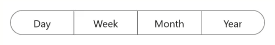

## Notifying segment selection changes
The [SelectionChanged](https://help.syncfusion.com/cr/maui-toolkit/Syncfusion.Maui.Toolkit.SegmentedControl.SfSegmentedControl.html#Syncfusion_Maui_Toolkit_SegmentedControl_SfSegmentedControl_SelectionChanged) event is triggered once the segment is selected in the segmented control. The [SelectionChangedEventArgs](https://help.syncfusion.com/cr/maui-toolkit/Syncfusion.Maui.Toolkit.SegmentedControl.SelectionChangedEventArgs.html) has the following values, which provide information for the `SelectionChanged` event.

* OldIndex
* NewIndex
* OldValue
* NewValue




using Syncfusion.Maui.Toolkit.SegmentedControl;
. . .

public partial class MainPage : ContentPage
{
    public MainPage()
    {
        InitializeComponent();
        SfSegmentedControl segmentedControl = new SfSegmentedControl();
        segmentedControl.SelectionChanged += OnSegmentedControlSelectionChanged;
        this.Content = segmentedControl;
    }

    private void OnSegmentedControlSelectionChanged(object sender, Syncfusion.Maui.Toolkit.SegmentedControl.SelectionChangedEventArgs e)
    {
        var newValue = e.NewValue;
        var oldValue = e.OldValue;
        var newIndex = e.NewIndex;
        var oldIndex = e.OldIndex;
    }
}


