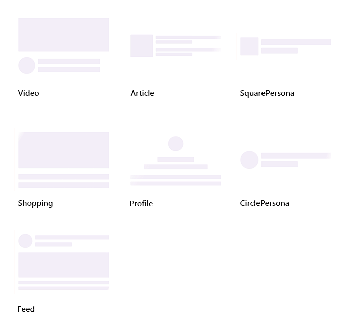

# Built-in views of .NET MAUI Shimmer (SfShimmer)

## Built-in types

Syncfusion [.NET MAUI Shimmer](https://help.syncfusion.com/cr/maui-toolkit/Syncfusion.Maui.Toolkit.Shimmer.SfShimmer.html) (SfShimmer) control provides seven built-in shimmer view types such as CirclePersona, SquarePersona, Profile, Article, Video, Feed, and Shopping.

   

The built-in shimmer types can be used by setting the [Type](https://help.syncfusion.com/cr/maui-toolkit/Syncfusion.Maui.Toolkit.Shimmer.SfShimmer.html#Syncfusion_Maui_Toolkit_Shimmer_SfShimmer_Type) of `SfShimmer`. By default, the [CirclePersona](https://help.syncfusion.com/cr/maui-toolkit/Syncfusion.Maui.Toolkit.Shimmer.ShimmerType.html#Syncfusion_Maui_Toolkit_Shimmer_ShimmerType_CirclePersona) is initially rendered.




<shimmer:SfShimmer VerticalOptions="FillAndExpand" 
                   Type="CirclePersona">
      <StackLayout>
         <Label 
            Text="Content is loaded!!"
            HorizontalOptions="CenterAndExpand"
            VerticalOptions="CenterAndExpand">
         </Label>
      </StackLayout>
</shimmer:SfShimmer>




SfShimmer shimmer = new SfShimmer()
{
   Type = ShimmerType.CirclePersona,
   VerticalOptions = LayoutOptions.Fill,
   Content = new Label
   {
      Text = "Content is loaded!!"
   }
};

this.Content = shimmer;


