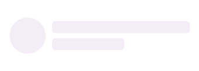

# Getting started of .NET MAUI Shimmer

This section explains how to add the [.NET MAUI Shimmer](https://help.syncfusion.com/cr/maui-toolkit/Syncfusion.Maui.Toolkit.Shimmer.SfShimmer.html) control. Follow the steps below to add a .NET MAUI Shimmer control to your project.




## Prerequisites

Before proceeding, ensure the following are set up:
 1. Install [.NET 8 SDK](https://dotnet.microsoft.com/en-us/download/dotnet/8.0) or later is installed.
 2. Set up a .NET MAUI environment with Visual Studio 2022 (v17.8 or later).
 
## Step 1: Create a New .NET MAUI Project

 1. Go to **File > New > Project** and choose the **.NET MAUI App** template.
 2. Name the project and choose a location. Then click **Next**.
 3. Select the .NET framework version and click **Create**.
 
## Step 2: Install the Syncfusion&reg; .NET MAUI Toolkit NuGet Package

 1. In **Solution Explorer**, right-click the project and choose **Manage NuGet Packages**.
 2. Search for [Syncfusion.Maui.Toolkit](https://www.nuget.org/packages/Syncfusion.Maui.Toolkit/) and install the latest version.
 3. Ensure the necessary dependencies are installed correctly, and the project is restored.
 
 ## Step 3: Register the handler

In the **MauiProgram.cs** file, register the handler for Syncfusion&reg; Toolkit.


    
using Syncfusion.Maui.Toolkit.Hosting;

public static class MauiProgram
{
	public static MauiApp CreateMauiApp()
	{
	    var builder = MauiApp.CreateBuilder();
		builder
			.ConfigureSyncfusionToolkit()
			.UseMauiApp<App>()
			.ConfigureFonts(fonts =>
			{
				fonts.AddFont("OpenSans-Regular.ttf", "OpenSansRegular");
				fonts.AddFont("OpenSans-Semibold.ttf", "OpenSansSemibold");
			});

		return builder.Build();
	}
}




## Step 4: Add .NET MAUI Shimmer control

 1. To initialize the control, import the `Syncfusion.Maui.Toolkit.Shimmer` namespace into your code.
 2. Initialize [SfShimmer](https://help.syncfusion.com/cr/maui-toolkit/Syncfusion.Maui.Toolkit.Shimmer.SfShimmer.html).




<ContentPage   
    . . .
    xmlns:shimmer="clr-namespace:Syncfusion.Maui.Toolkit.Shimmer;assembly=Syncfusion.Maui.Toolkit">

    <shimmer:SfShimmer />
</ContentPage>




using Syncfusion.Maui.Toolkit.Shimmer;
. . .

public partial class MainPage : ContentPage
{
    public MainPage()
    {
        InitializeComponent();
        SfShimmer shimmer = new SfShimmer();
        this.Content = shimmer;
    }
}







## Prerequisites

Before proceeding, ensure the following are set up:
 1. Install [.NET 8 SDK](https://dotnet.microsoft.com/en-us/download/dotnet/8.0) or later is installed.
 2. Set up a .NET MAUI environment with Visual Studio Code. 
 3. Ensure that the .NET MAUI extension is installed and configured as described [here.](https://learn.microsoft.com/en-us/dotnet/maui/get-started/installation?view=net-maui-8.0&tabs=visual-studio-code)

## Step 1: Create a New .NET MAUI Project

 1. Open the command palette by pressing `Ctrl+Shift+P` and type **.NET:New Project** and enter.
 2. Choose the **.NET MAUI App** template.
 3. Select the project location, type the project name and press **Enter**.
 4. Then choose **Create project.**

## Step 2: Install the Syncfusion&reg; .NET MAUI Toolkit NuGet Package

1. Press <kbd>Ctrl</kbd> + <kbd>`</kbd> (backtick) to open the integrated terminal in Visual Studio Code.
2. Ensure you're in the project root directory where your .csproj file is located.
3. Run the command `dotnet add package Syncfusion.Maui.Toolkit` to install the Syncfusion&reg; .NET MAUI Toolkit NuGet package.
4. To ensure all dependencies are installed, run `dotnet restore`.

## Step 3: Register the handler

In the **MauiProgram.cs** file, register the handler for Syncfusion&reg; Toolkit.


    
using Syncfusion.Maui.Toolkit.Hosting;

public static class MauiProgram
{
	public static MauiApp CreateMauiApp()
	{
	    var builder = MauiApp.CreateBuilder();
		builder
			.ConfigureSyncfusionToolkit()
			.UseMauiApp<App>()
			.ConfigureFonts(fonts =>
			{
				fonts.AddFont("OpenSans-Regular.ttf", "OpenSansRegular");
				fonts.AddFont("OpenSans-Semibold.ttf", "OpenSansSemibold");
			});

		return builder.Build();
	}
}




## Step 4: Add .NET MAUI Shimmer control

 1. To initialize the control, import the `Syncfusion.Maui.Toolkit.Shimmer` namespace into your code.
 2. Initialize [SfShimmer](https://help.syncfusion.com/cr/maui-toolkit/Syncfusion.Maui.Toolkit.Shimmer.SfShimmer.html).




<ContentPage   
    . . .
    xmlns:shimmer="clr-namespace:Syncfusion.Maui.Toolkit.Shimmer;assembly=Syncfusion.Maui.Toolkit">

    <shimmer:SfShimmer />
</ContentPage>




using Syncfusion.Maui.Toolkit.Shimmer;
. . .

public partial class MainPage : ContentPage
{
    public MainPage()
    {
        InitializeComponent();
        SfShimmer shimmer = new SfShimmer();
        this.Content = shimmer;
    }
}








## Prerequisites

Before proceeding, ensure the following are set up:

1. Ensure you have the latest version of JetBrains Rider.
2. Install [.NET 8 SDK](https://dotnet.microsoft.com/en-us/download/dotnet/8.0) or later is installed.
3. Make sure the MAUI workloads are installed and configured as described [here.](https://www.jetbrains.com/help/rider/MAUI.html#before-you-start)

## Step 1: Create a new .NET MAUI Project

1. Go to **File > New Solution,** Select .NET (C#) and choose the .NET MAUI App template.
2. Enter the Project Name, Solution Name, and Location.
3. Select the .NET framework version and click Create.

## Step 2: Install the Syncfusion® MAUI Toolkit NuGet Package

1. In **Solution Explorer,** right-click the project and choose **Manage NuGet Packages.**
2. Search for [Syncfusion.Maui.Toolkit](https://www.nuget.org/packages/Syncfusion.Maui.Toolkit/) and install the latest version.
3. Ensure the necessary dependencies are installed correctly, and the project is restored. If not, Open the Terminal in Rider and manually run: `dotnet restore`

## Step 3: Register the handler

In the **MauiProgram.cs** file, register the handler for Syncfusion&reg; Toolkit.


    
using Syncfusion.Maui.Toolkit.Hosting;

public static class MauiProgram
{
	public static MauiApp CreateMauiApp()
	{
	    var builder = MauiApp.CreateBuilder();
		builder
			.ConfigureSyncfusionToolkit()
			.UseMauiApp<App>()
			.ConfigureFonts(fonts =>
			{
				fonts.AddFont("OpenSans-Regular.ttf", "OpenSansRegular");
				fonts.AddFont("OpenSans-Semibold.ttf", "OpenSansSemibold");
			});

		return builder.Build();
	}
}




## Step 4: Add .NET MAUI Shimmer control

 1. To initialize the control, import the `Syncfusion.Maui.Toolkit.Shimmer` namespace into your code.
 2. Initialize [SfShimmer](https://help.syncfusion.com/cr/maui-toolkit/Syncfusion.Maui.Toolkit.Shimmer.SfShimmer.html).




<ContentPage   
    . . .
    xmlns:shimmer="clr-namespace:Syncfusion.Maui.Toolkit.Shimmer;assembly=Syncfusion.Maui.Toolkit">

    <shimmer:SfShimmer />
</ContentPage>




using Syncfusion.Maui.Toolkit.Shimmer;
. . .

public partial class MainPage : ContentPage
{
    public MainPage()
    {
        InitializeComponent();
        SfShimmer shimmer = new SfShimmer();
        this.Content = shimmer;
    }
}







## Change different shimmer views

The `.NET MAUI Shimmer` control provides seven different shimmer types of views. It can be assigned to the control using the [Type](https://help.syncfusion.com/cr/maui-toolkit/Syncfusion.Maui.Toolkit.Shimmer.SfShimmer.html#Syncfusion_Maui_Toolkit_Shimmer_SfShimmer_Type) property. By default, the control is assigned to the [CirclePersona](https://help.syncfusion.com/cr/maui-toolkit/Syncfusion.Maui.Toolkit.Shimmer.ShimmerType.html#Syncfusion_Maui_Toolkit_Shimmer_ShimmerType_CirclePersona) view.




<shimmer:SfShimmer VerticalOptions="Fill"
                   Type="CirclePersona">
    <StackLayout>
        <Label
            Text="Content is loaded!"
            HorizontalOptions="CenterAndExpand"
            VerticalOptions="CenterAndExpand">
        </Label>
    </StackLayout>
</shimmer:SfShimmer>




SfShimmer shimmer = new SfShimmer()
{
    Type = ShimmerType.CirclePersona,
    VerticalOptions = LayoutOptions.Fill,
    Content = new Label
    {
        Text = "Content is loaded!!"
    }
};

this.Content = shimmer;




## Loading shimmer content

Shimmer content is loaded when the [`IsActive`](https://help.syncfusion.com/cr/maui-toolkit/Syncfusion.Maui.Toolkit.Shimmer.SfShimmer.html#Syncfusion_Maui_Toolkit_Shimmer_SfShimmer_IsActive) property of the [`SfShimmer`](https://help.syncfusion.com/cr/maui-toolkit/Syncfusion.Maui.Toolkit.Shimmer.SfShimmer.html) is disabled.

 

 

<shimmer:SfShimmer VerticalOptions="FillAndExpand" 
                   IsActive ="false">
    <shimmer:SfShimmer.Content>
        <StackLayout>
            <Label Text="Content is loaded!"/>
        </StackLayout>
    </shimmer:SfShimmer.Content>
</shimmer:SfShimmer>



 

SfShimmer shimmer = new SfShimmer()
{
    IsActive = false,
    VerticalOptions = LayoutOptions.FillAndExpand,
    Content = new Label
    {
        Text = "Content is loaded!"
    }
};
this.Content = shimmer;


