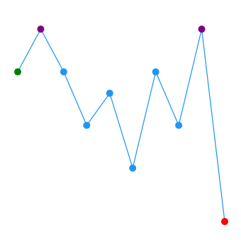
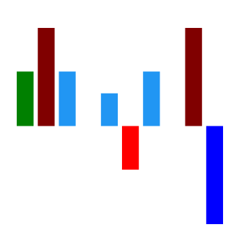
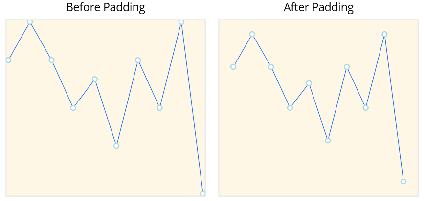

# Customize Data Points in .NET MAUI Spark Charts

N> **Prerequisite:** Ensure that the required NuGet package is installed, the necessary namespaces are imported, and the **Spark Charts** control is properly configured in your application. For detailed setup and configuration instructions, refer to the **[Getting Started](https://help.syncfusion.com/maui-toolkit/spark-charts/getting-started)** guide.

Customizing data point colors improves visual clarity by distinguishing key values. This enables efficient interpretation of chart data and helps identify critical trends at a glance.

## Data point styling

The color of the first, last, high, low, and negative data points can be customized using the following `Brush` type properties. For line and area charts, these fills render visibly only when the `ShowMarkers` property is enabled.

* [FirstPointFill](https://help.syncfusion.com/cr/maui-toolkit/Syncfusion.Maui.Toolkit.SparkCharts.SfSparkLineChart.html#Syncfusion_Maui_Toolkit_SparkCharts_SfSparkLineChart_FirstPointFill) - Used to highlight the first point.
* [LastPointFill](https://help.syncfusion.com/cr/maui-toolkit/Syncfusion.Maui.Toolkit.SparkCharts.SfSparkLineChart.html#Syncfusion_Maui_Toolkit_SparkCharts_SfSparkLineChart_LastPointFill) - Used to highlight the last point.
* [HighPointFill](https://help.syncfusion.com/cr/maui-toolkit/Syncfusion.Maui.Toolkit.SparkCharts.SfSparkLineChart.html#Syncfusion_Maui_Toolkit_SparkCharts_SfSparkLineChart_HighPointFill) - Used to highlight the highest point.
* [LowPointFill](https://help.syncfusion.com/cr/maui-toolkit/Syncfusion.Maui.Toolkit.SparkCharts.SfSparkLineChart.html#Syncfusion_Maui_Toolkit_SparkCharts_SfSparkLineChart_LowPointFill) - Used to highlight the lowest point.
* [NegativePointsFill](https://help.syncfusion.com/cr/maui-toolkit/Syncfusion.Maui.Toolkit.SparkCharts.SfSparkLineChart.html#Syncfusion_Maui_Toolkit_SparkCharts_SfSparkLineChart_NegativePointsFill) - Used to highlight the negative points.

The following code snippet demonstrates how to customize the data points in a spark line chart.





<sparkchart:SfSparkLineChart ItemsSource="{Binding Data}" 
                    YBindingPath="Value"
                    FirstPointFill="Green"
                    LastPointFill="Blue"
                    HighPointFill="Purple"
                    LowPointFill="Red"
                    ShowMarkers="True">
    <!-- code omitted for brevity -->
</sparkchart:SfSparkLineChart>





SfSparkLineChart sparkchart = new SfSparkLineChart()
{
    ItemsSource = new SparkChartViewModel().Data,
    YBindingPath = "Value",
    FirstPointFill = new SolidColorBrush(Colors.Green),
    LastPointFill = new SolidColorBrush(Colors.Blue),
    HighPointFill = new SolidColorBrush(Colors.Purple),
    LowPointFill = new SolidColorBrush(Colors.Red),
    ShowMarkers = true
};
//code omitted for brevity
this.Content = sparkchart;





N> [NegativePointsFill](https://help.syncfusion.com/cr/maui-toolkit/Syncfusion.Maui.Toolkit.SparkCharts.SfSparkLineChart.html#Syncfusion_Maui_Toolkit_SparkCharts_SfSparkLineChart_NegativePointsFill) is applicable only to [SfSparkColumnChart](https://help.syncfusion.com/cr/maui-toolkit/Syncfusion.Maui.Toolkit.SparkCharts.SfSparkColumnChart.html) and [SfSparkWinLossChart](https://help.syncfusion.com/cr/maui-toolkit/Syncfusion.Maui.Toolkit.SparkCharts.SfSparkWinLossChart.html).

The following code snippet demonstrates how to customize the segments in a spark column chart.





<sparkchart:SfSparkColumnChart ItemsSource="{Binding Data}" 
                    YBindingPath="Value"
                    FirstPointFill="Green"
                    LastPointFill="Purple"
                    HighPointFill="Maroon"
                    LowPointFill="Blue"
                    NegativePointsFill="Red">
    <!-- code omitted for brevity -->
</sparkchart:SfSparkColumnChart>





SfSparkColumnChart sparkchart = new SfSparkColumnChart()
{
    ItemsSource = new SparkChartViewModel().Data,
    YBindingPath = "Value",
    FirstPointFill = new SolidColorBrush(Colors.Green),
    LastPointFill = new SolidColorBrush(Colors.Purple),
    HighPointFill = new SolidColorBrush(Colors.Maroon),
    LowPointFill = new SolidColorBrush(Colors.Blue),
    NegativePointsFill = new SolidColorBrush(Colors.Red)
};
//code omitted for brevity
this.Content = sparkchart;





## Padding

The [Padding](https://help.syncfusion.com/cr/maui-toolkit/Syncfusion.Maui.Toolkit.SparkCharts.SfSparkChart.html#Syncfusion_Maui_Toolkit_SparkCharts_SfSparkChart_Padding) property represents the distance between the spark chart and its surrounding plot area. Padding can be applied in a specific direction or in all directions. The default value is `0`. Padding can be applied to all spark chart types.





<sparkchart:SfSparkLineChart ItemsSource="{Binding Data}" 
                    Padding="20"
                    ShowMarkers="True"
                    YBindingPath="Value">
    <sparkchart:SfSparkLineChart.BindingContext>
        <model:SparkChartViewModel/>
    </sparkchart:SfSparkLineChart.BindingContext>

    <sparkchart:SfSparkLineChart.MarkerSettings>
        <sparkchart:SparkChartMarkerSettings 
            Fill="white" 
            StrokeWidth="2"  
            Stroke="LightBlue"  
            Height="8" 
            Width="8" 
            ShapeType="Circle"/>
    </sparkchart:SfSparkLineChart.MarkerSettings>
</sparkchart:SfSparkLineChart>





var viewModel = new SparkChartViewModel();
SfSparkLineChart sparkchart = new SfSparkLineChart()
{
    BindingContext = viewModel,
    ItemsSource = viewModel.Data,
    Padding = new Thickness(20),
    ShowMarkers = true,
    YBindingPath = "Value",
    MarkerSettings = new SparkChartMarkerSettings
    {
        Fill= Colors.White,
        StrokeWidth = 2,
        Stroke = new SolidColorBrush(Colors.LightBlue),
        Height = 8,
        Width = 8,
        ShapeType = SparkChartMarkerShape.Circle
    }
};
this.Content = sparkchart;





