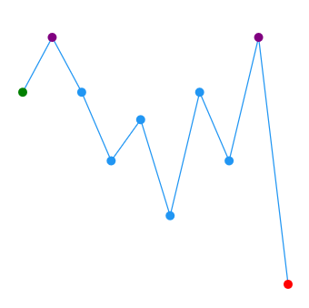
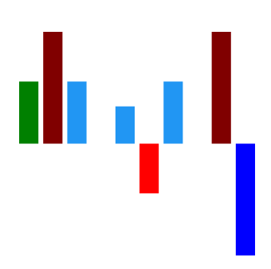
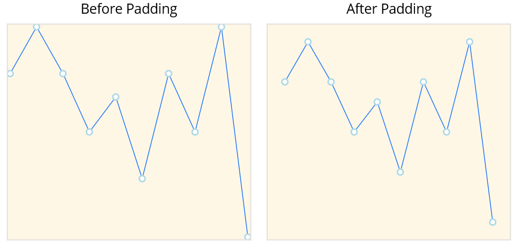

# Customize Data Points in .NET MAUI Spark Charts

Customizing data point colors improves visual clarity by distinguishing key values. This enables efficient interpretation of chart data and helps identify critical trends at a glance.

## Data point styling

Color of the first, last, high, low, and negative data points can be customized using the following `Brush` type properties.

* [FirstPointFill](https://help.syncfusion.com/cr/maui-toolkit/Syncfusion.Maui.Toolkit.SparkCharts.SfSparkLineChart.html#Syncfusion_Maui_Toolkit_SparkCharts_SfSparkLineChart_FirstPointFill) - Used to highlight the first point.
* [LastPointFill](https://help.syncfusion.com/cr/maui-toolkit/Syncfusion.Maui.Toolkit.SparkCharts.SfSparkLineChart.html#Syncfusion_Maui_Toolkit_SparkCharts_SfSparkLineChart_LastPointFill) - Used to highlight the last point.
* [HighPointFill](https://help.syncfusion.com/cr/maui-toolkit/Syncfusion.Maui.Toolkit.SparkCharts.SfSparkLineChart.html#Syncfusion_Maui_Toolkit_SparkCharts_SfSparkLineChart_HighPointFill) - Used to highlight the highest point.
* [LowPointFill](https://help.syncfusion.com/cr/maui-toolkit/Syncfusion.Maui.Toolkit.SparkCharts.SfSparkLineChart.html#Syncfusion_Maui_Toolkit_SparkCharts_SfSparkLineChart_LastPointFill) - Used to highlight the lowest point.
* [NegativePointsFill](https://help.syncfusion.com/cr/maui-toolkit/Syncfusion.Maui.Toolkit.SparkCharts.SfSparkLineChart.html#Syncfusion_Maui_Toolkit_SparkCharts_SfSparkLineChart_NegativePointsFill) - Used to highlight the negative points.





<sparkchart:SfSparkLineChart ItemsSource="{Binding Data}" 
                    YBindingPath="Value"
                    FirstPointFill="Green"
                    LastPointFill="Blue"
                    HighPointFill="Purple"
                    LowPointFill="Red"
                    ShowMarkers="True">
. . .
</sparkchart:SfSparkLineChart>





SfSparkLineChart sparkchart = new SfSparkLineChart()
{
    ItemsSource = new SparkChartViewModel().Data,
    YBindingPath = "Value",
    FirstPointFill = new SolidColorBrush(Colors.Green),
    LastPointFill = new SolidColorBrush(Colors.Blue),
    HighPointFill = new SolidColorBrush(Colors.Purple),
    LowPointFill = new SolidColorBrush(Colors.Red),
    ShowMarkers = true
};
this.Content = sparkchart;





N> [NegativePointsFill](https://help.syncfusion.com/cr/maui-toolkit/Syncfusion.Maui.Toolkit.SparkCharts.SfSparkLineChart.html#Syncfusion_Maui_Toolkit_SparkCharts_SfSparkLineChart_NegativePointsFill) is applicable for [SfSparkColumnChart](https://help.syncfusion.com/cr/maui-toolkit/Syncfusion.Maui.Toolkit.SparkCharts.SfSparkColumnChart.html) and [SfSparkWinLossChart](https://help.syncfusion.com/cr/maui-toolkit/Syncfusion.Maui.Toolkit.SparkCharts.SfSparkWinLossChart.html) alone.

Code snippet to customize the segments





<sparkchart:SfSparkColumnChart ItemsSource="{Binding Data}" 
                    YBindingPath="Value"
                    FirstPointFill="Green"
                    LastPointFill="Purple"
                    HighPointFill="Maroon"
                    LowPointFill= "Blue"
                    NegativePointsFill="Red">
. . .
</sparkchart:SfSparkColumnChart>





SfSparkColumnChart sparkchart = new SfSparkColumnChart()
{
    ItemsSource = new SparkChartViewModel().Data,
    YBindingPath = "Value",
    FirstPointFill = new SolidColorBrush(Colors.Green),
    LastPointFill = new SolidColorBrush(Colors.Purple),
    HighPointFill = new SolidColorBrush(Colors.Maroon),
    LowPointFill = new SolidColorBrush(Colors.Blue),
    NegativePointsFill = new SolidColorBrush(Colors.Red)
};
this.Content = sparkchart;





## Padding

The [Padding](https://help.syncfusion.com/cr/maui-toolkit/Syncfusion.Maui.Toolkit.SparkCharts.SfSparkChart.html#Syncfusion_Maui_Toolkit_SparkCharts_SfSparkChart_Padding) property represents the distance between an element and its child elements. Padding can be applied in specific direction or in all directions. Padding can be applied for all sparkline types.





<sparkchart:SfSparkLineChart ItemsSource="{Binding Data}" 
                    Padding="20"
                    ShowMarkers="True"
                    YBindingPath="Value">
    <sparkchart:SfSparkLineChart.BindingContext>
        <model:SparkDataViewModel/>
    </sparkchart:SfSparkLineChart.BindingContext>

    <sparkchart:SfSparkLineChart.MarkerSettings>
        <sparkchart:SparkChartMarkerSettings 
            Fill="white" 
            StrokeWidth="2"  
            Stroke="LightBlue"  
            Height="8" 
            Width="8" 
            ShapeType="Circle"/>
    </sparkchart:SfSparkLineChart.MarkerSettings>
</sparkchart:SfSparkLineChart>





var viewModel = new SparkDataViewModel();
SfSparkLineChart sparkchart = new SfSparkLineChart()
{
    BindingContext = viewModel,
    ItemsSource = viewModel.Data,
    Padding = new Thickness(20),
    ShowMarkers = true,
    YBindingPath = "Value",
    MarkerSettings = new SparkChartMarkerSettings
    {
        Fill= Colors.White,
        StrokeWidth = 2,
        Stroke = new SolidColorBrush(Colors.LightBlue),
        Height = 8,
        Width = 8,
        ShapeType = SparkChartMarkerShape.Circle
    }
};
this.Content = sparkchart;





