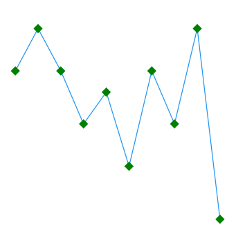

# Markers in .NET MAUI Spark Charts

Markers, also known as symbols, are used to indicate or highlight the position of data points in the [SfSparkLineChart](https://help.syncfusion.com/cr/maui-toolkit/Syncfusion.Maui.Toolkit.SparkCharts.SfSparkLineChart.html) and [SfSparkAreaChart](https://help.syncfusion.com/cr/maui-toolkit/Syncfusion.Maui.Toolkit.SparkCharts.SfSparkAreaChart.html).

## Enable Marker

To enable markers in the [SfSparkLineChart](https://help.syncfusion.com/cr/maui-toolkit/Syncfusion.Maui.Toolkit.SparkCharts.SfSparkLineChart.html) and [SfSparkAreaChart](https://help.syncfusion.com/cr/maui-toolkit/Syncfusion.Maui.Toolkit.SparkCharts.SfSparkAreaChart.html), set the [ShowMarkers](https://help.syncfusion.com/cr/maui-toolkit/Syncfusion.Maui.Toolkit.SparkCharts.SfSparkLineChart.html#Syncfusion_Maui_Toolkit_SparkCharts_SfSparkLineChart_ShowMarkers) property to `true`. Its default value is `false`.





<sparkchart:SfSparkLineChart ItemsSource="{Binding Data}" 
                    YBindingPath="Value"
                    ShowMarkers="True">
. . . 
</sparkchart:SfSparkLineChart>





SfSparkLineChart sparkchart = new SfSparkLineChart()
{
    ItemsSource = new SparkChartViewModel().Data,
    YBindingPath = "Value",
    ShowMarkers = true,
};

this.Content = sparkchart;





## Marker Customization

To change the appearance of markers in the [SfSparkLineChart](https://help.syncfusion.com/cr/maui-toolkit/Syncfusion.Maui.Toolkit.SparkCharts.SfSparkLineChart.html) and [SfSparkAreaChart](https://help.syncfusion.com/cr/maui-toolkit/Syncfusion.Maui.Toolkit.SparkCharts.SfSparkAreaChart.html), create an instance of the [MarkerSettings](https://help.syncfusion.com/cr/maui-toolkit/Syncfusion.Maui.Toolkit.SparkCharts.SfSparkLineChart.html#Syncfusion_Maui_Toolkit_SparkCharts_SfSparkLineChart_MarkerSettings) property. The following properties can be used to customize the marker's appearance.

* [ShapeType](https://help.syncfusion.com/cr/maui-toolkit/Syncfusion.Maui.Toolkit.SparkCharts.SparkChartMarkerSettings.html#Syncfusion_Maui_Toolkit_SparkCharts_SparkChartMarkerSettings_ShapeType), of type [SparkChartMarkerShape](https://help.syncfusion.com/cr/maui-toolkit/Syncfusion.Maui.Toolkit.SparkCharts.SparkChartMarkerShape.html), describes the shape of the marker. The default value of this property is [SparkChartMarkerShape.Circle](https://help.syncfusion.com/cr/maui-toolkit/Syncfusion.Maui.Toolkit.SparkCharts.SparkChartMarkerShape.html#Syncfusion_Maui_Toolkit_SparkCharts_SparkChartMarkerShape_Circle).
* [Stroke](https://help.syncfusion.com/cr/maui-toolkit/Syncfusion.Maui.Toolkit.SparkCharts.SparkChartMarkerSettings.html#Syncfusion_Maui_Toolkit_SparkCharts_SparkChartMarkerSettings_Stroke), of type `Brush`, indicates the brush used to paint the marker border.
* [StrokeWidth](https://help.syncfusion.com/cr/maui-toolkit/Syncfusion.Maui.Toolkit.SparkCharts.SparkChartMarkerSettings.html#Syncfusion_Maui_Toolkit_SparkCharts_SparkChartMarkerSettings_StrokeWidth), of type `double`, indicates the width of the marker border.
* [Fill](https://help.syncfusion.com/cr/maui-toolkit/Syncfusion.Maui.Toolkit.SparkCharts.SparkChartMarkerSettings.html#Syncfusion_Maui_Toolkit_SparkCharts_SparkChartMarkerSettings_Fill), of type `Brush`, indicates the color of the marker.
* [Width](https://help.syncfusion.com/cr/maui-toolkit/Syncfusion.Maui.Toolkit.SparkCharts.SparkChartMarkerSettings.html#Syncfusion_Maui_Toolkit_SparkCharts_SparkChartMarkerSettings_Width), of type `double`, indicates the width of the marker.
* [Height](https://help.syncfusion.com/cr/maui-toolkit/Syncfusion.Maui.Toolkit.SparkCharts.SparkChartMarkerSettings.html#Syncfusion_Maui_Toolkit_SparkCharts_SparkChartMarkerSettings_Height), of type `double`, indicates the height of the marker.





<sparkchart:SfSparkLineChart ItemsSource="{Binding Data}" 
                    YBindingPath="Value"
                    ShowMarkers="True">

    <sparkchart:SfSparkLineChart.MarkerSettings>
        <sparkchart:SparkChartMarkerSettings 
            Stroke="Green"
            Height="5"
            Width="5"
            ShapeType="Diamond"
            StrokeWidth="4"/>
    </sparkchart:SfSparkLineChart.MarkerSettings>
    . . .
</sparkchart:SfSparkLineChart>





SfSparkLineChart sparkchart = new SfSparkLineChart()
{
    ItemsSource = new SparkChartViewModel().Data,
    YBindingPath = "Value",
    ShowMarkers = true,
    MarkerSettings = new SparkChartMarkerSettings
    {
        Stroke = new SolidColorBrush(Colors.Green),
        Height = 5,
        Width = 5,
        ShapeType = SparkChartMarkerShape.Diamond,
        StrokeWidth = 4,
    }
};

this.Content = sparkchart;





