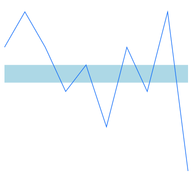

# Range Band in .NET MAUI Spark Charts

N> **Prerequisite:** Ensure that the required NuGet package is installed, the necessary namespaces are imported, and the **Spark Charts** control is properly configured in your application. For detailed setup and configuration instructions, refer to the **[Getting Started](https://help.syncfusion.com/maui-toolkit/spark-charts/getting-started)** guide.

Range bands are used to highlight a particular region in the spark chart along the Y-axis, making it easy to identify specific value ranges or thresholds. Range bands are supported across all spark chart types.

## Configure range band

The following properties can be used to configure a range band. If `RangeBandStart` or `RangeBandEnd` is left unset, no range band is rendered. If `RangeBandStart` is greater than `RangeBandEnd`, the band still renders over the interval between the two values.

* [RangeBandStart](https://help.syncfusion.com/cr/maui-toolkit/Syncfusion.Maui.Toolkit.SparkCharts.SfSparkChart.html#Syncfusion_Maui_Toolkit_SparkCharts_SfSparkChart_RangeBandStart), of type `double`, specifies the starting Y-axis value where the range band begins. The default value is `double.NaN`.
* [RangeBandEnd](https://help.syncfusion.com/cr/maui-toolkit/Syncfusion.Maui.Toolkit.SparkCharts.SfSparkChart.html#Syncfusion_Maui_Toolkit_SparkCharts_SfSparkChart_RangeBandEnd), of type `double`, specifies the ending Y-axis value where the range band ends. The default value is `double.NaN`.
* [RangeBandFill](https://help.syncfusion.com/cr/maui-toolkit/Syncfusion.Maui.Toolkit.SparkCharts.SfSparkChart.html#Syncfusion_Maui_Toolkit_SparkCharts_SfSparkChart_RangeBandFill), of type `Brush`, specifies the fill color for the range band. This color is applied to the area between `RangeBandStart` and `RangeBandEnd` values on the Y-axis. The default value is `null`.





<sparkchart:SfSparkLineChart ItemsSource = "{Binding Data}" 
                             YBindingPath = "Value"
                             RangeBandStart = "10" 
                             RangeBandEnd = "30" 
                             RangeBandFill = "LightBlue">
    <!-- code omitted for brevity -->
</sparkchart:SfSparkLineChart>





SfSparkLineChart sparkchart = new SfSparkLineChart()
{
    ItemsSource = new SparkChartViewModel().Data,
    YBindingPath = "Value",
    RangeBandStart = 10,
    RangeBandEnd = 30,
    RangeBandFill = new SolidColorBrush(Colors.LightBlue)
};
//code omitted for brevity
this.Content = sparkchart;





