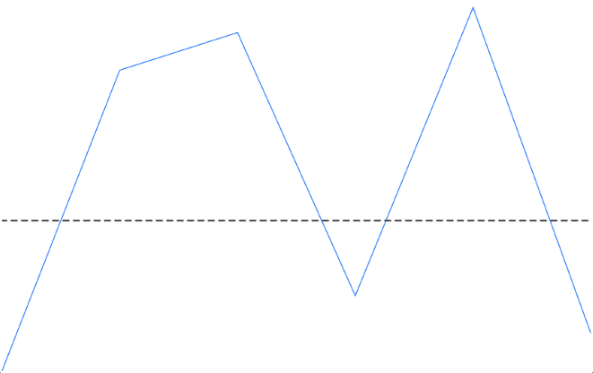

# Axis line in .NET MAUI Spark Charts

The axis is a baseline that helps compare values above and below it in spark charts. Use it to highlight zero or any target value.

## Enable the axis

Set the [ShowAxis](https://help.syncfusion.com/cr/maui-toolkit/Syncfusion.Maui.Toolkit.SparkCharts.SfSparkChart.html#Syncfusion_Maui_Toolkit_SparkCharts_SfSparkChart_ShowAxis) property to display the axis at the chart’s origin in [SfSparkChart](https://help.syncfusion.com/cr/maui-toolkit/Syncfusion.Maui.Toolkit.SparkCharts.SfSparkChart.html), by default, the  axis is set to `False`.





<sparkchart:SfSparkLineChart
    ItemsSource="{Binding Data}"
    YBindingPath="Value"
    ShowAxis="True">
</sparkchart:SfSparkLineChart>





var chart = new SfSparkLineChart
{
    ItemsSource = viewmodel.Data,
    YBindingPath = "Value",
    ShowAxis = true
};

Content = chart;





## Types

Spark charts consist of two axes for measuring and categorizing data: a vertical (Y) axis and a horizontal (X) axis. The Y-axis always uses a numerical scale to measure data values, while the X-axis provides flexibility to change its type using the `AxisType` property, supporting Numeric, Category, and DateTime scales.

**XBindingPath Property**

The `XBindingPath` property specifies the data source property that contains the X-axis values. It binds your collection’s data to the horizontal axis of the spark chart.

**AxisType Property**

The `AxisType` property of the spark charts determines how the chart interprets the X-axis values. Its default value is `SparkChartAxisType.Numeric`. It accepts the following SparkChartAxisType enum values

* `Category` - Treats X‑axis values as discrete categories. Use this for text or labels where each point represents a distinct group.

* `DateTime` - Treats X‑axis values as dates/times. Use this to highlight trends and changes over time.

* `Numeric` - Treats X‑axis values as numbers. Use this for quantities, indices, or other continuous numeric data.





<sparkchart:SfSparkColumnChart ItemsSource="{Binding Data}" 
                               YBindingPath="Value"
                               XBindingPath="OrderName" 
                               AxisType="Category">
</sparkchart:SfSparkColumnChart>





SfSparkColumnChart sparkchart = new SfSparkColumnChart()
{
    ItemsSource = new SparkChartViewModel().Data,
    YBindingPath = "Value",
    XBindingPath = "OrderName",
    AxisType = SparkChartAxisType.Category
};
this.Content = sparkchart;





## Origin

Set [AxisOrigin](https://help.syncfusion.com/cr/maui-toolkit/Syncfusion.Maui.Toolkit.SparkCharts.SfSparkChart.html#Syncfusion_Maui_Toolkit_SparkCharts_SfSparkChart_AxisOrigin) to draw the line at a specific Y value (for example, `0` to emphasize zero, or any custom value) of [SfSparkChart](https://help.syncfusion.com/cr/maui-toolkit/Syncfusion.Maui.Toolkit.SparkCharts.SfSparkChart.html).





<sparkchart:SfSparkLineChart
    ItemsSource="{Binding Data}"
    YBindingPath="Value"
    ShowAxis="True"
    AxisOrigin="8">
</sparkchart:SfSparkLineChart>





var chart = new SfSparkLineChart
{
    ItemsSource = viewmodel.Data,
    YBindingPath = "Value",
    ShowAxis = true
};

chart.AxisOrigin = 8;
Content = chart;





## Customization

The [AxisLineStyle](https://help.syncfusion.com/cr/maui-toolkit/Syncfusion.Maui.Toolkit.SparkCharts.SfSparkChart.html#Syncfusion_Maui_Toolkit_SparkCharts_SfSparkChart_AxisLineStyle) properties lets you customize the appearance of the axis in [SfSparkChart](https://help.syncfusion.com/cr/maui-toolkit/Syncfusion.Maui.Toolkit.SparkCharts.SfSparkChart.html). You can adjust its color, thickness, and dash pattern.

- [Stroke](https://help.syncfusion.com/cr/maui-toolkit/Syncfusion.Maui.Toolkit.SparkCharts.SparkChartLineStyle.html#Syncfusion_Maui_Toolkit_SparkCharts_SparkChartLineStyle_Stroke) - Gets or sets the axis line color.
- [StrokeWidth](https://help.syncfusion.com/cr/maui-toolkit/Syncfusion.Maui.Toolkit.SparkCharts.SparkChartLineStyle.html#Syncfusion_Maui_Toolkit_SparkCharts_SparkChartLineStyle_StrokeWidth) - Gets or sets the axis line thickness. Default is 1.
- [StrokeDashArray](https://help.syncfusion.com/cr/maui-toolkit/Syncfusion.Maui.Toolkit.SparkCharts.SparkChartLineStyle.html#Syncfusion_Maui_Toolkit_SparkCharts_SparkChartLineStyle_StrokeDashArray) - Gets or sets the dash pattern for the axis line. Default is null.





    <spark:SfSparkColumnChart.AxisLineStyle>
        <sparkchart:SparkChartLineStyle StrokeWidth="1.5" Stroke="#333333" StrokeDashArray="4,2" />
    </spark:SfSparkColumnChart.AxisLineStyle>





chart.AxisLineStyle = new SparkChartLineStyle
{
    Stroke = new SolidColorBrush(Color.FromArgb("#333333")),
    StrokeWidth = 2,
    StrokeDashArray = new DoubleCollection { 4, 2 }
}

this.content = chart;





N> Axis feature is applicable for all the [SfSparkChart](https://help.syncfusion.com/cr/maui-toolkit/Syncfusion.Maui.Toolkit.SparkCharts.SfSparkChart.html) types except [SfSparkWinLossChart](https://help.syncfusion.com/cr/maui-toolkit/Syncfusion.Maui.Toolkit.SparkCharts.SfSparkWinLossChart.html).
