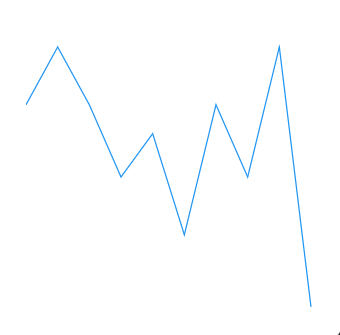
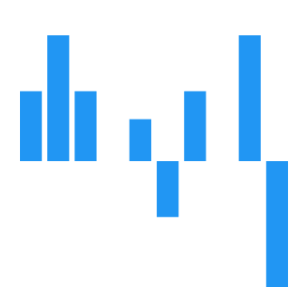
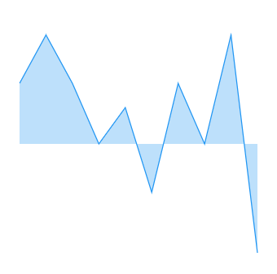
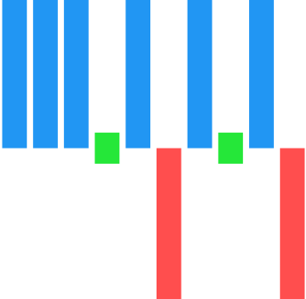

# Chart types in .NET MAUI Spark Charts

The `SfSparkChart` control supports four different chart types such as Line, Column, Area, and Win-loss.

## Line Sparkline

The `SfSparkLineChart` chart is used for identifying patterns and trends in the data, such as seasonal effects, large changes, and turning points over a period of time.





<sparkchart:SfSparkLineChart ItemsSource="{Binding Data}" 
                    YBindingPath="Value">
. . .
</sparkchart:SfSparkLineChart>





SfSparkLineChart sparkchart = new SfSparkLineChart()
{
    ItemsSource = new SparkChartViewModel().Data,
    YBindingPath = "Value",
};

this.Content = sparkchart;





## Column Sparkline

The `SfSparkColumnChart` uses vertical bars to show the comparison between the different data.





<sparkchart:SfSparkColumnChart ItemsSource="{Binding Data}" 
                    YBindingPath="Value">
. . .
</sparkchart:SfSparkColumnChart>





SfSparkColumnChart sparkchart = new SfSparkColumnChart()
{
    ItemsSource = new SparkChartViewModel().Data,
    YBindingPath = "YValue",
};
this.Content = sparkchart;





## Area Sparkline

The `SfSparkAreaChart` is used to emphasize a change in values. This is primarily used when the magnitude of the trend is to be communicated rather than individual data values.





<sparkchart:SfSparkAreaChart ItemsSource="{Binding Data}" 
                    YBindingPath="Value">
. . .
</sparkchart:SfSparkAreaChart>





SfSparkAreaChart sparkchart = new SfSparkAreaChart()
{
    ItemsSource = new SparkChartViewModel().Data,
    YBindingPath = "Value",
};

this.Content = sparkchart;





## WinLoss Sparkline

The `SfSparkWinLossChart` is used to show whether each value is positive or negative visualizing a Win/Loss scenario.





<sparkchart:SfSparkWinLossChart ItemsSource="{Binding Data}" 
                     YBindingPath="YValue">
. . .
</sparkchart:SfSparkWinLossChart>





SfSparkWinLossChart sparkchart = new SfSparkWinLossChart()
{
    ItemsSource = new SparkChartViewModel().Data,
    YBindingPath = "YValue",
};
this.Content = sparkchart;





