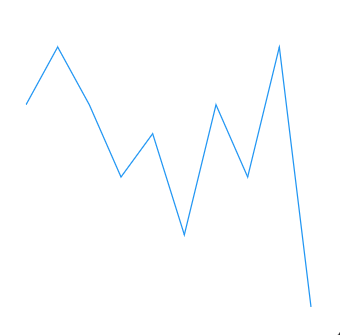
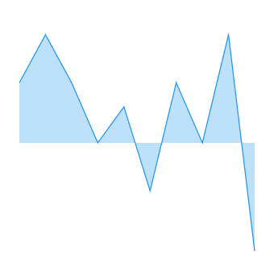
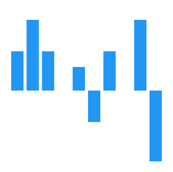
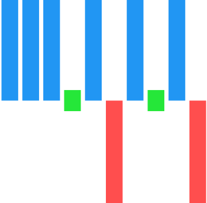

# Chart types in .NET MAUI Spark Charts

N> **Prerequisite:** Ensure that the required NuGet package is installed, the necessary namespaces are imported, and the **Spark Charts** control is properly configured in your application. For detailed setup and configuration instructions, refer to the **[Getting Started](https://help.syncfusion.com/maui-toolkit/spark-charts/getting-started)** guide.

The [SfSparkChart](https://help.syncfusion.com/cr/maui-toolkit/Syncfusion.Maui.Toolkit.SparkCharts.SfSparkChart.html) control supports four chart types: line, area, column, and win-loss.

## Line chart

The [SfSparkLineChart](https://help.syncfusion.com/cr/maui-toolkit/Syncfusion.Maui.Toolkit.SparkCharts.SfSparkLineChart.html) is used for identifying patterns and trends in the data, such as seasonal effects, large changes, and turning points over a period of time.





<sparkchart:SfSparkLineChart ItemsSource="{Binding Data}" 
                    YBindingPath="YValue">
    <!-- code omitted for brevity -->
</sparkchart:SfSparkLineChart>





SfSparkLineChart sparkchart = new SfSparkLineChart()
{
    ItemsSource = new SparkChartViewModel().Data,
    YBindingPath = "YValue",
};
//code omitted for brevity
this.Content = sparkchart;





## Area chart

The [SfSparkAreaChart](https://help.syncfusion.com/cr/maui-toolkit/Syncfusion.Maui.Toolkit.SparkCharts.SfSparkAreaChart.html) is used to emphasize a change in values. Use this to communicate the magnitude of a trend rather than individual data values.





<sparkchart:SfSparkAreaChart ItemsSource="{Binding Data}" 
                    YBindingPath="YValue">
    <!-- code omitted for brevity -->
</sparkchart:SfSparkAreaChart>





SfSparkAreaChart sparkchart = new SfSparkAreaChart()
{
    ItemsSource = new SparkChartViewModel().Data,
    YBindingPath = "YValue",
};
//code omitted for brevity
this.Content = sparkchart;





## Column chart

The [SfSparkColumnChart](https://help.syncfusion.com/cr/maui-toolkit/Syncfusion.Maui.Toolkit.SparkCharts.SfSparkColumnChart.html) uses vertical bars to compare values across data points.





<sparkchart:SfSparkColumnChart ItemsSource="{Binding Data}" 
                    YBindingPath="YValue">
    <!-- code omitted for brevity -->
</sparkchart:SfSparkColumnChart>





SfSparkColumnChart sparkchart = new SfSparkColumnChart()
{
    ItemsSource = new SparkChartViewModel().Data,
    YBindingPath = "YValue",
};
//code omitted for brevity
this.Content = sparkchart;





## Win-loss chart

The [SfSparkWinLossChart](https://help.syncfusion.com/cr/maui-toolkit/Syncfusion.Maui.Toolkit.SparkCharts.SfSparkWinLossChart.html) is used to show whether each value is positive or negative, visualizing a win-loss scenario. Positive values are rendered as bars above the axis, negative values as bars below the axis, and zero values are not rendered.





<sparkchart:SfSparkWinLossChart ItemsSource="{Binding Data}" 
                     YBindingPath="YValue">
    <!-- code omitted for brevity -->
</sparkchart:SfSparkWinLossChart>





SfSparkWinLossChart sparkchart = new SfSparkWinLossChart()
{
    ItemsSource = new SparkChartViewModel().Data,
    YBindingPath = "YValue",
};
//code omitted for brevity
this.Content = sparkchart;





