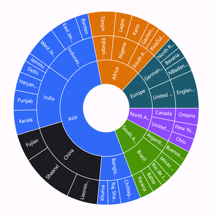
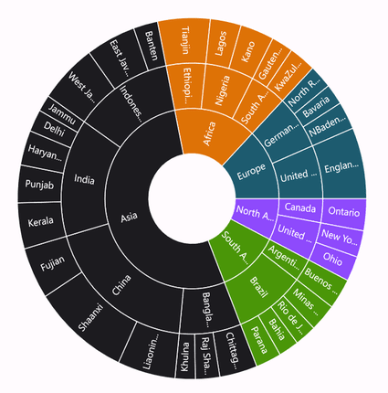
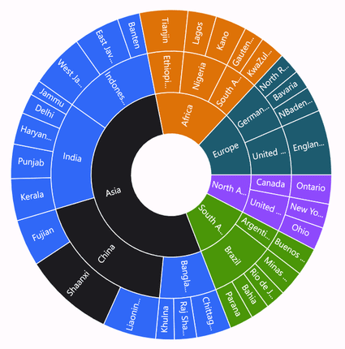
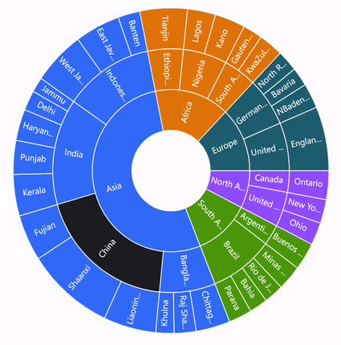
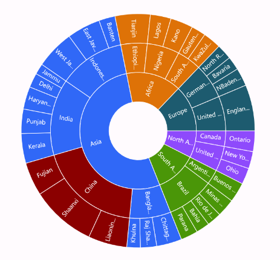
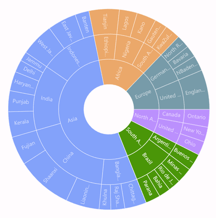
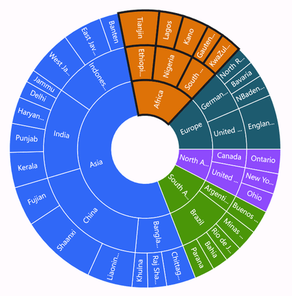

# Selection in .NET MAUI Sunburst Chart 

The Sunburst Chart supports segment selection and visual highlighting. Selection is triggered by tapping a segment, enabling users to interact with hierarchical data.

## Type

The [Type](https://help.syncfusion.com/cr/maui-toolkit/Syncfusion.Maui.Toolkit.SunburstChart.SunburstSelectionSettings.html#Syncfusion_Maui_Toolkit_SunburstChart_SunburstSelectionSettings_Type) property allows you to select a segment based on the following categories:
* [Child](https://help.syncfusion.com/cr/maui-toolkit/Syncfusion.Maui.Toolkit.SunburstChart.SunburstSelectionType.html#Syncfusion_Maui_Toolkit_SunburstChart_SunburstSelectionType_Child): Highlights the selected segment along with its children in all levels.
* [Group](https://help.syncfusion.com/cr/maui-toolkit/Syncfusion.Maui.Toolkit.SunburstChart.SunburstSelectionType.html#Syncfusion_Maui_Toolkit_SunburstChart_SunburstSelectionType_Group): Highlights the entire group of the selected segment in a hierarchy.
* [Parent](https://help.syncfusion.com/cr/maui-toolkit/Syncfusion.Maui.Toolkit.SunburstChart.SunburstSelectionType.html#Syncfusion_Maui_Toolkit_SunburstChart_SunburstSelectionType_Parent): Highlights the parent of the selected segment in the hierarchy.
* [Single](https://help.syncfusion.com/cr/maui-toolkit/Syncfusion.Maui.Toolkit.SunburstChart.SunburstSelectionType.html#Syncfusion_Maui_Toolkit_SunburstChart_SunburstSelectionType_Single): Highlights the selected segment alone.

The default value of the [Type](https://help.syncfusion.com/cr/maui-toolkit/Syncfusion.Maui.Toolkit.SunburstChart.SunburstSelectionSettings.html#Syncfusion_Maui_Toolkit_SunburstChart_SunburstSelectionSettings_Type) property is [Single](https://help.syncfusion.com/cr/maui-toolkit/Syncfusion.Maui.Toolkit.SunburstChart.SunburstSelectionType.html#Syncfusion_Maui_Toolkit_SunburstChart_SunburstSelectionType_Single).

The following code shows the [Child](zhttps://help.syncfusion.com/cr/maui-toolkit/Syncfusion.Maui.Toolkit.SunburstChart.SunburstSelectionType.html#Syncfusion_Maui_Toolkit_SunburstChart_SunburstSelectionType_Child) selection type.





<sunburst:SfSunburstChart>
    . . .
    <sunburst:SfSunburstChart.SelectionSettings>
        <sunburst:SunburstSelectionSettings Type="Child"/>
    </sunburst:SfSunburstChart.SelectionSettings>
</sunburst:SfSunburstChart>





SfSunburstChart sunburst = new SfSunburstChart();
. . .
SunburstSelectionSettings selectionSettings = new SunburstSelectionSettings
{
    Type = SunburstSelectionType.Child
};
sunburst.SelectionSettings = selectionSettings;
this.Content = sunburst;





The following code shows the [Group](https://help.syncfusion.com/cr/maui-toolkit/Syncfusion.Maui.Toolkit.SunburstChart.SunburstSelectionType.html#Syncfusion_Maui_Toolkit_SunburstChart_SunburstSelectionType_Group) selection type.





<sunburst:SfSunburstChart>
    . . .
    <sunburst:SfSunburstChart.SelectionSettings>
        <sunburst:SunburstSelectionSettings Type="Group"/>
    </sunburst:SfSunburstChart.SelectionSettings>
</sunburst:SfSunburstChart>





SfSunburstChart sunburst = new SfSunburstChart();
. . .
SunburstSelectionSettings selectionSettings = new SunburstSelectionSettings
{
    Type = SunburstSelectionType.Group
};
sunburst.SelectionSettings = selectionSettings;
this.Content = sunburst;





The following code shows the [Parent](https://help.syncfusion.com/cr/maui-toolkit/Syncfusion.Maui.Toolkit.SunburstChart.SunburstSelectionType.html#Syncfusion_Maui_Toolkit_SunburstChart_SunburstSelectionType_Parent) selection type.





<sunburst:SfSunburstChart>
    . . .
    <sunburst:SfSunburstChart.SelectionSettings>
        <sunburst:SunburstSelectionSettings Type="Parent"/>
    </sunburst:SfSunburstChart.SelectionSettings>
</sunburst:SfSunburstChart>





SfSunburstChart sunburst = new SfSunburstChart();
. . .
SunburstSelectionSettings selectionSettings = new SunburstSelectionSettings
{
    Type = SunburstSelectionType.Parent
};
sunburst.SelectionSettings = selectionSettings;
this.Content = sunburst;





The following code shows the [Single](https://help.syncfusion.com/cr/maui-toolkit/Syncfusion.Maui.Toolkit.SunburstChart.SunburstSelectionType.html#Syncfusion_Maui_Toolkit_SunburstChart_SunburstSelectionType_Single) selection type.





<sunburst:SfSunburstChart>
    . . .
    <sunburst:SfSunburstChart.SelectionSettings>
        <sunburst:SunburstSelectionSettings Type="Single"/>
    </sunburst:SfSunburstChart.SelectionSettings>
</sunburst:SfSunburstChart>





SfSunburstChart sunburst = new SfSunburstChart();
. . .
SunburstSelectionSettings selectionSettings = new SunburstSelectionSettings
{
    Type = SunburstSelectionType.Single
};
sunburst.SelectionSettings = selectionSettings;
this.Content = sunburst;





## DisplayMode

The [DisplayMode](https://help.syncfusion.com/cr/maui-toolkit/Syncfusion.Maui.Toolkit.SunburstChart.SunburstSelectionSettings.html#Syncfusion_Maui_Toolkit_SunburstChart_SunburstSelectionSettings_DisplayMode) property allows segments to be highlighted using brush, opacity, and stroke. The default value of [DisplayMode](https://help.syncfusion.com/cr/maui-toolkit/Syncfusion.Maui.Toolkit.SunburstChart.SunburstSelectionSettings.html#Syncfusion_Maui_Toolkit_SunburstChart_SunburstSelectionSettings_DisplayMode) is [HighlightByBrush](https://help.syncfusion.com/cr/maui-toolkit/Syncfusion.Maui.Toolkit.SunburstChart.SunburstSelectionDisplayMode.html#Syncfusion_Maui_Toolkit_SunburstChart_SunburstSelectionDisplayMode_HighlightByBrush).

### Brush 

This mode highlights the selected segment using the brush defined in the [Fill](https://help.syncfusion.com/cr/maui-toolkit/Syncfusion.Maui.Toolkit.SunburstChart.SunburstSelectionSettings.html#Syncfusion_Maui_Toolkit_SunburstChart_SunburstSelectionSettings_Fill) property of the [SunburstSelectionSettings](https://help.syncfusion.com/cr/maui-toolkit/Syncfusion.Maui.Toolkit.SunburstChart.SunburstSelectionSettings.html).





<sunburst:SfSunburstChart>
    . . .
    <sunburst:SfSunburstChart.SelectionSettings>
        <sunburst:SunburstSelectionSettings Fill="DarkRed" DisplayMode="HighlightByBrush" Type="Child"/>
    </sunburst:SfSunburstChart.SelectionSettings>
</sunburst:SfSunburstChart>





SfSunburstChart sunburst = new SfSunburstChart();
. . .
SunburstSelectionSettings selectionSettings = new SunburstSelectionSettings
{
    Fill = Colors.DarkRed,
    DisplayMode = SunburstSelectionDisplayMode.HighlightByBrush,
    Type = SunburstSelectionType.Child,
};
sunburst.SelectionSettings = selectionSettings;
this.Content = sunburst;





### Opacity

This mode highlights the selected segment with full opacity as 1, while unselected segments use the opacity value defined in the [Opacity](https://help.syncfusion.com/cr/maui-toolkit/Syncfusion.Maui.Toolkit.SunburstChart.SunburstSelectionSettings.html#Syncfusion_Maui_Toolkit_SunburstChart_SunburstSelectionSettings_Opacity) property.





<sunburst:SfSunburstChart>
    . . .
    <sunburst:SfSunburstChart.SelectionSettings>
        <sunburst:SunburstSelectionSettings Opacity="0.6" DisplayMode="HighlightByOpacity" Type="Child"/>
    </sunburst:SfSunburstChart.SelectionSettings>
</sunburst:SfSunburstChart>





SfSunburstChart sunburst = new SfSunburstChart();
. . .
SunburstSelectionSettings selectionSettings = new SunburstSelectionSettings
{
    Opacity = 0.6,
    DisplayMode = SunburstSelectionDisplayMode.HighlightByOpacity,
    Type = SunburstSelectionType.Child,
};
sunburst.SelectionSettings = selectionSettings;
this.Content = sunburst;





### Stroke 

This mode highlights the selected segment by applying stroke to it. The color and thickness of the stroke can be customized using the [Stroke](https://help.syncfusion.com/cr/maui-toolkit/Syncfusion.Maui.Toolkit.SunburstChart.SunburstSelectionSettings.html#Syncfusion_Maui_Toolkit_SunburstChart_SunburstSelectionSettings_Stroke) and [StrokeWidth](Syncfusion_Maui_Toolkit_SunburstChart_SunburstSelectionSettings_StrokeWidth) properties.





<sunburst:SfSunburstChart>
    . . .
    <sunburst:SfSunburstChart.SelectionSettings>
        <sunburst:SunburstSelectionSettings Stroke="Black" StrokeWidth="3" DisplayMode="HighlightByStroke" Type="Child"/>
    </sunburst:SfSunburstChart.SelectionSettings>
</sunburst:SfSunburstChart>





SfSunburstChart sunburst = new SfSunburstChart();
. . .
SunburstSelectionSettings selectionSettings = new SunburstSelectionSettings
{
    Stroke = Colors.Black,
    StrokeWidth = 3,
    DisplayMode = SunburstSelectionDisplayMode.HighlightByStroke,
    Type = SunburstSelectionType.Child,
};
sunburst.SelectionSettings = selectionSettings;
this.Content = sunburst;





## Events 

### SelectionChanging

The [SelectionChanging](https://help.syncfusion.com/cr/maui-toolkit/Syncfusion.Maui.Toolkit.SunburstChart.SunburstSelectionChangingEventArgs.html) event is triggered when a segment is about to be selected.
This is a cancelable event. The following properties are contained in the event arguments:

* [NewSegment](https://help.syncfusion.com/cr/maui-toolkit/Syncfusion.Maui.Toolkit.SunburstChart.SunburstSelectionChangingEventArgs.html#Syncfusion_Maui_Toolkit_SunburstChart_SunburstSelectionChangingEventArgs_NewSegment): Gets the new segment that was selected. 
* [OldSegment](https://help.syncfusion.com/cr/maui-toolkit/Syncfusion.Maui.Toolkit.SunburstChart.SunburstSelectionChangingEventArgs.html#Syncfusion_Maui_Toolkit_SunburstChart_SunburstSelectionChangingEventArgs_OldSegment): Gets the old segment that was selected or deselected.
* [Cancel](https://help.syncfusion.com/cr/maui-toolkit/Syncfusion.Maui.Toolkit.SunburstChart.SunburstSelectionChangingEventArgs.html#Syncfusion_Maui_Toolkit_SunburstChart_SunburstSelectionChangingEventArgs_Cancel) - Gets or sets a value indicating whether to proceed with the selection.

### Selection Changed

The [SelectionChanged](https://help.syncfusion.com/cr/maui-toolkit/Syncfusion.Maui.Toolkit.SunburstChart.SunburstSelectionChangedEventArgs.html) event occurs after a segment is selected or deselected. The following properties are contained in the event arguments:

* [IsSelected](https://help.syncfusion.com/cr/maui-toolkit/Syncfusion.Maui.Toolkit.SunburstChart.SunburstSelectionChangedEventArgs.html#Syncfusion_Maui_Toolkit_SunburstChart_SunburstSelectionChangedEventArgs_IsSelected): Indicates whether a segment is selected.
* [NewSegment](https://help.syncfusion.com/cr/maui-toolkit/Syncfusion.Maui.Toolkit.SunburstChart.SunburstSelectionChangedEventArgs.html#Syncfusion_Maui_Toolkit_SunburstChart_SunburstSelectionChangedEventArgs_NewSegment): Gets the new segment that was selected. 
* [OldSegment](https://help.syncfusion.com/cr/maui-toolkit/Syncfusion.Maui.Toolkit.SunburstChart.SunburstSelectionChangedEventArgs.html#Syncfusion_Maui_Toolkit_SunburstChart_SunburstSelectionChangedEventArgs_OldSegment): Gets the old segment that was selected or deselected.
