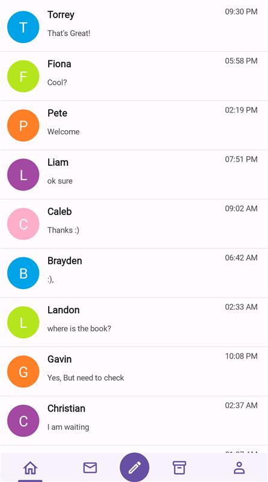

# Center Button Customization in .NET MAUI Tab View (SfTabView)

This section explains how to enable and customize the center button in .NET MAUI [SfTabView.](https://help.syncfusion.com/cr/maui-toolkit/Syncfusion.Maui.Toolkit.TabView.SfTabView.html)

## Enable the center button 

You can enable the center button in Tab View by setting the `IsCenterButtonEnabled` property to `True.`





<tabView:SfTabView x:Name="tabView"
                   IsCenterButtonEnabled="True" />





public MainPage()
{
    InitializeComponent();
    SfTabView tabView = new SfTabView();
    tabView.IsCenterButtonEnabled = true;
    this.Content = tabView;
}




## Customize the center button

You can customize the center button using the properties of `CenterButtonSettings`. The following properties are used to customize the view of center button `Background`, `Stroke`,`StrokeThickness`, `CornerRadius`, `TextColor`, `Height`, `Title`, `FontAttributes`, `FontFamily`, `FontSize`, `Width`, `ImageSource`, `ImageSize`, and `DisplayMode`.





<tabView:SfTabView.CenterButtonSettings>
  <tabView:CenterButtonSettings Height="45"
                                Width="45"
                                CornerRadius="50"
                                Background="#6750A4"
                                ImageSize="25"
                                DisplayMode="Image"
                                ImageSource="home.png">
  </tabView:CenterButtonSettings>
</tabView:SfTabView.CenterButtonSettings>





public MainPage()
{
    InitializeComponent();
    SfTabView tabView = new SfTabView();
    CenterButtonSettings centerButtonSettings = new CenterButtonSettings()
    {
        Height = 45,
        Width = 45,
        DisplayMode = CenterButtonDisplayMode.Image,
        ImageSize = 25,
        Background = Color.FromArgb("#6750A4");
        CornerRadius = new CornerRadius(10),
        ImageSource = "home.png"        
    };

    tabView.CenterButtonSettings = centerButtonSettings;
}




 

## Center button tapped event

When the center button is tapped, the `CenterButtonTapped` event occurs. Using this event we can set alert messages.





<tabView:SfTabView CenterButtonTapped="OnCenterButtonTapped">
</tabView:SfTabView>





public MainPage()
{
    InitializeComponent();
    tabView.CenterButtonTapped += OnCenterButtonTapped;
}

private void OnCenterButtonTapped(object sender, EventArgs e)
{
    DisplayAlert("Message", "CenterButton Clicked", "Ok");
}




