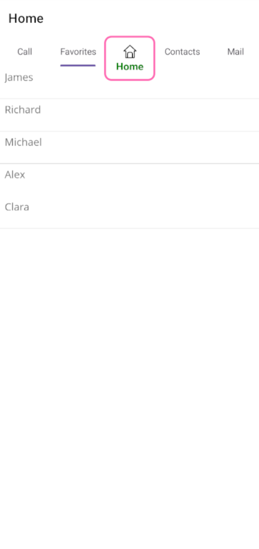

# Center Button Customization in .NET MAUI Tab View (SfTabView)

## Enable the center button 
This section explains how to create and customize The .NET MAUI [SfTabView](https://help.syncfusion.com/cr/maui-toolkit/Syncfusion.Maui.Toolkit.TabView.SfTabView.html) Center Button. Its appearance can be configured using `CenterButtonSettings,` and visibility can be controlled with `IsCenterButtonEnabled.`





<tabView:SfTabView x:Name="tabView"
                   IsCenterButtonEnabled="True" />





public MainPage()
{
    InitializeComponent();
    SfTabView tabView = new SfTabView();
    tabView.IsCenterButtonEnabled = true;
    this.Content = tabView;
}




## Customize the center button
We can customize the center button using the properties of CenterButtonSetting. The following properties are used to customize the view of center button `Background`, `Stroke`,`StrokeThickness`, `CornerRadius`, `TextColor`, `Height`, `Title`, `FontAttributes`, `FontFamily`, `FontSize`, `Width`, `ImageSource`, `ImageSize`, `DisplayMode`.





<tabView:SfTabView.CenterButtonSettings>
     <tabView:CenterButtonSettings Title="Home" 
                              Height="70" 
                              Width="80"
                              Background="White" 
                              Stroke="HotPink" 
                              StrokeThickness="3" 
                              CornerRadius="10" 
                              TextColor="Green" 
                              ImageSource="image.png" 
                              ImageSize="24" 
                              DisplayMode="ImageWithText" 
                              FontFamily="SevillanaRegular" 
                              FontAttributes="Bold" 
                              FontSize="16" />
</tabView:SfTabView.CenterButtonSettings>





public MainPage()
{
    InitializeComponent();
    var centerButton = tabView.CenterButtonSettings;        centerButton.Height = 80;
    centerButton.Width = 100;
    centerButton.Title = "Center Button";    
    centerButton.FontAttributes = FontAttributes.Bold;
    centerButton.TextColor = Colors.Green;        centerButton.DisplayMode = CenterButtonDisplayMode.ImageWithText;
    centerButton.ImageSource = "Home.png";        centerButton.ImageSize = 24;
    centerButton.FontFamily = "SevillanaRegular";        centerButton.CornerRadius = 10;
}




## Center button tapped event

When center button is tapped, the `CenterButtonTapped` event occurs. Using this event we can set alert message.





<tabView:SfTabView CenterButtonTapped="OnCenterButtonTapped">
</tabView:SfTabView>





public MainPage()
{
    InitializeComponent();
    tabView.CenterButtonTapped += OnCenterButtonTapped;
}

private void OnCenterButtonTapped(object sender, EventArgs e)
{
    DisplayAlert("Message", "CenterButton Clicked", "Ok");
}





