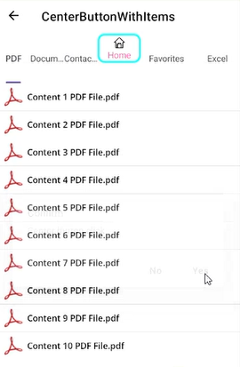

# CenterButton Customization in .NET MAUI Tab View (SfTabView)

This section explains how to create and customize The .NET MAUI [SfTabView](https://help.syncfusion.com/cr/maui-toolkit/Syncfusion.Maui.Toolkit.TabView.SfTabView.html) CenterButton. Its appearance can be configured using `CenterButtonSettings,` and visibility can be controlled with `IsCenterButtonEnabled.`





<tabView:SfTabView x:Name="tabView"
                   IsCenterButtonEnabled="True" />





public MainPage()
{
    InitializeComponent();
    SfTabView tabView = new SfTabView();
    tabView.IsCenterButtonEnabled = true;
    this.Content = tabView;
}




## Customize CenterButtonSettings
We can customize the CenterButton using the properties of CenterButtonSetting. The following properties are used to customize the view of CenterButton `Background`, `Stroke`,`StrokeThickness`, `CornerRadius`, `TextColor`, `Height`, `Title`, `FontAttributes`, `FontFamily`, `FontSize`, `Width`.





<tabView:SfTabView.CenterButtonSettings>
    <tabView:CenterButtonSettings Height="80" Width="100"
                                  Title="Center Button" TextColor="Green"
                                  FontAttributes="Bold">
    </tabView:CenterButtonSettings>
</tabView:SfTabView.CenterButtonSettings>





public MainPage()
{
    InitializeComponent();
    var centerButton = tabView.CenterButtonSettings;
    centerButton.Height = 80;
    centerButton.Width = 100;
    centerButton.Title = "Center Button";
    centerButton.FontAttributes = FontAttributes.Bold;
    centerButton.TextColor = Color.Green;
}




## CenterButtonTapped event

When CenterButton is tapped, the `CenterButtonTapped` event occurs. Using this event we can set alert message.





<tabView:SfTabView CenterButtonTapped="TabView_CenterButtonTapped">
</tabView:SfTabView>





public MainPage()
{
    InitializeComponent();
    tabView.CenterButtonTapped += TabView_CenterButtonTapped;
}

private void TabView_CenterButtonTapped(object sender, EventArgs e)
{
    DisplayAlert("Message", "CenterButton Clicked", "Ok");
}





## Custom CenterButton




<tabView:SfTabView.CenterButtonSettings>
     <tabView:CenterButtonSettings 
     Height="70"
     Width="100"     
     TextColor="HotPink" 
     StrokeThickness="3" 
     CornerRadius="10"      
     ImageSource="home.png"
     ImageSize="24" 
     DisplayMode="ImageWithText" />
</tabView:SfTabView.CenterButtonSettings>





public MainPage()
{
    InitializeComponent();
    var centerButton = tabView.CenterButtonSettings;
    centerButton.Height = 80;
    centerButton.Width = 100;   
    centerButton.TextColor = Color.HotPink;
    centerButton.StrokeThickness = 3;
    centerButton.CornerRadius = 10;
    centerButton.ImageSource = "home.png"
    centerButton.ImageSize = 24;    
}





