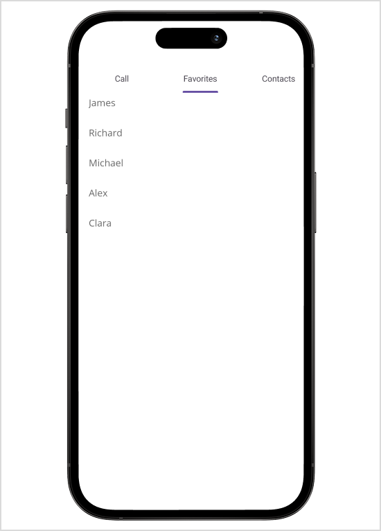

# Getting Started with .NET MAUI Tab View

This section guides you through setting up and configuring a [SfTabView](https://help.syncfusion.com/cr/maui-toolkit/Syncfusion.Maui.Toolkit.TabView.SfTabView.html) in your .NET MAUI application. Follow the steps below to add a basic Tab View to your project.




## Prerequisites

Before proceeding, ensure the following are setup:
1. Install [.NET 9 SDK](https://dotnet.microsoft.com/en-us/download/dotnet/9.0) or later.
2. Set up a .NET MAUI environment with Visual Studio 2022 (v17.3 or later) or Visual Studio 2026 (v18.0.0 or later).

## Step 1: Create a new .NET MAUI project

1. Go to **File > New > Project** and choose the **.NET MAUI App** template.
2. Name the project and choose a location. Click **Next**.
3. Select the .NET framework version and click **Create**.

## Step 2: Install the Syncfusion® .NET MAUI Toolkit package

1. In **Solution Explorer**, right-click the project and choose **Manage NuGet Packages**.
2. Search for [Syncfusion.Maui.Toolkit](https://www.nuget.org/packages/Syncfusion.Maui.Toolkit/) and install the latest version.
3. Ensure the necessary dependencies are installed correctly, and the project is restored.

## Step 3: Register the handler

In the **MauiProgram.cs** file, register the handler for Syncfusion® Toolkit.



using Syncfusion.Maui.Toolkit.Hosting;

public static class MauiProgram
{
    public static MauiApp CreateMauiApp()
    {
        var builder = MauiApp.CreateBuilder();
        builder
            .ConfigureSyncfusionToolkit()
            .UseMauiApp<App>()
            .ConfigureFonts(fonts =>
            {
                fonts.AddFont("OpenSans-Regular.ttf", "OpenSansRegular");
                fonts.AddFont("OpenSans-Semibold.ttf", "OpenSansSemibold");
            });

        return builder.Build();
    }
}

 

## Step 4: Add a basic Tab View

1. To initialize the control, import the `Syncfusion.Maui.Toolkit.TabView` namespace.

2. Initialize [SfTabView](https://help.syncfusion.com/cr/maui-toolkit/Syncfusion.Maui.Toolkit.TabView.SfTabView.html).




<?xml version="1.0" encoding="utf-8" ?>
<ContentPage xmlns="http://schemas.microsoft.com/dotnet/2021/maui"
             xmlns:x="http://schemas.microsoft.com/winfx/2009/xaml"
             x:Class="TabViewGettingStarted.MainPage"
             xmlns:local="clr-namespace:TabViewGettingStarted"
             xmlns:tabView="clr-namespace:Syncfusion.Maui.Toolkit.TabView;assembly=Syncfusion.Maui.Toolkit">
    <!-- Define the content of the ContentPage -->
    <ContentPage.Content>
        <!-- Add a SfTabView control to the ContentPage -->
        <tabView:SfTabView />
    </ContentPage.Content>
</ContentPage>



using Syncfusion.Maui.Toolkit.TabView;
namespace TabViewGettingStarted
{
    public partial class MainPage : ContentPage
    {
        public MainPage()
        {
            InitializeComponent();
            // Create an instance of the SfTabView control
            SfTabView tabView = new SfTabView();
            // Set the Content property of the ContentPage to the newly created SfTabView instance
            this.Content = tabView;
        }
    }
}







## Prerequisites

Before proceeding, ensure the following are setup:
1. Ensure [.NET 9 SDK](https://dotnet.microsoft.com/en-us/download/dotnet/9.0) or later.
2. Set up a .NET MAUI environment with Visual Studio Code.
3. Ensure that the .NET MAUI extension is installed and configured as described [here](https://learn.microsoft.com/en-us/dotnet/maui/get-started/installation?view=net-maui-8.0&tabs=visual-studio-code).

## Step 1: Create a new .NET MAUI project

1. Open the command palette by pressing `Ctrl+Shift+P` and type **.NET: New Project** and press **Enter**.
2. Choose the **.NET MAUI App** template.
3. Select the project location, type the project name, and press **Enter**.
4. Choose **Create project**.

## Step 2: Install the Syncfusion® .NET MAUI Toolkit package

1. Press <kbd>Ctrl</kbd> + <kbd>`</kbd> (backtick) to open the integrated terminal in Visual Studio Code.
2. Ensure you're in the project root directory where your .csproj file is located.
3. Run the command `dotnet add package Syncfusion.Maui.Toolkit` to install the Syncfusion® .NET MAUI Toolkit NuGet package.
4. To ensure all dependencies are installed, run `dotnet restore`.

## Step 3: Register the handler

In the **MauiProgram.cs** file, register the handler for Syncfusion® Toolkit.



using Syncfusion.Maui.Toolkit.Hosting;

public static class MauiProgram
{
    public static MauiApp CreateMauiApp()
    {
        var builder = MauiApp.CreateBuilder();
        builder
            .ConfigureSyncfusionToolkit()
            .UseMauiApp<App>()
            .ConfigureFonts(fonts =>
            {
                fonts.AddFont("OpenSans-Regular.ttf", "OpenSansRegular");
                fonts.AddFont("OpenSans-Semibold.ttf", "OpenSansSemibold");
            });

        return builder.Build();
    }
}

 

## Step 4: Add a basic Tab View

1. To initialize the control, import the `Syncfusion.Maui.Toolkit.TabView` namespace.

2. Initialize [SfTabView](https://help.syncfusion.com/cr/maui-toolkit/Syncfusion.Maui.Toolkit.TabView.SfTabView.html).




<?xml version="1.0" encoding="utf-8" ?>
<ContentPage xmlns="http://schemas.microsoft.com/dotnet/2021/maui"
             xmlns:x="http://schemas.microsoft.com/winfx/2009/xaml"
             x:Class="TabViewGettingStarted.MainPage"
             xmlns:local="clr-namespace:TabViewGettingStarted"
             xmlns:tabView="clr-namespace:Syncfusion.Maui.Toolkit.TabView;assembly=Syncfusion.Maui.Toolkit">
    <!-- Define the content of the ContentPage -->
    <ContentPage.Content>
        <!-- Add a SfTabView control to the ContentPage -->
        <tabView:SfTabView />
    </ContentPage.Content>
</ContentPage>



using Syncfusion.Maui.Toolkit.TabView;
namespace TabViewGettingStarted
{
    public partial class MainPage : ContentPage
    {
        public MainPage()
        {
            InitializeComponent();
            // Create an instance of the SfTabView control
            SfTabView tabView = new SfTabView();
            // Set the Content property of the ContentPage to the newly created SfTabView instance
            this.Content = tabView;
        }
    }
}








## Prerequisites

Before proceeding, ensure the following are set up:

1. Ensure you have the latest version of JetBrains Rider.
2. Install [.NET 9 SDK](https://dotnet.microsoft.com/en-us/download/dotnet/9.0) or later.
3. Make sure the MAUI workloads are installed and configured as described [here](https://www.jetbrains.com/help/rider/MAUI.html#before-you-start).

## Step 1: Create a new .NET MAUI project

1. Go to **File > New Solution**, Select .NET (C#) and choose the **.NET MAUI App** template.
2. Enter the Project Name, Solution Name, and Location.
3. Select the .NET framework version and click **Create**.

## Step 2: Install the Syncfusion® MAUI Toolkit NuGet package

1. In **Solution Explorer**, right-click the project and choose **Manage NuGet Packages**.
2. Search for [Syncfusion.Maui.Toolkit](https://www.nuget.org/packages/Syncfusion.Maui.Toolkit/) and install the latest version.
3. Ensure the necessary dependencies are installed correctly, and the project is restored. If not, open the Terminal in Rider and manually run: `dotnet restore`.

## Step 3: Register the handler

In the **MauiProgram.cs** file, register the handler for Syncfusion® Toolkit.



using Syncfusion.Maui.Toolkit.Hosting;

public static class MauiProgram
{
    public static MauiApp CreateMauiApp()
    {
        var builder = MauiApp.CreateBuilder();
        builder
            .ConfigureSyncfusionToolkit()
            .UseMauiApp<App>()
            .ConfigureFonts(fonts =>
            {
                fonts.AddFont("OpenSans-Regular.ttf", "OpenSansRegular");
                fonts.AddFont("OpenSans-Semibold.ttf", "OpenSansSemibold");
            });

        return builder.Build();
    }
}

 

## Step 4: Add a basic Tab View

1. To initialize the control, import the `Syncfusion.Maui.Toolkit.TabView` namespace.

2. Initialize [SfTabView](https://help.syncfusion.com/cr/maui-toolkit/Syncfusion.Maui.Toolkit.TabView.SfTabView.html).




<?xml version="1.0" encoding="utf-8" ?>
<ContentPage xmlns="http://schemas.microsoft.com/dotnet/2021/maui"
             xmlns:x="http://schemas.microsoft.com/winfx/2009/xaml"
             x:Class="TabViewGettingStarted.MainPage"
             xmlns:local="clr-namespace:TabViewGettingStarted"
             xmlns:tabView="clr-namespace:Syncfusion.Maui.Toolkit.TabView;assembly=Syncfusion.Maui.Toolkit">
    <!-- Define the content of the ContentPage -->
    <ContentPage.Content>
        <!-- Add a SfTabView control to the ContentPage -->
        <tabView:SfTabView />
    </ContentPage.Content>
</ContentPage>



using Syncfusion.Maui.Toolkit.TabView;
namespace TabViewGettingStarted
{
    public partial class MainPage : ContentPage
    {
        public MainPage()
        {
            InitializeComponent();
            // Create an instance of the SfTabView control
            SfTabView tabView = new SfTabView();
            // Set the Content property of the ContentPage to the newly created SfTabView instance
            this.Content = tabView;
        }
    }
}







## Step 5: Populate tab items in Tab View

Tab items can be added to the control using the [Items](https://help.syncfusion.com/cr/maui-toolkit/Syncfusion.Maui.Toolkit.TabView.SfTabView.html#Syncfusion_Maui_Toolkit_TabView_SfTabView_Items) property of [SfTabView](https://help.syncfusion.com/cr/maui-toolkit/Syncfusion.Maui.Toolkit.TabView.SfTabView.html).

The following examples demonstrate how to add tab items to the `SfTabView` control using both XAML and C# approaches.



<?xml version="1.0" encoding="utf-8" ?>
<ContentPage xmlns="http://schemas.microsoft.com/dotnet/2021/maui"
             xmlns:x="http://schemas.microsoft.com/winfx/2009/xaml"
             x:Class="TabViewGettingStarted.MainPage"
             xmlns:tabView="clr-namespace:Syncfusion.Maui.Toolkit.TabView;assembly=Syncfusion.Maui.Toolkit"
             BackgroundColor="{DynamicResource PageBackgroundColor}">
    <ContentPage.Content>
        <tabView:SfTabView x:Name="tabView">
            <tabView:SfTabView.Items>
                <tabView:SfTabItem Header="Call">                    
                        <Grid BackgroundColor="Red" />
                </tabView:SfTabItem>
                <tabView:SfTabItem Header="Favorites">
                        <ListView RowHeight="50">
                            <ListView.ItemsSource>
                                <x:Array Type="{x:Type x:String}">
                                    <x:String>James</x:String>
                                    <x:String>Richard</x:String>
                                    <x:String>Michael</x:String>
                                    <x:String>Alex</x:String>
                                    <x:String>Clara</x:String>
                                </x:Array>
                            </ListView.ItemsSource>
                            <ListView.ItemTemplate>
                                <DataTemplate>
                                    <ViewCell>
                                        <Grid Margin="10,5">
                                            <Label TextColor="#666666"
                                                   Text="{Binding}" />
                                        </Grid>
                                    </ViewCell>
                                </DataTemplate>
                            </ListView.ItemTemplate>
                        </ListView>
                    </tabView:SfTabItem.Content>
                </tabView:SfTabItem>
                <tabView:SfTabItem Header="Contacts">
                        <Grid BackgroundColor="Blue" />
                </tabView:SfTabItem>
            </tabView:SfTabView.Items>
        </tabView:SfTabView>
    </ContentPage.Content>
</ContentPage>



using Syncfusion.Maui.Toolkit.TabView;
namespace TabViewGettingStarted
{
    public partial class MainPage : ContentPage
    {
        public MainPage()
        {
            InitializeComponent();

            // Create an instance of the SfTabView control
            SfTabView tabView = new SfTabView();

            // Create a Grid with a red background for the "Call" tab
            Grid allContactsGrid = new Grid { BackgroundColor = Colors.Red };

            // Create a ListView for the "Favorites" tab with predefined items
            var favorites = new ListView
            {
                RowHeight = 50,
                ItemsSource = new string[] { "James", "Richard", "Michael", "Alex", "Clara" },
                ItemTemplate = new DataTemplate(() =>
                {
                    var grid = new Grid
                    {
                        Margin = new Thickness(10, 5)
                    };

                    var label = new Label
                    {
                        VerticalOptions = LayoutOptions.Start,
                        HorizontalOptions = LayoutOptions.Start,
                        TextColor = Color.FromArgb("#666666"),
                        FontSize = 16
                    };
                    label.SetBinding(Label.TextProperty, ".");

                    grid.Children.Add(label);

                    return new ViewCell
                    {
                        View = grid
                    };
                })
            };

            // Create a Grid with a blue background for the "Contacts" tab
            Grid contactsGrid = new Grid { BackgroundColor = Colors.Blue };

            // Create a collection of tab items and add the previously created content to each tab
            var tabItems = new TabItemCollection
            {
                new SfTabItem()
                {
                    Header = "Call",
                    Content = allContactsGrid
                },
                new SfTabItem()
                {
                    Header = "Favorites",
                    Content = favorites
                },
                new SfTabItem()
                {
                    Header = "Contacts",
                    Content = contactsGrid
                }
            };

            // Assign the collection of tab items to the SfTabView
            tabView.Items = tabItems;

            // Set the Content property of the ContentPage to the SfTabView instance
            this.Content = tabView;
        }
    }
}




N> View [sample](https://github.com/SyncfusionExamples/maui-toolkit-samples/tree/master/TabView/TabViewGettingStarted) in GitHub.
