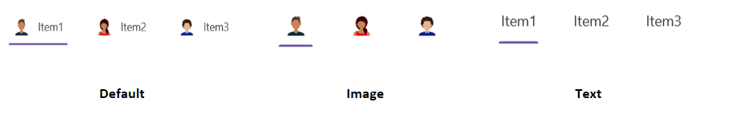

# Header Display Mode in .NET MAUI Tab View control (SfTabView)

By default, the [Tab View](https://help.syncfusion.com/cr/maui-toolkit/Syncfusion.Maui.Toolkit.TabView.SfTabView.html) control displays the title of each Tab Item. It can be customized to display in any of the following modes:

* Default
* Image
* Text

The Tab View can be modified by setting the [HeaderDisplayMode](https://help.syncfusion.com/cr/maui-toolkit/Syncfusion.Maui.Toolkit.TabView.SfTabView.html#Syncfusion_Maui_Toolkit_TabView_SfTabView_HeaderDisplayMode) property of the [.NET MAUI Tab View](https://help.syncfusion.com/cr/maui-toolkit/Syncfusion.Maui.Toolkit.TabView.html).

Below are examples of how to use this property in XAML and C#:





<!-- Define the SfTabView control with the default header display mode -->
<tabView:SfTabView HeaderDisplayMode="Default">
    <!-- Define the first tab item with a header and an image source -->
    <tabView:SfTabItem Header="Item1"
                       ImageSource="avatar1.png" />
    <!-- Define the second tab item with a header and an image source -->
    <tabView:SfTabItem Header="Item2"
                       ImageSource="avatar2.png" />
    <!-- Define the third tab item with a header and an image source -->
    <tabView:SfTabItem Header="Item3"
                       ImageSource="avatar3.png" />
</tabView:SfTabView>





// Create an instance of the SfTabView control with default header display mode
SfTabView tabView = new SfTabView
{
	HeaderDisplayMode = TabBarDisplayMode.Default
};

// Create the first tab item with a header and image source
SfTabItem tabItem1 = new SfTabItem
{
	Header = "Item1",
	ImageSource = "avatar1.png"
};

// Create the second tab item with a header and image source
SfTabItem tabItem2 = new SfTabItem
{
	Header = "Item2",
	ImageSource = "avatar2.png"
};

// Create the third tab item with a header and image source
SfTabItem tabItem3 = new SfTabItem
{
	Header = "Item3",
	ImageSource = "avatar3.png"
};

// Add the tab items to the SfTabView control
tabView.Items.Add(tabItem1);
tabView.Items.Add(tabItem2);
tabView.Items.Add(tabItem3);





N> The [HeaderDisplayMode](https://help.syncfusion.com/cr/maui-toolkit/Syncfusion.Maui.Toolkit.TabView.SfTabView.html#Syncfusion_Maui_Toolkit_TabView_SfTabView_HeaderDisplayMode) property will only apply if both a [Header](https://help.syncfusion.com/cr/maui-toolkit/Syncfusion.Maui.Toolkit.TabView.SfTabItem.html#Syncfusion_Maui_Toolkit_TabView_SfTabItem_Header) and an [ImageSource](https://help.syncfusion.com/cr/maui-toolkit/Syncfusion.Maui.Toolkit.TabView.SfTabItem.html#Syncfusion_Maui_Toolkit_TabView_SfTabItem_ImageSource) are provided for the tab item. If either is missing, the tab item will automatically apply the default mode.
