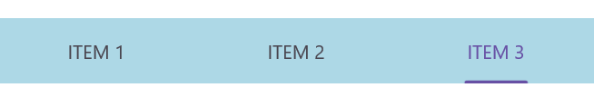
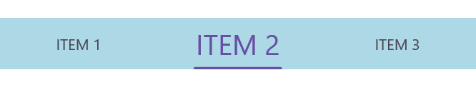

# How to select a tab item programmatically? 

## Programmatically select the tab item

You can programmatically select a tab item using the [SelectedIndex](https://help.syncfusion.com/cr/maui-toolkit/Syncfusion.Maui.Toolkit.TabView.SfTabView.html#Syncfusion_Maui_Toolkit_TabView_SfTabView_SelectedIndex) property of `SfTabView`, as shown in the following code snippet.




<!-- Define the SfTabView control with a name and set the initially selected tab index to 2 -->
<tabView:SfTabView x:Name="tabView"
				   SelectedIndex="2" />



// Create an instance of the SfTabView control
SfTabView tabView = new SfTabView();
// Set the selected index of the SfTabView to 2
tabView.SelectedIndex = 2;



The following image shows the tab item selected programmatically using the `SelectedIndex` property:

## Get the selected tab item

The [IsSelected](https://help.syncfusion.com/cr/maui-toolkit/Syncfusion.Maui.Toolkit.TabView.SfTabItem.html#Syncfusion_Maui_Toolkit_TabView_SfTabItem_IsSelected) property indicates whether a tab item is active. You can use this property to determine the selected item in the tab view, as shown in the following code snippet.




<!-- Define the SfTabView control with a name and an event handler for the SelectionChanged event -->
<tabView:SfTabView x:Name="tabView"
                   SelectionChanged="TabView_SelectionIndexChanged" />




// Create an instance of the SfTabView control
SfTabView tabView = new SfTabView();
// Subscribe to the SelectionChanged event
tabView.SelectionChanged += TabView_SelectionIndexChanged;

// Event handler for the SelectionChanged event
private void TabView_SelectionIndexChanged(object? sender, TabSelectionChangedEventArgs e)
{
	// Access the selected tab item using the new index
	SfTabItem tabItem = tabView.Items[e.NewIndex];
	
	// Check if the tab item is selected
	bool isTabItemSelected = tabItem.IsSelected;
	
	// If the tab item is selected, set its font size
	if (isTabItemSelected)
	{
		tabItem.FontSize = 26;
	}
}





The following image shows a tab item selected in the .NET MAUI TabView:

