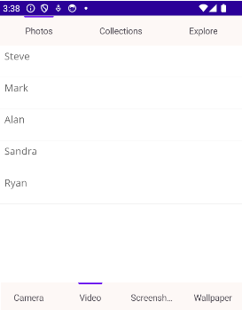

# Nested Tabs in .NET MAUI Tab View (SfTabView)

The .NET MAUI Tab View (SfTabView) control supports nested tabs, allowing you to create a hierarchical structure of tab items. You can configure nested tab items in the tab view using the [Items](https://help.syncfusion.com/cr/maui-toolkit/Syncfusion.Maui.Toolkit.TabView.SfTabView.html#Syncfusion_Maui_Toolkit_TabView_SfTabView_Items) property of [SfTabView](https://help.syncfusion.com/cr/maui-toolkit/Syncfusion.Maui.Toolkit.TabView.SfTabView.html). This property holds a [TabItemCollection](https://help.syncfusion.com/cr/maui-toolkit/Syncfusion.Maui.Toolkit.TabView.TabItemCollection.html), which can contain multiple [SfTabItem](https://help.syncfusion.com/cr/maui-toolkit/Syncfusion.Maui.Toolkit.TabView.SfTabItem.html) instances.

The following example demonstrates how to create nested tabs in the `SfTabView` control. In this sample, we will create a main tab view with three tabs: **Photos**, **Collections**, and **Explore**. The **Photos** tab will contain a nested tab view with four sub-tabs: **Camera**, **Video**, **Screenshots**, and **Wallpaper**.




<ContentPage xmlns="http://schemas.microsoft.com/dotnet/2021/maui"
             xmlns:x="http://schemas.microsoft.com/winfx/2009/xaml"
             x:Class="TabViewMauiSample.MainPage"
             xmlns:tabView="clr-namespace:Syncfusion.Maui.Toolkit.TabView;assembly=Syncfusion.Maui.Toolkit.TabView"
             BackgroundColor="{DynamicResource SecondaryColor}">
    <ContentPage.Content>
        <Grid>
            <tabView:SfTabView x:Name="tabView"
                                    TabBarBackground="#FDF8F6"
                                    TabWidthMode="SizeToContent"
                                    TabBarPlacement="Top"
                                    BackgroundColor="Transparent"
                                    IndicatorBackground="#6200EE"
                                    IndicatorPlacement="Top" >
                <tabView:SfTabView.Items>
                    <!-- Main tab: Photos -->
                    <tabView:SfTabItem Header="Photos">
                        <tabView:SfTabItem.Content>
                            <Grid BackgroundColor="Blue">
                                <tabView:SfTabView x:Name="nestedTabView"
                                                        TabBarBackground="#FDF8F6"
                                                        TabWidthMode="Default"
                                                        TabBarPlacement="Bottom"
                                                        BackgroundColor="Transparent"
                                                        IndicatorBackground="#6200EE"
                                                        IndicatorPlacement="Top" >
                                    <tabView:SfTabView.Items>
                                        <!-- Nested tab: Camera -->
                                        <tabView:SfTabItem Header="Camera">
                                            <tabView:SfTabItem.Content>
                                                <Grid BackgroundColor="Blue">
                                                </Grid>
                                            </tabView:SfTabItem.Content>
                                        </tabView:SfTabItem>
                                        <!-- Nested tab: Video -->
                                        <tabView:SfTabItem Header="Video">
                                            <tabView:SfTabItem.Content>
                                                <Grid BackgroundColor="Blue">
                                                </Grid>
                                            </tabView:SfTabItem.Content>
                                        </tabView:SfTabItem>
                                        <!-- Nested tab: Screenshots -->
                                        <tabView:SfTabItem Header="Screenshots">
                                            <tabView:SfTabItem.Content>
                                                <Grid BackgroundColor="Blue">
                                                </Grid>
                                            </tabView:SfTabItem.Content>
                                        </tabView:SfTabItem>
                                        <!-- Nested tab: Wallpaper -->
                                        <tabView:SfTabItem Header="Wallpaper">
                                            <tabView:SfTabItem.Content>
                                                <Grid BackgroundColor="Blue">
                                                </Grid>
                                            </tabView:SfTabItem.Content>
                                        </tabView:SfTabItem>
                                    </tabView:SfTabView.Items>
                                </tabView:SfTabView>
                            </Grid>
                        </tabView:SfTabItem.Content>
                    </tabView:SfTabItem>
                    <!-- Main tab: Collections -->
                    <tabView:SfTabItem Header="Collections">
                        <tabView:SfTabItem.Content>
                            <Grid BackgroundColor="Red"/>
                        </tabView:SfTabItem.Content>
                    </tabView:SfTabItem>
                    <!-- Main tab: Explore -->
                    <tabView:SfTabItem Header="Explore">
                        <tabView:SfTabItem.Content>
                            <Grid BackgroundColor="Green"/>
                        </tabView:SfTabItem.Content>
                    </tabView:SfTabItem>
                </tabView:SfTabView.Items>
            </tabView:SfTabView>
        </Grid>
    </ContentPage.Content>
</ContentPage>



public partial class MainPage : ContentPage
{ 
    public MainPage()
    {
        InitializeComponent();

        // Create main tab view
        SfTabView tabView = new SfTabView();

        // Create nested tab view
        SfTabView nestedTabView = new SfTabView();

        // Configure main tab view items
        var tabItems = new TabItemCollection
        {
            new SfTabItem()
            {
                Header = "Photos",
                Content = nestedTabView
            },
            new SfTabItem()
            {
                Header = "Collections",
                Content = new ListView()
                {
                    // Add your items here.
                },
            },
            new SfTabItem()
            {
                Header = "Explore",
                Content = new ListView()
                {
                     // Add your items here.
                },
            }
        };

        tabView.Items = tabItems;
        tabView.TabWidthMode = TabWidthMode.SizeToContent;
        tabView.TabBarPlacement = TabBarPlacement.Top;
        tabView.IndicatorPlacement = TabIndicatorPlacement.Top;
        tabView.TabBarBackground = new SolidColorBrush(Color.FromArgb("#FDF8F6"));
        tabView.IndicatorBackground = new SolidColorBrush(Color.FromArgb("#6200EE"));

        // Configure nested tab view items
        var nestedTabItems = new TabItemCollection
        {
            new SfTabItem()
            {
                Header = "Camera",
                Content = new ListView()
                {
                     // Add your items here.
                },
            },
            new SfTabItem()
            {
                Header = "Video",
                Content = new ListView()
                {
                     // Add your items here.
                },
            },
            new SfTabItem()
            {
                Header = "Screenshots",
                Content = new ListView()
                {
                     // Add your items here.
                },
            },
            new SfTabItem()
            {
                Header = "Wallpaper",
                Content = new ListView()
                {
                     // Add your items here.
                },
            }
        };

        nestedTabView.Items = nestedTabItems;
        nestedTabView.TabBarPlacement = TabBarPlacement.Bottom;
        nestedTabView.IndicatorPlacement = TabIndicatorPlacement.Top;
        nestedTabView.TabBarBackground = new SolidColorBrush(Color.FromArgb("#FDF8F6"));
        nestedTabView.IndicatorBackground = new SolidColorBrush(Color.FromArgb("#6200EE"));
        this.Content = tabView;
    }
}




The following image illustrates the nested tab structure:

N> View [sample](https://github.com/SyncfusionExamples/maui-toolkit-samples/tree/master/TabView/NestedTabViewSample) in GitHub