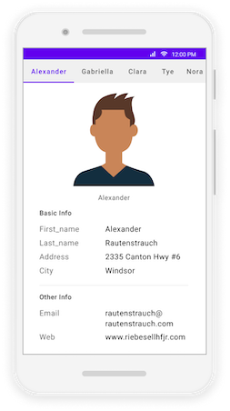

# Overview of .NET MAUI Tab View (SfTabView)

The .NET Multi-platform App UI (MAUI) Tab View provides an advanced, simple, and intuitive interface for tab navigation in both mobile and desktop applications.

## Key features

* **Nested Tabs**: Support for nested tabs with various header placements.
* **Fixed and Scrollable Headers**: Options for both fixed and scrollable tab headers.
* **Image and Text Support**: Headers can include both images and text.
* **Customizable Header Position**: Ability to position headers at the top, bottom, left, or right of the tab view.
* **Content Transition Animation**: Smooth transitions between tab content with customizable animation duration.
* **Tab Item Customization**: Extensive customization options for tab items, including background color, text color, and image position.

## Usage

* The .NET MAUI Tab View can be used to optimize screen space usage when the application with complex and extensive layouts.
* The .NET MAUI Tab View consists of a set of tab items that share the same space.
* At a time, only one .NET MAUI tab item will be visible and accessible to users. Users have to tap the tab of the hidden tab item to make it visible on the screen.

The following image provides an overview of the .NET MAUI Tab View:

