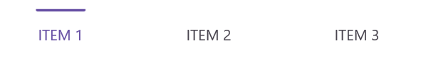
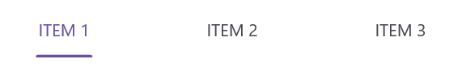
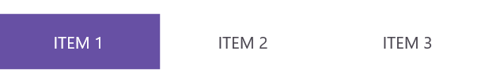
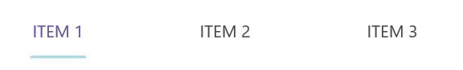
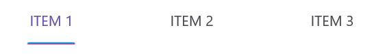
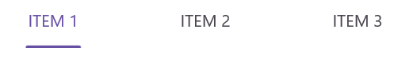
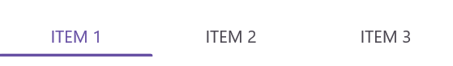
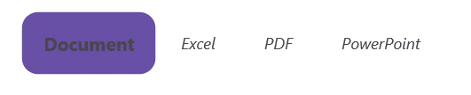

# Customize the selection indicator in .NET MAUI Tab View (SfTabView)

## Placement options

The .NET MAUI Tab View provides three options for aligning the selection indicator relative to the tab header item: top, bottom, and fill. You can set the alignment by configuring the [IndicatorPlacement](https://help.syncfusion.com/cr/maui-toolkit/Syncfusion.Maui.Toolkit.TabView.SfTabView.html#Syncfusion_Maui_Toolkit_TabView_SfTabView_IndicatorPlacement) property.

### Top

The selection indicator will be positioned at the top of the selected tab. You can set this using the `IndicatorPlacement` property, as shown in the following code snippets:




    <tabView:SfTabView IndicatorPlacement="Top"/>



SfTabView tabView = new SfTabView();
tabView.IndicatorPlacement = TabIndicatorPlacement.Top;




The following image shows the selection indicator placed at the top of the tab header:

 

### Bottom

The selection indicator will be positioned at the bottom of the selected tab. You can set this using the `IndicatorPlacement` property, as shown in the following code snippets:




    <tabView:SfTabView IndicatorPlacement="Bottom"/>



SfTabView tabView = new SfTabView();
tabView.IndicatorPlacement = TabIndicatorPlacement.Bottom;




The following image shows the selection indicator placed at the bottom of the tab header:

 

### Fill

The selection indicator will fill the selected tab. You can set this using the `IndicatorPlacement` property, as shown in the following code snippets:




    <tabView:SfTabView IndicatorPlacement="Fill"/>



SfTabView tabView = new SfTabView();
tabView.IndicatorPlacement = TabIndicatorPlacement.Fill;




The following image shows the selection indicator filling the entire tab header:

 

## Background customization

The background of the indicator can be customized using the [IndicatorBackground](https://help.syncfusion.com/cr/maui-toolkit/Syncfusion.Maui.Toolkit.TabView.SfTabView.html#Syncfusion_Maui_Toolkit_TabView_SfTabView_IndicatorBackground) property of `SfTabView`.

### Solid color 

You can customize the selection indicator's background color using the [`IndicatorBackground`](https://help.syncfusion.com/cr/maui-toolkit/Syncfusion.Maui.Toolkit.TabView.SfTabView.html#Syncfusion_Maui_Toolkit_TabView_SfTabView_IndicatorBackground) property of `SfTabView`. Below are examples of how to set a solid background color using this property in XAML and C#:




    <tabView:SfTabView IndicatorBackground="LightBlue"/>



SfTabView tabView = new SfTabView();
tabView.IndicatorBackground = Colors.LightBlue;




The following image shows the selection indicator background customization:

 

### Gradient color 

You can customize the selection indicator's background using linear or radial gradients. Below are examples of how to apply these gradients:



    <tabView:SfTabView>
        <tabView:SfTabView.IndicatorBackground>
            <LinearGradientBrush EndPoint="0,1">
                <GradientStop Color="#009FFF" Offset="0.1" />
                <GradientStop Color="#ec2F4B" Offset="1.0" />
            </LinearGradientBrush>
        </tabView:SfTabView.IndicatorBackground>
    </tabView:SfTabView>


Microsoft.Maui.Controls.GradientStop gradient1 = new Microsoft.Maui.Controls.GradientStop()
{
    Color = Color.FromArgb("#009FFF"),
    Offset = (float)0.1,
};

Microsoft.Maui.Controls.GradientStop gradient2 = new Microsoft.Maui.Controls.GradientStop()
{
    Color = Color.FromArgb("#ec2F4B"),
    Offset = (float)1.0,
};

LinearGradientBrush gradientBrush = new LinearGradientBrush()
{
    EndPoint = new Point(0, 1),
    GradientStops = new GradientStopCollection() { gradient1, gradient2 }
};

SfTabView tabView = new SfTabView();
tabView.IndicatorBackground = gradientBrush;




The following image shows the selection indicator with a gradient background:

 

## Indicator width modes

The [IndicatorWidthMode](https://help.syncfusion.com/cr/maui-toolkit/Syncfusion.Maui.Toolkit.TabView.SfTabView.html#Syncfusion_Maui_Toolkit_TabView_SfTabView_IndicatorWidthMode) property allows you to customize the width of the selection indicator. By default, this property is set to [Fit](https://help.syncfusion.com/cr/maui-toolkit/Syncfusion.Maui.Toolkit.TabView.IndicatorWidthMode.html#Syncfusion_Maui_Toolkit_TabView_IndicatorWidthMode_Fit), which adjusts the indicator width to fit the content of the header item. You can change the width to stretch across the entire header item by setting the `IndicatorWidthMode` property to [Stretch](https://help.syncfusion.com/cr/maui-toolkit/Syncfusion.Maui.Toolkit.TabView.IndicatorWidthMode.html#Syncfusion_Maui_Toolkit_TabView_IndicatorWidthMode_Stretch).

### Fit mode

In Fit mode, the indicator width adjusts to fit the content of the header item. The following examples demonstrate how to set the `IndicatorWidthMode` property to `Fit`:




    <tabView:SfTabView IndicatorWidthMode="Fit"/>



SfTabView tabView = new SfTabView();
tabView.IndicatorWidthMode = IndicatorWidthMode.Fit;




The following image shows the selection indicator with the width mode set to `Fit`:

 

### Stretch mode

In Stretch mode, the indicator width stretches to cover the entire header item. The following examples demonstrate how to set the `IndicatorWidthMode` property to `Stretch`:




    <tabView:SfTabView IndicatorWidthMode="Stretch"/>



SfTabView tabView = new SfTabView();
tabView.IndicatorWidthMode = IndicatorWidthMode.Stretch;




The following image shows the selection indicator with the width mode set to `Stretch`:

 

## Indicator corner radius

You can customize the corner radius of the selection indicator using the [IndicatorCornerRadius](https://help.syncfusion.com/cr/maui-toolkit/Syncfusion.Maui.Toolkit.TabView.SfTabView.html#Syncfusion_Maui_Toolkit_TabView_SfTabView_IndicatorCornerRadius) property in the `SfTabView`.




    <tabView:SfTabView IndicatorCornerRadius ="5"/>



SfTabView tabView = new SfTabView();
tabView.IndicatorCornerRadius  = 5;


 

The following image shows the selection indicator with the corner radius:

 