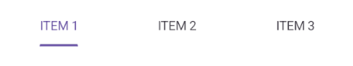
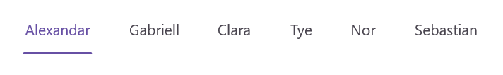
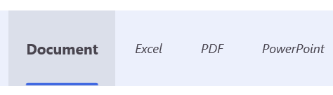
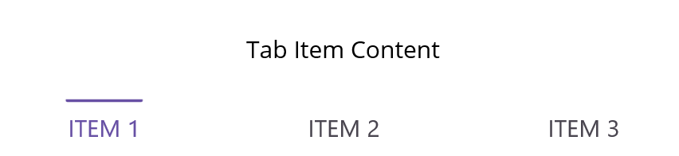
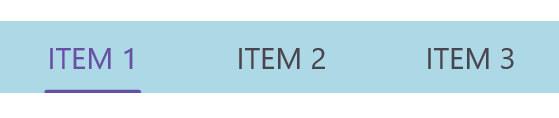

# Customize the Tab Bar in .NET MAUI Tab View (SfTabView)

## Tab width options

The .NET MAUI Tab View provides two modes for determining how the width of the tab is calculated on the tab bar while it gets populated. The options are [Default](https://help.syncfusion.com/cr/maui-toolkit/Syncfusion.Maui.Toolkit.TabView.TabWidthMode.html#Syncfusion_Maui_Toolkit_TabView_TabWidthMode_Default) and [SizeToContent](https://help.syncfusion.com/cr/maui-toolkit/Syncfusion.Maui.Toolkit.TabView.TabWidthMode.html#Syncfusion_Maui_Toolkit_TabView_TabWidthMode_SizeToContent). You can set these modes using the [TabWidthMode](https://help.syncfusion.com/cr/maui-toolkit/Syncfusion.Maui.Toolkit.TabView.TabWidthMode.html) property.

### Default tab width mode

In this mode, the width of the tab is divided equally based on the available control width. This enables a fixed tab bar that will not allow tab scrolling even it contains any number of tabs. You can achieve this by setting the `TabWidthMode` property to `Default`.

N> This mode is recommended when the tab count is not more than four. More tabs in this mode may result in text being trimmed.

To set the tab width mode, use the following code:




    <tabView:SfTabView TabWidthMode="Default">



SfTabView tabView = new SfTabView();
tabView.TabWidthMode = TabWidthMode.Default;




The following image shows the tab bar in default tab width mode.

### Based on the text size

The width of a tab is set to fit the text or image that it contains by setting the `TabWidthMode` as `SizeToContent`. Scroll is enabled in this mode to access the items that are outside the visible area.

To set the tab width mode to fit the content, use the following code:




    <tabView:SfTabView TabWidthMode="SizeToContent">



SfTabView tabView = new SfTabView();
tabView.TabWidthMode = TabWidthMode.SizeToContent;




The following image shows the tab bar in size-to-content width mode.

 

## Customize the tab bar height

The height of the tab bar can be customized by setting the [TabBarHeight](https://help.syncfusion.com/cr/maui-toolkit/Syncfusion.Maui.Toolkit.TabView.SfTabView.html#Syncfusion_Maui_Toolkit_TabView_SfTabView_TabBarHeight) property. The default height is 48.

N> It is recommended to set the `TabBarHeight` as 72 while displaying the image and text with ImagePosition as either top or bottom.

To set the tab bar height, use the following code:




    <tabView:SfTabView TabBarHeight="100">



SfTabView tabView = new SfTabView();
tabView.TabBarHeight = 100;




## Customize the tab header text alignment

The horizontal text alignment of the tab header can be customized by setting the [HeaderHorizontalTextAlignment](https://help.syncfusion.com/cr/maui-toolkit/Syncfusion.Maui.Toolkit.TabView.SfTabView.html#Syncfusion_Maui_Toolkit_TabView_SfTabView_HeaderHorizontalTextAlignment) property. The default value is Center. This property accepts the following values:

*   **Start** - The text will be placed at the starting position in the header tab.
*   **Center** - The text will be placed at the center of the header tab.
*   **End** - The text will be placed at the end of the header tab.

To set the horizontal text alignment of the tab header, use the following code:



 
<tabView:SfTabView HeaderHorizontalTextAlignment="Center"> 



SfTabView tabView = new SfTabView(); 
tabView.HeaderHorizontalTextAlignment = TextAlignment.Center; 



 

## Tab bar placement options 

The .NET MAUI Tab View provides two options for determining how the tab bar aligns relative to the tab content. The options are top and bottom. This can be done using the [TabBarPlacement](https://help.syncfusion.com/cr/maui-toolkit/Syncfusion.Maui.Toolkit.TabView.SfTabView.html#Syncfusion_Maui_Toolkit_TabView_SfTabView_TabBarPlacement) property.

### Top

In this option, the tab bar will be placed above the content region of the tab view. To set the tab bar placement to the top, use the following code:




    <tabView:SfTabView TabBarPlacement="Top">



SfTabView tabView = new SfTabView();
tabView.TabBarPlacement = TabBarPlacement.Top;




The following image shows the tab bar placed at the top of the content region.

 

### Bottom

In this option, the tab bar will be placed below the content region of the tab view. To set the tab bar placement to the bottom, use the following code:




    <tabView:SfTabView TabBarPlacement="Bottom">



SfTabView tabView = new SfTabView();
tabView.TabBarPlacement = TabBarPlacement.Bottom;




The following image illustrates the tab bar placed at the bottom of the content region.

 

## Tab Bar background customization

TYou can customize the tab bar background using the [TabBarBackground](https://help.syncfusion.com/cr/maui-toolkit/Syncfusion.Maui.Toolkit.TabView.SfTabView.html#Syncfusion_Maui_Toolkit_TabView_SfTabView_TabBarBackground) property. You can set a solid color or a gradient color as the background.

### Solid Color 

A solid color can be achieved by assigning the `SolidColorBrush` to the [TabBarBackground](https://help.syncfusion.com/cr/maui-toolkit/Syncfusion.Maui.Toolkit.TabView.SfTabView.html#Syncfusion_Maui_Toolkit_TabView_SfTabView_TabBarBackground), which represents the color of the tab bar background.

To set a solid color as the background, use the following code:




    <tabView:SfTabView TabBarBackground="LightBlue">



SfTabView tabView = new SfTabView();
tabView.TabBarBackground = Colors.LightBlue;




The following image shows the tab bar with a solid color background.

 

### Gradient Color 

The background can be customized with a linear gradient and radial gradient as like below example.



    <tabView:SfTabView>
        <tabView:SfTabView.TabBarBackground>
            <LinearGradientBrush EndPoint="0,1">
                <GradientStop Color="#009FFF" Offset="0.1" />
                <GradientStop Color="#ec2F4B Offset="1.0" />
            </LinearGradientBrush>
        </tabView:SfTabView.TabBarBackground>
    </tabView:SfTabView>



Microsoft.Maui.Controls.GradientStop gra1 = new Microsoft.Maui.Controls.GradientStop()
{
    Color = Color.FromArgb("#009FFF"),
    Offset = (float)0.1,
};

Microsoft.Maui.Controls.GradientStop gra2 = new Microsoft.Maui.Controls.GradientStop()
{
    Color = Color.FromArgb("#ec2F4B"),
    Offset = (float)1.0,
};

LinearGradientBrush graBrush = new LinearGradientBrush()
{
    EndPoint = new Point(0, 1),
    GradientStops = new GradientStopCollection() { gra1, gra2 }
};

SfTabView tabView = new SfTabView();
tabView.TabBarBackground = graBrush;



The following image shows the tab bar with a gradient color background.

N> View [sample](https://github.com/SyncfusionExamples/maui-toolkit-samples/tree/master/TabView/TabBarCustomization) in GitHub