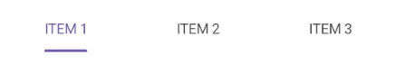

# Customizing Tab Item Appearance in .NET MAUI Tab View (SfTabView)

A tab item consists of several elements that can be customized to enhance its appearance and functionality. This guide will walk you through the various customization options available for tab items in [SfTabView](https://help.syncfusion.com/cr/maui-toolkit/Syncfusion.Maui.Toolkit.TabView.SfTabView.html).

## Customizable elements of a tab item

### Header

The [Header](https://help.syncfusion.com/cr/maui-toolkit/Syncfusion.Maui.Toolkit.TabView.SfTabItem.html#Syncfusion_Maui_Toolkit_TabView_SfTabItem_Header) holds the text of the tab item that is displayed in the tab bar. The `Header` property can be set in both XAML and C# code as shown in the examples below.




<!-- Define the SfTabView control -->
<tabView:SfTabView>
	<!-- Define a tab item with the header set to "ITEM 1" -->
	<tabView:SfTabItem Header="ITEM 1" />
</tabView:SfTabView>



// Create an instance of the SfTabView control
SfTabView tabView = new SfTabView();

// Create a collection of tab items
var tabItems = new TabItemCollection
{
	new SfTabItem()
	{
		Header = "ITEM 1",
	}
};

// Set the Items property of the SfTabView to the collection of tab items
tabView.Items = tabItems;




The following image shows a tab item with the header text:

 

### Image source 

You can add an image to a tab item to enhance its visual appeal. The [ImageSource](https://help.syncfusion.com/cr/maui-toolkit/Syncfusion.Maui.Toolkit.TabView.SfTabItem.html#Syncfusion_Maui_Toolkit_TabView_SfTabItem_ImageSource) specifies the image to be displayed in the tab item. You can set the `ImageSource` property in both XAML and C# code as shown in the examples below.




<!-- Define the SfTabView control -->
<tabView:SfTabView>
    <!-- Define a tab item with the header set to "ITEM 1" and an image source set to "alexandar" -->
    <tabView:SfTabItem Header="ITEM 1"
                       ImageSource="alexandar" />
</tabView:SfTabView>



// Create an instance of the SfTabView control
SfTabView tabView = new SfTabView();

// Create a collection of tab items
var tabItems = new TabItemCollection
{
	new SfTabItem
	{
		Header = "ITEM 1",
		ImageSource = "alexandar",
	}
};

// Set the Items property of the SfTabView to the collection of tab items
tabView.Items = tabItems;




The following image shows a tab item with an image source:

 

### Content 

The `Content` property allows you to assign a view that will be displayed in the main area of the Tab View. You can set the `Content` property in both XAML and C# code as shown in the examples below.




<!-- Define the SfTabView control -->
<tabView:SfTabView>
	<!-- Define a tab item with the header set to "ITEM 2" -->
	<tabView:SfTabItem Header="ITEM 2">
		<!-- Define the content of the tab item -->
		<tabView:SfTabItem.Content>
			<ListView>
				<!-- Add your items here -->
			</ListView>
		</tabView:SfTabItem.Content>
	</tabView:SfTabItem>
</tabView:SfTabView>



// Create an instance of the SfTabView control
SfTabView tabView = new SfTabView();

// Create a collection of tab items
var tabItems = new TabItemCollection
{
	new SfTabItem
	{
		Header = "ITEM 2",
		Content = new ListView
		{
			// Add your items here
		}
	}
};

// Set the Items property of the SfTabView to the collection of tab items
tabView.Items = tabItems;




The following image shows a tab item with its content:

 

### Customizing tab header content

The `HeaderContent` property allows you to define a custom view for the tab header. When built-in view is not needed, it can be overridden by adding custom views to the header in tabs. The tab view header can be customized by adding different views such as image, button, and label inside the header content. The following code sample demonstrates how to customize the header content as needed.

 


<!-- Define the SfTabView control -->
<tabView:SfTabView>
	<!-- Define a tab item with the HeaderContent-->
	<tabView:SfTabItem>
		<!-- Define the HeaderContent of the tab item -->		
		<tabView:SfTabItem.HeaderContent>
			<Grid ColumnSpacing="5" HorizontalOptions="Center" VerticalOptions="Center">
				<Grid.ColumnDefinitions>
					<ColumnDefinition Width="Auto"/>
					<ColumnDefinition Width="*"/>
				</Grid.ColumnDefinitions>
				<Image Source="call.png" HeightRequest="20" WidthRequest="20"/>
				<Label Grid.Column="1" Text="Call" HorizontalTextAlignment="Center"  VerticalTextAlignment="Center"/>
			</Grid>
		</tabView:SfTabItem.HeaderContent>
		<tabView:SfTabItem.Content>
			<ListView>
				<!-- Add your items here -->
			</ListView>
		</tabView:SfTabItem.Content>
	</tabView:SfTabItem>
</tabView:SfTabView>



// Create an instance of the SfTabView control
SfTabView tabView = new SfTabView();

var callHeader = new Grid
{
    ColumnSpacing = 5,
    HorizontalOptions = LayoutOptions.Center,
    VerticalOptions = LayoutOptions.Center,
    ColumnDefinitions =
    {
        new ColumnDefinition { Width = GridLength.Auto },
        new ColumnDefinition { Width = GridLength.Star }
    }
};
var callImage = new Image { Source = "call.png", HeightRequest = 20, WidthRequest = 20 };
Grid.SetColumn(callImage, 0);

var callLabel = new Label
{
    Text = "Call",
    HorizontalTextAlignment = TextAlignment.Center,
    VerticalTextAlignment = TextAlignment.Center
};
Grid.SetColumn(callLabel, 1);

callHeader.Children.Add(callImage);
callHeader.Children.Add(callLabel);

// Create a collection of tab items with HeaderContent
var tabItems = new TabItemCollection
{
	new SfTabItem
	{
		HeaderContent = callHeader,
		Content = new ListView
		{
			// Add your items here
		}
	}
};

// Set the Items property of the SfTabView to the collection of tab items
tabView.Items = tabItems;




The following image shows a tab item with custom header content:

N> Ensure consistent sizing and alignment to achieve a visually balanced layout across all tabs in `HeaderContent`.

## Image position options 

The .NET MAUI Tab View provides four options that determine how the image in the tab aligns relative to the text. The options are left, top, right, and bottom. You can set this alignment using the [ImagePosition](https://help.syncfusion.com/cr/maui-toolkit/Syncfusion.Maui.Toolkit.TabView.SfTabItem.html#Syncfusion_Maui_Toolkit_TabView_SfTabItem_ImagePosition) property of the [SfTabItem](https://help.syncfusion.com/cr/maui-toolkit/Syncfusion.Maui.Toolkit.TabView.SfTabItem.html) class.

N> Each tab item can have a different image position. You can use the Visual State Manager to apply the same image position to all tabs.

### Top

When the `ImagePosition` property is set to `Top`, the image will be placed above the text, aligned vertically. You can set the `ImagePosition` property in both XAML and C# code as shown in the examples below.




<!-- Define the SfTabView control -->
<tabView:SfTabView>
	<!-- Define a tab item with the image position set to Top -->
	<tabView:SfTabItem ImagePosition="Top" />
</tabView:SfTabView>



// Create an instance of the SfTabView control
SfTabView tabView = new SfTabView();

// Create a collection of tab items
var tabItems = new TabItemCollection
{
	new SfTabItem
	{
		ImagePosition = TabImagePosition.Top,
	}
};

// Set the Items property of the SfTabView to the collection of tab items
tabView.Items = tabItems;




The following image shows the tab item with the image positioned to the top of the text:

 

### Bottom

When the `ImagePosition` property is set to `Bottom`, the image will be placed below the text, aligned vertically. 




<!-- Define the SfTabView control -->
<tabView:SfTabView>
	<!-- Define a tab item with the image position set to Top -->
	<tabView:SfTabItem ImagePosition="Top" />
</tabView:SfTabView>



// Create an instance of the SfTabView control
SfTabView tabView = new SfTabView();

// Create a collection of tab items
var tabItems = new TabItemCollection
{
	new SfTabItem
	{
		ImagePosition = TabImagePosition.Bottom,
	}
};

// Set the Items property of the SfTabView to the collection of tab items
tabView.Items = tabItems;




The following image shows the tab item with the image positioned to the bottom of the text:

 

### Left

When the `ImagePosition` property is set to `Left`, the image will be placed before the text, aligned horizontally.




<!-- Define the SfTabView control -->
<tabView:SfTabView>
	<!-- Define a tab item with the image position set to Left -->
	<tabView:SfTabItem ImagePosition="Left" />
</tabView:SfTabView>



// Create an instance of the SfTabView control
SfTabView tabView = new SfTabView();

// Create a collection of tab items
var tabItems = new TabItemCollection
{
    new SfTabItem()
    {
        ImagePosition = TabImagePosition.Left,
    }
};

// Set the Items property of the SfTabView to the collection of tab items
tabView.Items = tabItems;




The following image shows the tab item with the image positioned to the left of the text:

 

### Right

When the `ImagePosition` property is set to `Right`, the image will be placed to the right side of the text, aligned horizontally.




<!-- Define the SfTabView control -->
<tabView:SfTabView>
	<!-- Define a tab item with the image position set to Right -->
	<tabView:SfTabItem ImagePosition="Right" />
</tabView:SfTabView>



// Create an instance of the SfTabView control
SfTabView tabView = new SfTabView();

// Create a collection of tab items
var tabItems = new TabItemCollection
{
    new SfTabItem()
    {
        ImagePosition = TabImagePosition.Right,
    }
};

// Set the Items property of the SfTabView to the collection of tab items
tabView.Items = tabItems;




The following image shows the tab item with the image positioned to the right of the text:

 

## Image text spacing

The [ImageTextSpacing](https://help.syncfusion.com/cr/maui-toolkit/Syncfusion.Maui.Toolkit.TabView.SfTabItem.html#Syncfusion_Maui_Toolkit_TabView_SfTabItem_ImageTextSpacing) property in [SfTabItem](https://help.syncfusion.com/cr/maui-toolkit/Syncfusion.Maui.Toolkit.TabView.SfTabItem.html) allows you to set the spacing between the image and the text of the tab item. This property is particularly useful when you want to fine-tune the layout of tab items that contain both an image and text.




<!-- Define the SfTabView control -->
<tabView:SfTabView>
	<!-- Define a tab item with the image text spacing set to 20 -->
	<tabView:SfTabItem ImageTextSpacing="20" />
</tabView:SfTabView>



// Create an instance of the SfTabView control
SfTabView tabView = new SfTabView();

// Create a collection of tab items
var tabItems = new TabItemCollection
{
    new SfTabItem()
    {
        ImageTextSpacing = "20",
    }
};

// Set the Items property of the SfTabView to the collection of tab items
tabView.Items = tabItems;




The following image shows a tab item with the specified image text spacing:

## Text color customization

The [TextColor](https://help.syncfusion.com/cr/maui-toolkit/Syncfusion.Maui.Toolkit.TabView.SfTabItem.html#Syncfusion_Maui_Toolkit_TabView_SfTabItem_TextColor) property allows you to customize the color of the text displayed in the tab item. Below are examples demonstrating how to set the `TextColor` property in both XAML and C#.




<!-- Define the SfTabView control -->
<tabView:SfTabView>
	<!-- Define a tab item with the text color set to Blue -->
	<tabView:SfTabItem TextColor="Blue" />
</tabView:SfTabView>



// Create an instance of the SfTabView control
SfTabView tabView = new SfTabView();

// Create a collection of tab items
var tabItems = new TabItemCollection
{
    new SfTabItem()
    {
        TextColor = Color.Blue,
    }
};

// Set the Items property of the SfTabView to the collection of tab items
tabView.Items = tabItems;




The following image shows a tab item with the specified text color:

 

## Font customization 

Font customization allows you to modify the appearance of the text in tab items. You can adjust the following font properties:

### Font family

The [FontFamily](https://help.syncfusion.com/cr/maui-toolkit/Syncfusion.Maui.Toolkit.TabView.SfTabItem.html#Syncfusion_Maui_Toolkit_TabView_SfTabItem_FontFamily) property sets the font family of the tab item text. Below are examples demonstrating how to set the `FontFamily` property in both XAML and C#.




<!-- Define the SfTabView control -->
<tabView:SfTabView>
	<!-- Define a tab item with the font family set to OpenSansRegular -->
	<tabView:SfTabItem FontFamily="OpenSansRegular" />
</tabView:SfTabView>



// Create an instance of the SfTabView control
SfTabView tabView = new SfTabView();

// Create a collection of tab items
var tabItems = new TabItemCollection
{
    new SfTabItem()
    {
        FontFamily = "OpenSansRegular",
    }
};

// Set the Items property of the SfTabView to the collection of tab items
tabView.Items = tabItems;




The following image shows a tab item with the specified font family:

 

### Font attributes

The [FontAttributes](https://help.syncfusion.com/cr/maui-toolkit/Syncfusion.Maui.Toolkit.TabView.SfTabItem.html#Syncfusion_Maui_Toolkit_TabView_SfTabItem_FontAttributes) defines the font style (e.g., bold, italic) of the tab item text. Below are examples demonstrating how to set the `FontAttributes` property in both XAML and C#.




<!-- Define the SfTabView control -->
<tabView:SfTabView>
	<!-- Define a tab item with the font attributes set to Bold -->
	<tabView:SfTabItem FontAttributes="Bold" />
</tabView:SfTabView>



// Create an instance of the SfTabView control
SfTabView tabView = new SfTabView();

// Create a collection of tab items
var tabItems = new TabItemCollection
{
    new SfTabItem()
    {
        FontAttributes = FontAttributes.Bold,
    }
};

// Set the Items property of the SfTabView to the collection of tab items
tabView.Items = tabItems;




The following image shows a tab item with the specified font attributes:

 

### Font size

The [FontSize](https://help.syncfusion.com/cr/maui-toolkit/Syncfusion.Maui.Toolkit.TabView.SfTabItem.html#Syncfusion_Maui_Toolkit_TabView_SfTabItem_FontSize) property specifies the size of the text in the tab item. Below are examples demonstrating how to set the `FontSize` property in both XAML and C#.




<!-- Define the SfTabView control -->
<tabView:SfTabView>
	<!-- Define a tab item with the font size set to 32 -->
	<tabView:SfTabItem FontSize="32" />
</tabView:SfTabView>



// Create an instance of the SfTabView control
SfTabView tabView = new SfTabView();

// Create a collection of tab items
var tabItems = new TabItemCollection
{
    new SfTabItem()
    {
        FontSize = 32,
    }
};

// Set the Items property of the SfTabView to the collection of tab items
tabView.Items = tabItems;




The following image shows a tab item with the specified font size:

## Tab header padding

The [TabHeaderPadding](https://help.syncfusion.com/cr/maui-toolkit/Syncfusion.Maui.Toolkit.TabView.SfTabView.html#Syncfusion_Maui_Toolkit_TabView_SfTabView_TabHeaderPadding) property in [SfTabView](https://help.syncfusion.com/cr/maui-toolkit/Syncfusion.Maui.Toolkit.TabView.SfTabView.html) allows you to add padding to the tab header.

N> The `TabHeaderPadding` property is only applicable when [TabWidthMode](https://help.syncfusion.com/cr/maui-toolkit/Syncfusion.Maui.Toolkit.TabView.SfTabView.html#Syncfusion_Maui_Toolkit_TabView_SfTabView_TabWidthMode) is set to [SizeToContent](https://help.syncfusion.com/cr/maui-toolkit/Syncfusion.Maui.Toolkit.TabView.TabWidthMode.html#Syncfusion_Maui_Toolkit_TabView_TabWidthMode_SizeToContent).

Below are examples demonstrating how to set the `TabHeaderPadding` property in both XAML and C#.




<!-- Define the SfTabView control with specific tab width mode and header padding -->
<tabView:SfTabView TabWidthMode="SizeToContent"
                   TabHeaderPadding="5,10,5,10">
    <!-- Define a tab item -->
    <tabView:SfTabItem />
</tabView:SfTabView>



// Create an instance of the SfTabView control
SfTabView tabView = new SfTabView();

// Set the tab width mode to size to content
tabView.TabWidthMode = TabWidthMode.SizeToContent;

// Set the tab header padding
tabView.TabHeaderPadding = new Thickness(5, 10, 5, 10);




The following image shows a tab item with the specified header padding:

## Scroll buttons on header

Scroll buttons are used to navigate through the items in the header of the Tab View by adjusting the [IsScrollButtonEnabled](https://help.syncfusion.com/cr/maui-toolkit/Syncfusion.Maui.Toolkit.TabView.SfTabView.html#Syncfusion_Maui_Toolkit_TabView_SfTabView_IsScrollButtonEnabled) property of [SfTabView](https://help.syncfusion.com/cr/maui-toolkit/Syncfusion.Maui.Toolkit.TabView.SfTabView.html?tabs=tabid-1). These buttons are particularly useful when you have many tabs that exceed the available width of the Tab View.

Below are examples demonstrating how to enable scroll buttons in both XAML and C#.




<!-- Define the SfTabView control with scroll button enabled -->
<tabView:SfTabView IsScrollButtonEnabled="True">
	<!-- Define a tab item -->
	<tabView:SfTabItem />
</tabView:SfTabView>



// Create an instance of the SfTabView control
SfTabView tabView = new SfTabView();

// Enable scroll buttons for the tab view
tabView.IsScrollButtonEnabled = true;




The following image shows the tab view with scroll buttons enabled:

 

### Scroll button customization

The [ScrollButtonBackground](https://help.syncfusion.com/cr/maui-toolkit/Syncfusion.Maui.Toolkit.TabView.SfTabView.html#Syncfusion_Maui_Toolkit_TabView_SfTabView_ScrollButtonBackground) and [ScrollButtonColor](https://help.syncfusion.com/cr/maui-toolkit/Syncfusion.Maui.Toolkit.TabView.SfTabView.html#Syncfusion_Maui_Toolkit_TabView_SfTabView_ScrollButtonColor) properties of [SfTabView](https://help.syncfusion.com/cr/maui-toolkit/Syncfusion.Maui.Toolkit.TabView.SfTabView.html) allows users to customize the background color and foreground color of the scroll button.




<tabView:SfTabView ScrollButtonBackground="Violet" ScrollButtonColor="Red">
</tabView:SfTabView>



StackLayout stackLayout = new StackLayout();
var tabView = new SfTabView();
tabView.ScrollButtonBackground = SolidColorBrush.Violet;
tabView.ScrollButtonColor = Colors.Red;
stackLayout.Children.Add(tabView);
this.Content = stackLayout;




## Font auto scaling enabled

The [FontAutoScalingEnabled](https://help.syncfusion.com/cr/maui-toolkit/Syncfusion.Maui.Toolkit.TabView.SfTabItem.html#Syncfusion_Maui_Toolkit_TabView_SfTabItem_FontAutoScalingEnabled) property allows you to enable or disable automatic font scaling for the tab headers. When enabled, this feature adjusts the font size of the tab headers based on the text size settings of the operating system. The default value of the `FontAutoScalingEnabled` property is `false`.

Below are examples demonstrating how to enable font auto scaling in both XAML and C#.




<!-- Define the SfTabView control with font auto-scaling enabled -->
<tabView:SfTabView FontAutoScalingEnabled="True">
	<!-- Define a tab item -->
	<tabView:SfTabItem />
</tabView:SfTabView>



// Create an instance of the SfTabView control
SfTabView tabView = new SfTabView();

// Enable font auto-scaling for the tab view
tabView.FontAutoScalingEnabled = true;




## Content transition duration

You can customize the animation duration when switching between tabs in the Tab View by setting the [ContentTransitionDuration](https://help.syncfusion.com/cr/maui-toolkit/Syncfusion.Maui.Toolkit.TabView.SfTabView.html#Syncfusion_Maui_Toolkit_TabView_SfTabView_ContentTransitionDuration) property. This property affects the smooth transition of content when the [SelectedIndex](https://help.syncfusion.com/cr/maui-toolkit/Syncfusion.Maui.Toolkit.TabView.SfTabView.html#Syncfusion_Maui_Toolkit_TabView_SfTabView_SelectedIndex) changes.

Below are examples demonstrating how to set the content transition duration in both XAML and C#.




<!-- Define the SfTabView control with content transition duration set to 300 -->
<tabView:SfTabView ContentTransitionDuration="300">
	<!-- Define a tab item -->
	<tabView:SfTabItem />
</tabView:SfTabView>



// Create an instance of the SfTabView control
SfTabView tabView = new SfTabView();

// Set the content transition duration for the tab view
tabView.ContentTransitionDuration = 300;




## Animation easing

The `AnimationEasing` property of the [SfTabView](https://help.syncfusion.com/cr/maui-toolkit/Syncfusion.Maui.Toolkit.TabView.SfTabView.html) allows you to specify the easing function for the transition animation when switching between tab contents. This provides more control over the animation's acceleration and deceleration, allowing for more natural and visually appealing transitions. The default value of the `AnimationEasing` property is [Easing.Linear](https://learn.microsoft.com/en-us/dotnet/api/microsoft.maui.easing.linear?view=net-maui-9.0#microsoft-maui-easing-linear).




<!-- Define the SfTabView control with AnimationEasing -->
<tabView:SfTabView AnimationEasing="{x:Static Easing.BounceOut}"
                   ContentTransitionDuration="500">
    <!-- Define a tab items -->
</tabView:SfTabView>



// Create an instance of the SfTabView control
SfTabView tabView = new SfTabView();

// Set the AnimationEasing property
tabView.AnimationEasing = Easing.BounceOut;
tabView.ContentTransitionDuration = 500;





## Enable content transition

The .NET MAUI Tab View allows users to enable or disable the transition animation for tab content when switching between tabs using [IsContentTransitionEnabled](https://help.syncfusion.com/cr/maui-toolkit/Syncfusion.Maui.Toolkit.TabView.SfTabView.html#Syncfusion_Maui_Toolkit_TabView_SfTabView_IsContentTransitionEnabled) property. 




<tabView:SfTabView IsContentTransitionEnabled="True" ContentTransitionDuration = "1000"/>



SfTabView tabView = new SfTabView();
tabView.IsContentTransitionEnabled = "True"; 
tabView.ContentTransitionDuration = 1000; 




## Image size

You can customize the image size in the .NET MAUI Tab View control by setting the [ImageSize](https://help.syncfusion.com/cr/maui-toolkit/Syncfusion.Maui.Toolkit.TabView.SfTabItem.html#Syncfusion_Maui_Toolkit_TabView_SfTabItem_ImageSize) property.




<tabView:SfTabView>
    <tabView:SfTabItem ImageSize="50"/>
</tabView:SfTabView>



StackLayout stackLayout = new StackLayout();
var tabView = new SfTabView();
var tabItems = new TabItemCollection
{
    new SfTabItem()
    {
        ImageSize = 50,
    }
};
tabView.Items = tabItems;
stackLayout.Children.Add(tabView);
this.Content = stackLayout;




## Disable ripple effect on item click

The `EnableRippleAnimation` property of the [SfTabView](https://help.syncfusion.com/cr/maui-toolkit/Syncfusion.Maui.Toolkit.TabView.SfTabView.html) allows you to enable or disable the ripple animation for tab headers. This animation provides visual feedback when a tab header is tapped. The default value of the `EnableRippleAnimation` property is `true`.




<!-- Define the SfTabView control with the ripple animation disabled -->
<tabView:SfTabView EnableRippleAnimation="False">
    <!-- Define tab items -->
</tabView:SfTabView>



// Create an instance of the SfTabView control
SfTabView tabView = new SfTabView();

// Disable the ripple animation
tabView.EnableRippleAnimation = false;





## How to

### Disable hover effect on tab item

To disable the hover effect when the mouse pointer is over a [TabItem](https://help.syncfusion.com/cr/maui-toolkit/Syncfusion.Maui.Toolkit.TabView.SfTabItem.html) header, set color value `Transparent` to the built-in key `SfTabViewHoverBackground`.





<ContentPage xmlns="http://schemas.microsoft.com/dotnet/2021/maui"
			 xmlns:x="http://schemas.microsoft.com/winfx/2009/xaml"
			 ... >
	<ContentPage.Resources>
		<x:String x:Key="SfTabViewTheme">CustomTheme</x:String>
		<Color x:Key="SfTabViewHoverBackground">Transparent</Color>
	</ContentPage.Resources>
	<ContentPage.Content>
		<tabView:SfTabView x:Name="tabView" EnableRippleAnimation="False">
			<!-- Define tab items -->
		</tabView:SfTabView>
	</ContentPage.Content>
</ContentPage>



