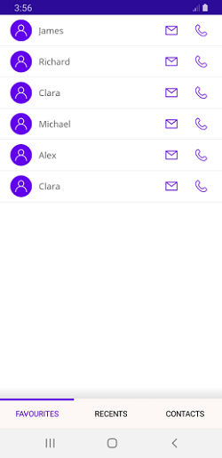

# Visual State Manager in .NET MAUI Tab View (SfTabView)

Use the [VisualStateManager](https://learn.microsoft.com/en-us/dotnet/api/microsoft.maui.controls.visualstatemanager?view=net-maui-8.0) to change the properties of the [SfTabView](https://help.syncfusion.com/cr/maui-toolkit/Syncfusion.Maui.Toolkit.TabView.SfTabView.html) control based on visual states defined in your code. The applicable visual states are `Selected`, `Normal`, and `Disabled`. 

Refer to the following example to implement Visual State Manager in the `SfTabView` control. This example demonstrates how to define visual states and apply them to the `SfTabView` control to change its appearance based on different states:

Additionally, the C# example demonstrates how to create a custom `CustomTabItem` class that inherits from `SfTabItem`. This class sets up the visual states programmatically, allowing for more dynamic control over the visual states.





<ContentPage xmlns="http://schemas.microsoft.com/dotnet/2021/maui"
             xmlns:x="http://schemas.microsoft.com/winfx/2009/xaml"
             x:Class="TabViewMauiSample.MainPage"
             xmlns:tabView="clr-namespace:Syncfusion.Maui.Toolkit.TabView;assembly=Syncfusion.Maui.Toolkit"
             BackgroundColor="{DynamicResource SecondaryColor}">
    <ContentPage.Content>
        <Grid>
            <Grid.Resources>
                <!-- Style for tab buttons -->
                
                <!-- Visual State Manager style for SfTabItem -->
                
            </Grid.Resources>

            <!-- SfTabView control -->
            <tabView:SfTabView>
                <!-- Tab item for FAVOURITES -->
                <tabView:SfTabItem Header="FAVOURITES">
                    <tabView:SfTabItem.Content>
                        <Grid>
                            <!-- Gradient background at the bottom -->
                            <Grid Grid.Row="1"
                                  VerticalOptions="End"
                                  HeightRequest="20">
                                <Grid.Background>
                                    <LinearGradientBrush EndPoint="0,1">
                                        <GradientStop Color="Transparent"
                                                      Offset="0.1" />
                                        <GradientStop Color="#EAEAEA"
                                                      Offset="0.8" />
                                        <GradientStop Color="#E5E5E5"
                                                      Offset="1.0" />
                                    </LinearGradientBrush>
                                </Grid.Background>
                            </Grid>
                            <!-- ListView for displaying favorite contacts -->
                            <ListView RowHeight="50">
                                <ListView.ItemsSource>
                                    <x:Array Type="{x:Type x:String}">
                                        <x:String>James</x:String>
                                        <x:String>Richard</x:String>
                                        <x:String>Clara</x:String>
                                        <x:String>Michael</x:String>
                                        <x:String>Alex</x:String>
                                        <x:String>Clara</x:String>
                                    </x:Array>
                                </ListView.ItemsSource>
                                <ListView.ItemTemplate>
                                    <DataTemplate>
                                        <ViewCell>
                                            <Grid ColumnDefinitions="48,*,48,48"
                                                  Margin="10,5">
                                                <!-- Contact image -->
                                                <Image Grid.Column="0"
                                                       WidthRequest="35"
                                                       HeightRequest="35"
                                                       VerticalOptions="Center"
                                                       HorizontalOptions="Center"
                                                       Aspect="AspectFit"
                                                       Source="contact_image" />
                                                <!-- Contact name -->
                                                <Label Grid.Column="1"
                                                       VerticalOptions="Center"
                                                       HorizontalOptions="Start"
                                                       Margin="5,0"
                                                       TextColor="#666666"
                                                       FontSize="16"
                                                       Text="{Binding}" />
                                                <!-- Mail icon -->
                                                <Image Grid.Column="2"
                                                       WidthRequest="35"
                                                       HeightRequest="35"
                                                       VerticalOptions="Center"
                                                       HorizontalOptions="Center"
                                                       Aspect="AspectFit"
                                                       Source="mail" />
                                                <!-- Call icon -->
                                                <Image Grid.Column="3"
                                                       WidthRequest="35"
                                                       HeightRequest="35"
                                                       VerticalOptions="Center"
                                                       HorizontalOptions="Center"
                                                       Aspect="AspectFit"
                                                       Source="call1" />
                                            </Grid>
                                        </ViewCell>
                                    </DataTemplate>
                                </ListView.ItemTemplate>
                            </ListView>
                        </Grid>
                    </tabView:SfTabItem.Content>
                </tabView:SfTabItem>
                <!-- Tab item for RECENTS -->
                <tabView:SfTabItem Header="RECENTS">
                    <tabView:SfTabItem.Content>
                        <Grid BackgroundColor="Green"
                              x:Name="FavoritesGrid" />
                    </tabView:SfTabItem.Content>
                </tabView:SfTabItem>
                <!-- Tab item for CONTACTS -->
                <tabView:SfTabItem Header="CONTACTS">
                    <tabView:SfTabItem.Content>
                        <Grid BackgroundColor="Blue"
                              x:Name="ContactsGrid" />
                    </tabView:SfTabItem.Content>
                </tabView:SfTabItem>
            </tabView:SfTabView>
        </Grid>
    </ContentPage.Content>
 </ContentPage>





public partial class MainPage : ContentPage
{
	public MainPage()
	{
		InitializeComponent();

		// Create an instance of the SfTabView control
		SfTabView tabView = new SfTabView();

		// Create a ListView with sample data
		ListView listView = new ListView
		{
			RowHeight = 50,
			ItemsSource = new string[] { "James", "Richard", "Clara", "Michael", "Alex", "Clara" },
			ItemTemplate = new DataTemplate(() =>
			{
				// Define the layout for each item in the ListView
				var grid = new Grid
				{
					ColumnDefinitions =
					{
						new ColumnDefinition { Width = new GridLength(48) },
						new ColumnDefinition { Width = new GridLength(1, GridUnitType.Star) },
						new ColumnDefinition { Width = new GridLength(48) },
						new ColumnDefinition { Width = new GridLength(48) }
					},
					Margin = new Thickness(10, 5)
				};

				// Define the first image in the grid
				var image1 = new Image
				{
					WidthRequest = 35,
					HeightRequest = 35,
					VerticalOptions = LayoutOptions.Center,
					HorizontalOptions = LayoutOptions.Center,
					Aspect = Aspect.AspectFit,
					Source = "contact_image"
				};

				// Define the label in the grid
				var label = new Label
				{
					VerticalOptions = LayoutOptions.Center,
					HorizontalOptions = LayoutOptions.Start,
					Margin = new Thickness(5, 0),
					TextColor = Color.FromHex("#666666"),
					FontSize = 16
				};
				label.SetBinding(Label.TextProperty, ".");

				// Define the second image in the grid
				var image2 = new Image
				{
					WidthRequest = 35,
					HeightRequest = 35,
					VerticalOptions = LayoutOptions.Center,
					HorizontalOptions = LayoutOptions.Center,
					Aspect = Aspect.AspectFit,
					Source = "mail"
				};

				// Define the third image in the grid
				var image3 = new Image
				{
					WidthRequest = 35,
					HeightRequest = 35,
					VerticalOptions = LayoutOptions.Center,
					HorizontalOptions = LayoutOptions.Center,
					Aspect = Aspect.AspectFit,
					Source = "call1"
				};

				// Set the column positions for the elements in the grid
				Grid.SetColumn(image1, 0);
				Grid.SetColumn(label, 1);
				Grid.SetColumn(image2, 2);
				Grid.SetColumn(image3, 3);

				// Add the elements to the grid
				grid.Children.Add(image1);
				grid.Children.Add(label);
				grid.Children.Add(image2);
				grid.Children.Add(image3);

				// Return a ViewCell containing the grid
				return new ViewCell { View = grid };
			})
		};

		// Create grids for the tab contents
		Grid favoritesGrid = new Grid { };
		favoritesGrid.Children.Add(listView);
		Grid recentsGrid = new Grid { BackgroundColor = Colors.Green };
		Grid contactsGrid = new Grid { BackgroundColor = Colors.Blue };

		// Create a collection of tab items
		var tabItems = new TabItemCollection
		{
			new CustomTabItem()
			{
				Header = "FAVOURITES",
				Content = favoritesGrid
			},
			new CustomTabItem()
			{
				Header = "RECENTS",
				Content = recentsGrid
			},
			new CustomTabItem()
			{
				Header = "CONTACTS",
				Content = contactsGrid
			}
		};

		// Set the tab items for the SfTabView
		tabView.Items = tabItems;

		// Set the content of the page to the SfTabView
		this.Content = tabView;
	}
}

// We create a custom `CustomTabItem` class that inherits from `SfTabItem`. This class sets up the visual states programmatically, allowing for more dynamic control over the visual states.

public class CustomTabItem : SfTabItem
{
	public CustomTabItem()
	{
		// Create a list to hold visual state groups
		VisualStateGroupList visualStateGroupList = new VisualStateGroupList();

		// Create a visual state group for common states
		VisualStateGroup commonStateGroup = new VisualStateGroup();

		// Define the "Normal" visual state
		VisualState normalState = new VisualState
		{
			Name = "Normal"
		};
		// Set the text color for the "Normal" state
		normalState.Setters.Add(new Setter { Property = SfTabItem.TextColorProperty, Value = Colors.Black });

		// Define the "Selected" visual state
		VisualState selectedState = new VisualState
		{
			Name = "Selected"
		};
		// Set the text color for the "Selected" state
		selectedState.Setters.Add(new Setter { Property = SfTabItem.TextColorProperty, Value = Color.FromHex("#6750A4") });

		// Add the visual states to the common state group
		commonStateGroup.States.Add(normalState);
		commonStateGroup.States.Add(selectedState);

		// Add the common state group to the visual state group list
		visualStateGroupList.Add(commonStateGroup);

		// Set the visual state groups for this tab item
		VisualStateManager.SetVisualStateGroups(this, visualStateGroupList);
	}
}




By using the Visual State Manager, you can easily change the appearance of tab items based on their current state, providing visual feedback to users and enhancing the overall user experience. The following image demonstrating different visual states for tab items

N> View [sample](https://github.com/SyncfusionExamples/maui-toolkit-samples/tree/master/TabView/VisualStateManagerTabView) in GitHub.