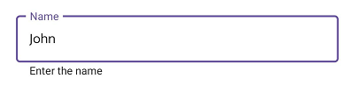
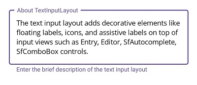
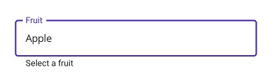
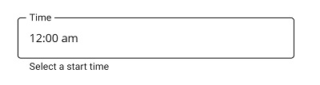
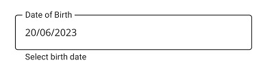

# Supported Input Views in .NET MAUI TextInputLayout (SfTextInputLayout)

Input views can be added to the text input layout control by setting the `Content` property.

## Entry

To enter a single line text input, add [`Entry`](https://learn.microsoft.com/en-us/dotnet/maui/user-interface/controls/entry).

 

 

<inputLayout:SfTextInputLayout Hint="Name"
                               HelperText="Enter your name"
                               ContainerType="Outlined">
   <Entry />
</inputLayout:SfTextInputLayout>  



 

var inputLayout = new SfTextInputLayout();
inputLayout.Hint = "Name"; 
inputLayout.HelperText = "Enter your name"
inputLayout.Content = new Entry(); 





## Editor

To enter multi-line text input, add [`Editor`](https://learn.microsoft.com/en-us/dotnet/maui/user-interface/controls/editor), then set the [AutoSize](https://learn.microsoft.com/en-us/dotnet/api/microsoft.maui.controls.editor.autosize?view=net-maui-8.0#microsoft-maui-controls-editor-autosize) property to `TextChanges`.

 

 

<inputLayout:SfTextInputLayout Hint="About TextInputLayout" 
                               HelperText="Enter the brief description of the text input layout"
                               ContainerType="Outlined">
   <Editor AutoSize="TextChanges" />
</inputLayout:SfTextInputLayout>  



 

var inputLayout = new SfTextInputLayout();
inputLayout.Hint = "Notes"; 
inputLayout.Content = new Editor(); 





## Picker

To initialize the [Picker](https://learn.microsoft.com/en-us/dotnet/maui/user-interface/controls/picker) control and launch it in each platform, refer to the `getting started with picker` documentation.




<inputLayout:SfTextInputLayout Hint="Fruit" 
                               HelperText="Select a fruit"
                               ContainerType="Outlined" >
   <picker:Picker SelectedItem="Apple">
        <Picker.ItemsSource>
            <x:Array Type="{x:Type x:String}">
                <x:String>Apple</x:String>
                <x:String>Orange</x:String>
                <x:String>Strawberry</x:String>
            </x:Array>
        </Picker.ItemsSource>
   </picker:Picker>
</inputLayout:SfTextInputLayout> 




var inputLayout = new SfTextInputLayout();
inputLayout.Hint = "Fruit"; 
inputLayout.HelperText = "Select a fruit";
inputLayout.ContainerType = ContainerType.Outlined;
inputLayout.ContainerBackground = Colors.Transparent;
var picker = new Picker();
picker.Items.Add("Apple");
picker.Items.Add("Orange");
picker.Items.Add("Strawberry");
picker.SelectedItem = "Apple";
inputLayout.Content = picker;




N> Windows platform will not support `.NET MAUI Picker` as input view of the text input layout.

## TimePicker

To initialize the [TimePicker](https://learn.microsoft.com/en-us/dotnet/maui/user-interface/controls/timepicker) control and launch it in each platform, refer to the `getting started with time picker` documentation.




 <inputLayout:SfTextInputLayout Hint="Time" 
                               HelperText="Select a start time"
                               ContainerType="Outlined" >
    <timepicker:TimePicker/>
 </inputLayout:SfTextInputLayout>




var inputLayout = new SfTextInputLayout();
inputLayout.Hint = "Time"; 
inputLayout.HelperText = "Select a start time";
inputLayout.ContainerType = ContainerType.Outlined;
inputLayout.ContainerBackground = Colors.Transparent;
inputLayout.Content = new TimePicker(); 




N> Windows platform will not support `.NET MAUI TimePicker` as input view of the text input layout.

## DatePicker

To initialize the [DatePicker]( https://learn.microsoft.com/en-us/dotnet/maui/user-interface/controls/DatePicker) control and launch it in each platform, refer to the `getting started with date picker` documentation.




<inputLayout:SfTextInputLayout Hint="Date of Birth" 
                               HelperText="Select birth date"
                               ContainerType="Outlined" >
    <datepicker:DatePicker/>
</inputLayout:SfTextInputLayout> 




var inputLayout = new SfTextInputLayout();
inputLayout.Hint = "Date of Birth"; 
inputLayout.HelperText = "Select birth date";
inputLayout.ContainerType = ContainerType.Outlined;
inputLayout.ContainerBackground = Colors.Transparent;
inputLayout.Content = new DatePicker(); 




N> Windows platform will not support `.NET MAUI DatePicker` as input view of the text input layout.

